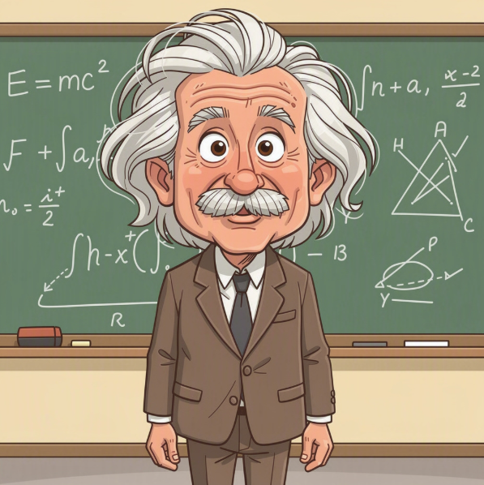
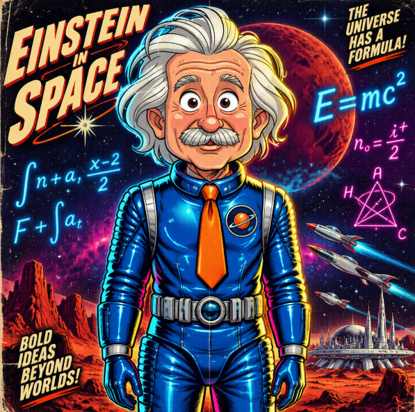

# Getting Started: Image to Image with Microsoft Foundry

Image-to-image generation starts with an existing picture and applies a text-directed transformation. It is useful for restyling photos, changing lighting, replacing backgrounds, and exploring design variations while preserving the parts of the source image that matter.

With Microsoft Foundry, the sample sends the source image and prompt to an OpenAI-compatible image edits endpoint.

## What you need

1. A **Foundry project** with a compatible image-edit deployment, such as `gpt-image-1`.
2. A source image file, such as `source.png`.
3. **Azure CLI login** (`az login`) with permission to use the project — or another identity supported by `DefaultAzureCredential`.
4. The Python packages listed in [`code/requirements.txt`](code/requirements.txt):

```bash
pip install -r code/requirements.txt
```

## The core idea

An image edit has four pieces:

1. **Authenticate** with Entra ID and create an OpenAI client for the Foundry project route.
2. **Open the source image** as binary input.
3. **Send the image and instruction** with `images.edit`.
4. **Decode and save** the base64 image returned by the model.

```python
with open("source.png", "rb") as source_image:
    response = openai_client.images.edit(
        model="gpt-image-1",
        image=source_image,
        prompt="Transform this into a vibrant retro-futurist sci-fi movie poster. Preserve the person's face and pose, but use a cobalt-blue space suit, neon equations, saturated colors, and dramatic rim lighting.",
        size="1024x1024",
    )
```

The prompt should explain both the desired change and what must remain unchanged. For a visibly different result, make the transformation concrete: change the medium, palette, wardrobe, lighting, and setting while explicitly preserving identity and pose.

## Configure and run it

Copy [`code/.env.example`](code/.env.example) to `code/.env`, place the source image in the code directory, and set `PROJECT_ENDPOINT`, `MODEL`, `INPUT_FILE`, and `PROMPT`.

`PROJECT_ENDPOINT` should be the project endpoint shown in Foundry:

```text
https://<resource-name>.services.ai.azure.com/api/projects/<project-name>
```

The script derives the OpenAI-compatible base URL as `https://<resource-name>.services.ai.azure.com/openai/v1` and calls `/images/edits`. The configured deployment must support image edits; an image-generation-only deployment will not work for this sample.

For a short prompt, use `PROMPT` directly. For a longer prompt or one containing quotation marks, save it in a text file and set `PROMPT_FILE=prompt.txt` instead.

The image-edit API accepts standard aspect-ratio sizes rather than arbitrary pixel dimensions. The script maps `WIDTH` and `HEIGHT` to `1024x1024`, `1536x1024`, or `1024x1536`.

## Source and result

The source image is a classroom portrait. The edit prompt turns it into a high-contrast retro-futurist science-fiction poster while keeping the subject recognizable.

| SOURCE | RESULT |
| --- | --- |
|  |  |

The prompt used for this transformation was:

```text
Create an unmistakable dramatic transformation of the source image into a vibrant retro-futurist 1960s sci-fi movie poster. Keep the same central person, face, expression, hairstyle silhouette, and standing pose, but replace the brown suit with a glossy cobalt-blue space suit and bright orange tie. Turn the classroom chalkboard into a deep midnight-purple starfield with large glowing cyan and magenta equations, add bold rim lighting, saturated colors, halftone print texture, and a red planet visible behind the subject. Do not preserve the original muted watercolor look; make the transformation clearly visible while keeping the subject recognizable.
```

Run the sample from the article's `code` directory:

```bash
python image_to_image.py
```

`OUTPUT_FILE` is treated as a base filename. The deployment name and timestamp are inserted before the extension, for example:

```text
Saved edited image to edited_image_gpt-image-1_20260924_164800.png
```

The attached [`image_to_image.py`](code/image_to_image.py) is the complete runnable sample and is available in the code modal for viewing or download.

## Microsoft Learn resources

- [Azure AI Projects client library for Python](https://learn.microsoft.com/python/api/overview/azure/ai-projects-readme?view=azure-python) — authenticate with `AIProjectClient` and obtain an OpenAI-compatible client.
- [Azure OpenAI image generation and editing](https://learn.microsoft.com/azure/ai-foundry/openai/dall-e-quickstart) — configure image generation and editing with Python.
- [Azure OpenAI image generation models](https://learn.microsoft.com/azure/foundry/openai/how-to/dall-e) — review supported image-model operations and request formats.
