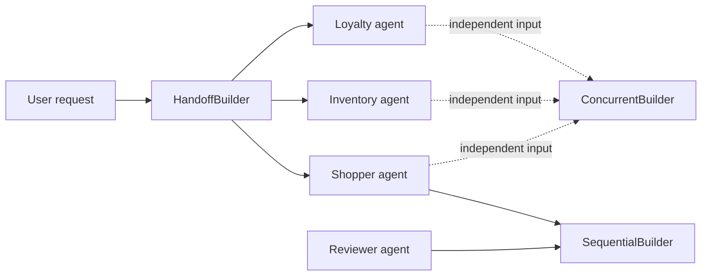

# Microsoft Foundry SDK: Part 10 - Multi-Agent Orchestration with Microsoft Agent Framework

Part 9 deliberately implemented routing and orchestration by hand with Foundry prompt agents so the mechanics were easy to see. This article replaces that application-owned coordination with the production-oriented abstraction: **Microsoft Agent Framework owns the workflow, while Microsoft Foundry supplies the project endpoint and model deployment**.

We will build the same retail scenario:

- a triage agent hands a request to a shopper, inventory, or loyalty specialist;
- a shopper draft flows into a reviewer;
- shopper, inventory, and loyalty specialists work independently in parallel.

The important difference is that Python no longer parses a routing JSON object, manually passes review text between calls, or starts worker threads. The Agent Framework builders express those relationships directly.

## Architecture



`FoundryChatClient` connects Agent Framework to the Foundry project endpoint. `as_agent()` creates code-defined Agent Framework agents that use the selected Foundry model deployment. The orchestration builders then connect those agents into workflows.

## What belongs to Foundry and what belongs to Agent Framework?

Keep the boundary explicit:

- **Microsoft Foundry** provides the project endpoint, model deployment, identity, hosted-agent runtime, tracing, evaluation, and operational controls.
- **Microsoft Agent Framework** creates the application agents and owns the workflow graph: who can hand off to whom, which participants run sequentially or concurrently, and how workflow events and outputs move through that graph.
- **Your application** still owns business policy: authorization, tool permissions, validation, approval, retries, timeouts, and the final user-facing response.

Part 9 manually implemented all three layers in application code. Part 10 moves the workflow graph into Agent Framework without removing application policy.

## When to use each builder

| Builder | Use it for | What it owns |
| --- | --- | --- |
| `HandoffBuilder` | Dynamic specialist ownership | Handoff tools, allowed transitions, and conversation context |
| `SequentialBuilder` | A fixed pipeline | Passing the workflow conversation from one participant to the next |
| `ConcurrentBuilder` | Independent reviews | Running participants in parallel and aggregating their responses |
| `GroupChatBuilder` | Participants should react to each other's messages | Shared conversation turns and termination policy |
| `MagenticBuilder` | An open-ended task needs planning and replanning | Manager-style delegation, progress, and stopping conditions |

Use a handoff when one agent should take ownership of the conversation. Use sequential orchestration when every request follows the same order. Use concurrent orchestration when the specialists do not depend on each other's intermediate results.

This article includes runnable examples for all five orchestration shapes. The first three are usually enough for straightforward routing and pipelines. Use group chat only when participants need to see and refine one another's messages; use Magentic when the task needs a manager to plan, delegate, track progress, and replan.

## Treat routing metadata as a contract

Agent Framework uses the agent's identity, description, and instructions to make routing decisions understandable to both the model and the application team. Keep each routing description:

- specific about the questions the agent owns;
- distinct from the descriptions of neighboring agents;
- free of capabilities the agent cannot actually perform;
- aligned with the tools and permissions granted to that agent.

For example, the triage agent can hand off to the inventory specialist for availability and delivery, but not for product recommendations. The `.add_handoff(...)` declaration is the executable topology: it constrains which transitions are possible even when the model sees several plausible intents. Do not rely on descriptions alone to enforce authorization.

## Prerequisites

- A Microsoft Foundry project with a chat-capable model deployment.
- Azure CLI authentication: `az login`.
- Python 3.10 or later.
- `AZURE_AI_PROJECT_ENDPOINT` and `MODEL_DEPLOYMENT` in `code/.env`.

The examples use the Agent Framework Foundry integration:

```powershell
cd code
python -m venv .venv
.\.venv\Scripts\Activate.ps1
pip install -r requirements.txt
Copy-Item ..\..\.env.example .env
```

These commands prepare an isolated Python environment for the article. `cd code` moves into the folder containing the examples, `venv` creates a project-local environment, and `Activate.ps1` makes the following `python` and `pip` commands use that environment. `pip install` reads `requirements.txt` and installs Agent Framework plus the Foundry integration. The final command copies the example environment file; edit the resulting `.env` with your own project endpoint and model deployment before running an example.

The `agent-framework-foundry` package provides `FoundryChatClient`; the `agent-framework` package provides the workflow builders.

## Step 1: Create Foundry-backed agents

The shared helper creates five focused agents:

```python
chat_client = FoundryChatClient(
    project_endpoint=os.environ["AZURE_AI_PROJECT_ENDPOINT"],
    model=os.environ["MODEL_DEPLOYMENT"],
    credential=AzureCliCredential(),
)

shopper = chat_client.as_agent(
    name="part10-shopper",
    description="Handles product selection and recommendations.",
    instructions="Help users choose products without inventing product facts.",
)
```

The first block creates the connection object that knows how to reach the Foundry project and model. The second block creates one Agent Framework agent from that connection. `name` gives the agent a stable identity in workflow configuration and traces, `description` helps other agents understand when this specialist is relevant, and `instructions` define how it should behave after it receives a request. Creating the agent does not send a prompt; it only prepares a reusable participant for a later workflow.

Unlike Part 9, these agents do not need a Foundry prompt-agent version or a separate `get_openai_client()` call. Agent Framework uses the Foundry project endpoint through `FoundryChatClient`.

The complete definitions are in [`common.py`](code/common.py).

## Step 2: Route with `HandoffBuilder`

The triage agent starts the workflow. The builder registers the handoff capability and limits the triage agent to the three specialists:

```python
workflow = (
    HandoffBuilder(
        name="part10-retail-handoff",
        participants=[triage, shopper, inventory, loyalty],
    )
    .with_start_agent(triage)
    .add_handoff(triage, [shopper, inventory, loyalty])
    .build()
)

events = await workflow.run("Can I use my loyalty points on this order?")
```

Read this from the inside out:

- `HandoffBuilder(...)` creates a configuration object for a handoff workflow.
- `participants` is the complete set of agents that may take part. Listing an agent here does not yet say who may hand off to it.
- `.with_start_agent(triage)` says that every new request begins with the triage agent.
- `.add_handoff(triage, [shopper, inventory, loyalty])` defines the allowed outgoing routes from triage. The triage agent may transfer ownership to one of those three specialists.
- `.build()` validates this configuration and returns an executable workflow object. It does not call the model yet.
- `await workflow.run(...)` starts the workflow with the user's text. The framework sends that text to the start agent, observes the agent's handoff decision, invokes the selected specialist, and collects the resulting events.

The `await` is important because model calls and handoffs are network operations. Python pauses this coroutine while the workflow is running, without blocking the entire asynchronous application.

Every participant in a handoff workflow must be created with `require_per_service_call_history_persistence=True`. Handoffs can short-circuit a tool call, so this setting keeps each agent's local conversation history synchronized with the Foundry service. The shared [`common.py`](code/common.py) helper applies this setting to all Part 10 agents.

The model decides which specialist should own the request, but the framework controls how the handoff is represented and executed. The application receives workflow outputs instead of parsing a model-generated `target` field.

Run the example:

```powershell
python 01_handoff.py
```

Example output:

```text
No handoff configuration found for agent 'part10-shopper'. This agent will not be able to hand off to any other agents and your workflow may get stuck.
No handoff configuration found for agent 'part10-inventory'. This agent will not be able to hand off to any other agents and your workflow may get stuck.
No handoff configuration found for agent 'part10-loyalty'. This agent will not be able to hand off to any other agents and your workflow may get stuck.

--- Agent Framework handoff result ---
[part10-triage]

[part10-triage]

[part10-loyalty]
Possibly - it depends on the store's loyalty program rules and whether points
redemption is enabled for this order. I can help you check, but I do not have
access to your account balance or the store's live checkout settings here.
```

The warning is expected in this example. Only `part10-triage` has outgoing handoff routes; the three specialist agents are terminal participants, so they do not need handoff configuration. The blank triage entries are intermediate workflow events, while the final answer is emitted by `part10-loyalty`. The exact wording will vary because the response comes from the model.

Handoff workflows are interactive by design: an agent can hand off, or it can answer and request more user input. For a chat application, process `request_info` events and continue the workflow with the user's next message. Do not use autonomous mode as a substitute for a user interaction loop unless you also configure turn limits.

## Step 3: Chain a draft and review with `SequentialBuilder`

The sequential builder expresses the fixed shopper-to-reviewer pipeline:

```python
workflow = SequentialBuilder(
    participants=[shopper, reviewer]
).build()

events = await workflow.run(
    "Recommend a waterproof trail jacket for a runner who hikes on weekends."
)
```

Here, `SequentialBuilder` receives an ordered list rather than a routing graph. The framework first gives the request to `shopper`; when that agent produces a response, the framework passes the workflow conversation to `reviewer`. The reviewer can therefore inspect the shopper's draft without the application manually copying text into a second prompt. `build()` creates that fixed pipeline, and `run()` executes it for one request.

The reviewer receives the workflow conversation after the shopper has responded. The final output comes from the last participant by default.

Run it:

```powershell
python 02_sequential.py
```

Example output:

```text
--- Agent Framework sequential result ---
[part10-reviewer]
A good fit is a lightweight, seam-sealed waterproof trail-running shell
rather than a heavy hiking hardshell.

Why this is the best match:
- For running: it stays light, packable, and less restrictive.
- For weekend hikes: it still gives proper rain protection for day use.
- Best compromise: it balances weather protection, breathability, and mobility.

Assumptions:
- You want one jacket for both running and hiking.
- Your hikes are day hikes or casual weekend outings.
- You need real waterproofing, not just water resistance.
- You care about low weight and breathability more than maximum durability.

Features to prioritize:
- Waterproof membrane
- Fully sealed seams
- Adjustable hood
- Ventilation such as pit zips
- Packability
- Enough room for a light layer underneath
```

Only the reviewer appears in the heading because `print_outputs()` prints the final workflow output, which comes from the last participant by default. The shopper still ran first and produced the draft that the reviewer received through the shared workflow conversation. The exact recommendation and wording will vary between runs because the agents use a model.

This replaces the manual `review_prompt = "..."+ response_text(draft)` construction from Part 9. The framework owns the message flow, while the agent instructions still define the review behavior.

## Step 4: Fan out with `ConcurrentBuilder`

The three specialists can independently assess the same checkout question:

```python
workflow = ConcurrentBuilder(
    participants=[shopper, inventory, loyalty]
).build()

events = await workflow.run(
    "A customer wants a blue trail jacket in medium and wants to pay with points."
)
```

`ConcurrentBuilder` treats the participant list as independent workers. It sends the same initial request to `shopper`, `inventory`, and `loyalty` instead of waiting for one response before starting the next. `await workflow.run(...)` still gives us one completion point in the application, but the framework performs the participant calls concurrently and then packages their responses into the workflow output.

The default aggregator returns the participant responses in one `AgentResponse`. The application can display them, pass them to a summarizer, or apply its own result policy.

Run it:

```powershell
python 03_parallel.py
```

Example output:

```text
--- Agent Framework concurrent result ---
[part10-shopper]
Before checkout, confirm the jacket is blue, available in medium, suitable
for trail use, and eligible for loyalty-point payment. Also confirm shipping
and billing details.

[part10-inventory]
Before checkout, confirm that the exact color and size are in stock, whether
the item can be purchased with points, and what pickup, delivery, or
backorder options are available if it is unavailable.

[part10-loyalty]
Before checkout, confirm the customer's points balance, the redemption rate,
whether the item and promotions are eligible, whether partial payment is
allowed, and whether another payment method is needed.
```

All three agents received the same original request. The inventory agent did not receive the shopper's answer, and the loyalty agent did not wait for inventory; they worked independently. The framework then collected the three responses into one result. The order of responses may vary depending on which participant finishes first, and the exact wording varies because the responses come from the model.

This replaces the manual `ThreadPoolExecutor` in Part 9. The framework handles the concurrent workflow and result aggregation.

## Step 5: Collaborate with `GroupChatBuilder`

Group chat is different from both handoff and concurrent orchestration. A central selector chooses the next speaker, and participants can see the shared conversation history. That makes it useful for iterative critique, debate, and refinement rather than one-way fan-out.

This example uses a fixed speaking order across four participants - three specialists (shopper, inventory, loyalty) followed by a reviewer - so the workflow can demonstrate something a single shopper/reviewer pair can't: multiple independent specialists weighing in on the same request before one participant consolidates their input. This also answers a question the earlier builders don't raise: **who is allowed to deliver the final answer to the customer?**

By default, `GroupChatBuilder` doesn't know or care whose turn produced the last message. If you just stop the loop after a fixed number of messages, the customer-facing answer is whoever happened to be speaking when the counter tripped - which could easily be an unreviewed specialist draft instead of a consolidated answer. This example fixes that by explicitly designating the reviewer as the only participant allowed to close the conversation, using `output_from` and a termination condition that waits for the reviewer specifically:

```python
SHOPPER_NAME = "part10-shopper"
INVENTORY_NAME = "part10-inventory"
LOYALTY_NAME = "part10-loyalty"
REVIEWER_NAME = "part10-reviewer"

# Each specialist speaks once, in this fixed order, then the reviewer
# synthesizes everything that was said into one final answer.
SPEAKING_ORDER = [SHOPPER_NAME, INVENTORY_NAME, LOYALTY_NAME, REVIEWER_NAME]

def specialist_then_synthesize(state: GroupChatState) -> str:
    return SPEAKING_ORDER[state.current_round % len(SPEAKING_ORDER)]

def synthesis_has_closed(conversation: list) -> bool:
    return (
        len(conversation) >= len(SPEAKING_ORDER) + 1
        and conversation[-1].author_name == REVIEWER_NAME
    )

workflow = GroupChatBuilder(
    participants=[shopper, inventory, loyalty, reviewer],
    selection_func=specialist_then_synthesize,
    termination_condition=synthesis_has_closed,
    output_from=[reviewer],
    intermediate_output_from=[shopper, inventory, loyalty],
).build()
```

The selector is called before each turn and returns the name of the participant that should speak next. Instead of an open-ended round-robin, `SPEAKING_ORDER` gives each specialist exactly one turn - shopper, then inventory, then loyalty - before handing the floor to the reviewer. Because group chat shares one growing conversation, every later speaker (including the reviewer) sees everything said before it, so the reviewer's turn has all three specialist answers to work with, not just the last one.

Four things now work together to make the reviewer the owner of the final response:

- **`SPEAKING_ORDER`** guarantees every specialist contributes exactly once before the reviewer ever speaks, instead of an open-ended or random rotation.
- **`synthesis_has_closed`** replaces a fixed message count. It only allows termination once the *last* message in the conversation came from the reviewer, so the workflow can never stop mid-specialist-turn.
- **`output_from=[reviewer]`** tells the workflow that only the reviewer's messages count as the workflow's final `output`. Every other participant's messages are hidden from `get_outputs()` unless explicitly listed.
- **`intermediate_output_from=[shopper, inventory, loyalty]`** surfaces all three specialist drafts as `intermediate` events instead - visible to your application for logging or debugging, but not part of the answer returned to the caller.

The orchestrator's own completion message (`group_chat_orchestrator`) is always included in `get_outputs()` alongside your designated participant, so your application code should filter for the reviewer's message specifically when building the customer-facing response.

Run it:

```powershell
python 04_group_chat.py
```

The example prints all three specialist drafts separately from the reviewer's consolidated answer, so it's obvious which one is meant to reach the customer. Each reply is a multi-paragraph message, so the output below is truncated to the first line of each turn:

```text
--- Agent Framework group-chat result ---
Internal deliberation (not shown to the customer):
[part10-shopper]
I can help with that, but I need the specific product listing or store/catalog details...
(confirms the requested fit - blue, medium - but asks for a product link or SKU before confirming stock or points)

[part10-inventory]
The jacket you're looking for is a waterproof trail jacket in blue, size medium...
(repeats the same fit, flags that it needs the SKU to confirm stock and points policy)

[part10-loyalty]
I can help, but I need the specific product page or SKU to verify it accurately...
(same fit and availability caveat, offers to help phrase a reply to the customer in the meantime)

Final answer to the customer:
[part10-reviewer]
I can confirm the item details only if you provide the product listing or SKU...
(one consolidated answer restating fit, and asking for the missing SKU to confirm stock and loyalty payment)

[group_chat_orchestrator]
The group chat has reached its termination condition.
```

The exact wording varies between runs because each turn is a real model call, and in this run all three specialists independently declined to invent stock or loyalty details - a direct result of the "do not invent" instructions from Step 1. What matters is the *structure*: three specialists each answer the same request once, and only the reviewer's single consolidated message becomes the workflow's output. This demonstrates the key difference from `ConcurrentBuilder`: in concurrent execution the three specialist answers themselves would each be returned to the caller, but here they're merged into one voice before anything is surfaced. It also demonstrates the key difference from `HandoffBuilder`: instead of one specialist owning the whole conversation after a handoff, several specialists contribute in parallel turns and a dedicated participant is responsible for turning their input into a single response.

For production, replace the simple selector with a policy or agent-based selector, and always configure a termination condition or maximum turn count. Just as important: always set `output_from` (or an equivalent application-level filter) so the workflow itself enforces which participant's answer is authoritative, instead of relying on message-count arithmetic to land on the right speaker.

> **Beyond a fixed speaking order.** `SPEAKING_ORDER` is deliberately simple so the mechanics stay visible. It is out of scope for this article, but more capable selectors exist:
>
> - **Manager-led selection (`MagenticBuilder`, see Step 6)** - a manager agent decides who should speak next based on the request, instead of a hardcoded list.
> - **Relevance-based custom selectors** - inspect the request (keywords, or a cheap classifier/LLM call) and only invite the specialists that are actually relevant, skipping the rest.
> - **Dynamic termination instead of a fixed round count** - let the reviewer, or a router, decide after each turn whether enough information has been gathered, ending early instead of always visiting every specialist.
> - **Fan-out with selective synthesis** - run all specialists concurrently with `ConcurrentBuilder`, then have the reviewer cite only the outputs relevant to the question, removing speaking order entirely.
> - **Triage-first routing** - reuse a triage agent (like the one from Step 2) to classify which specialists are needed per request, then build `SPEAKING_ORDER` dynamically instead of hardcoding it.

## Step 6: Plan and replan with `MagenticBuilder`

Magentic orchestration adds a manager agent that turns an open-ended request into a plan, delegates work to participants, tracks progress, and replans when a step stalls. It is more flexible than a fixed sequence, but it also has less predictable latency and token usage.

```python
workflow = MagenticBuilder(
    participants=[shopper, inventory, loyalty],
    manager_agent=manager,
    max_round_count=6,
    max_stall_count=2,
    max_reset_count=1,
).build()
```

`manager_agent` is not one of the specialists doing the retail investigation. It is the coordinator: it interprets the request, creates or updates a plan, chooses which participant should work next, and uses their responses to decide whether more work is needed. `max_round_count` limits the total coordination loop, `max_stall_count` limits consecutive rounds without useful progress, and `max_reset_count` limits how often the manager may discard and rebuild its plan. The builder turns those rules into one executable workflow.

The limits are not optional production decoration: they protect against loops, runaway cost, and workflows that keep replanning without making progress.

> **What "no progress" means to the manager.** Before every round, the manager asks itself a judged question: *is the request satisfied, and is progress being made?* If the answer is no for more rounds than `max_stall_count` allows, it replans; if it still can't make progress after using its allotted resets (`max_reset_count`), it terminates rather than looping forever. This matters here because the specialists were instructed in Step 1 to never invent facts. If the manager expects them to eventually produce confirmed stock numbers or point balances - which they never will, because there is no real inventory or loyalty system behind this demo - it judges every round as "no real progress" and burns through its stall and reset budget until it gives up:
>
> ```text
> Magentic Orchestrator: Max reset count reached
>
> --- Agent Framework Magentic result ---
> [magentic_manager]
> Workflow terminated due to reaching maximum reset count.
> ```
>
> The fix isn't more retries - it's telling the manager what a *satisfied* task looks like when specialists genuinely can't confirm live facts:
>
> ```python
> manager = Agent(
>     client=chat_client,
>     name="part10-magentic-manager",
>     description="Plans and coordinates a complex retail investigation.",
>     instructions=(
>         "Coordinate the specialist team to answer the user's question. "
>         "Create a practical plan, delegate useful work, replan when needed, "
>         "and return one concise final answer. The specialists have no real "
>         "inventory, catalog, or loyalty-account data to check, so they cannot "
>         "confirm live facts such as exact stock or point balances - that is "
>         "expected, not a failure. Treat the task as satisfied once the "
>         "specialists have covered fit, availability, and loyalty payment, "
>         "even if their answer is a clear checklist of what still needs to be "
>         "confirmed (for example, against a real inventory system) rather than "
>         "confirmed facts. Do not keep delegating the same question hoping for "
>         "different facts to appear."
>     ),
> )
> ```
>
> In a real system, this gap would be closed differently: give the specialists actual tools - a database or CRM lookup, an inventory API call, a loyalty-service query - so they *can* return confirmed facts instead of a checklist. This demo skips that so the orchestration mechanics stay visible, but production Magentic workflows should give participants real data sources whenever the manager's success criteria depend on facts the model can't know on its own.

Run it:

```powershell
python 05_magentic.py
```

```text
--- Agent Framework Magentic result ---
[part10-magentic-manager]
Here's a concise checkout readiness brief for a blue trail jacket in medium...
(covers a fit checklist - size chart, measurements, layering - an availability checklist including backorder/pickup fallbacks, and a loyalty-points checklist covering balance, exclusions, and combinability, then a "checkout-ready only if" summary tying all three together)
```

This run took noticeably longer than the handoff, sequential, or concurrent examples - that's expected, not a problem. Every round costs at least two model calls (the manager judging progress, then the delegated specialist), plus one call to build the initial plan and one to prepare the final answer. A run bounded by `max_round_count=6` can mean well over a dozen sequential model calls before the final answer appears, which is the real-world cost of the planning and judging loop that makes Magentic more flexible than a fixed sequence.

## Step 7: Run the complete example

The complete script creates the agents once and runs the handoff, sequential, and concurrent examples. The group-chat and Magentic workflows remain separate because they need their own selectors, managers, and safety limits:

```powershell
python full_example.py
```

`full_example.py` is a convenience runner, not a new orchestration pattern. It creates one shared client and one set of agents, constructs three independent workflow objects, runs each with a sample request, and prints their outputs. The workflows do not share execution state with one another; sharing the agent definitions only avoids repeating setup code.

The source files are:

- [`common.py`](code/common.py)
- [`01_handoff.py`](code/01_handoff.py)
- [`02_sequential.py`](code/02_sequential.py)
- [`03_parallel.py`](code/03_parallel.py)
- [`04_group_chat.py`](code/04_group_chat.py)
- [`05_magentic.py`](code/05_magentic.py)
- [`full_example.py`](code/full_example.py)
- [`requirements.txt`](code/requirements.txt)

## Production considerations

The builder decides **how agents collaborate**. It does not decide **what your business is allowed to do**. For example, `HandoffBuilder` can allow the triage agent to hand a request to the inventory agent, but it does not know whether the current user is allowed to see stock data. Your application must check that before the inventory agent calls a protected tool.

Keep these responsibilities separate:

| Responsibility | Owner | Concrete example |
| --- | --- | --- |
| Workflow shape | Agent Framework | Choose handoff, sequence, fan-out, group chat, or Magentic; define participants and transitions |
| Business authorization | Your application | Check user and account permissions before exposing data or enabling a tool |
| Input and output validation | Your application | Reject unsupported requests and verify that an agent did not invent an order ID or stock quantity |
| Human approval | Your application | Pause before placing an order, changing an account, or writing a CRM record |
| Reliability and cost controls | Both | The builder limits turns and concurrency; your application adds timeouts, retries, cancellation, and budgets |
| User-facing response | Your application | Combine specialist results, remove internal details, and return one safe answer to the user |

Before deploying a workflow, make the following decisions:

- constrain every handoff to the transitions the business process actually permits;
- define what happens when the request is ambiguous, unsupported, or requires more information;
- handle `request_info` events by returning control to the user instead of letting the workflow guess;
- configure hard turn, stall, and reset limits for group-chat and Magentic workflows;
- set timeouts and explicit failure behavior for tools and remote services;
- limit concurrent participants to control latency and model cost;
- add a final summarizer when the user should see one answer instead of several specialist responses;
- require approval before any agent changes data or performs an irreversible action.

In short, Agent Framework can coordinate the team, but your application remains the gatekeeper for data access, side effects, and the final answer.

The examples in this article run as ordinary local Python processes. They call the model deployment in your Foundry project, so the model request and its related telemetry may appear in Foundry, but the Agent Framework workflow itself is not registered as a hosted agent just because it uses `FoundryChatClient`. Running `python 01_handoff.py` or `python full_example.py` does not create a hosted-agent resource.

To run the same workflow as a hosted Foundry agent, package the Agent Framework application and deploy it through one of Foundry's supported deployment paths, such as a ZIP package, `azd`, or a container. Part 8, [Deploy a Hosted Agent](../part8-hosted-agent/part8-hosted-agent.md), walks through those deployment options. That deployment step creates the hosted runtime; Foundry then supplies managed identity, scaling, and operational hosting around the workflow. The workflow code and its Agent Framework orchestration remain yours.

## Key takeaways

- `FoundryChatClient` connects Agent Framework agents to a Foundry project and model deployment.
- `HandoffBuilder` implements dynamic routing and task ownership.
- `SequentialBuilder` implements fixed agent pipelines.
- `ConcurrentBuilder` implements independent fan-out and aggregation.
- `GroupChatBuilder` implements bounded shared-context collaboration.
- `MagenticBuilder` implements manager-led planning, delegation, and replanning.
- Part 9 explains the mechanics manually with prompt agents; Part 10 uses Microsoft Agent Framework to own the orchestration layer.

Next up: **Part 11** - Connect independently hosted agents with Agent2Agent.

---

*Sources: [Microsoft Agent Framework](https://learn.microsoft.com/agent-framework/overview/agent-framework-overview), [Handoff orchestration](https://learn.microsoft.com/agent-framework/workflows/orchestrations/handoff), [Sequential orchestration](https://learn.microsoft.com/agent-framework/workflows/orchestrations/sequential), [Concurrent orchestration](https://learn.microsoft.com/agent-framework/workflows/orchestrations/concurrent), and [Microsoft Foundry SDKs and endpoints](https://learn.microsoft.com/azure/foundry/how-to/develop/sdk-overview#agent-framework).*
