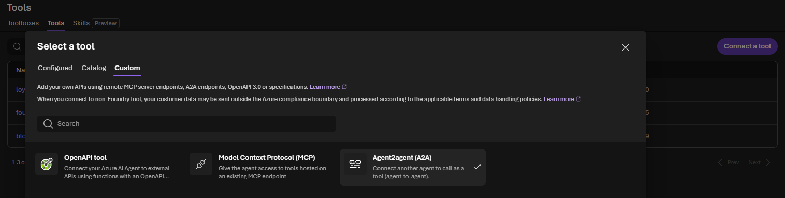
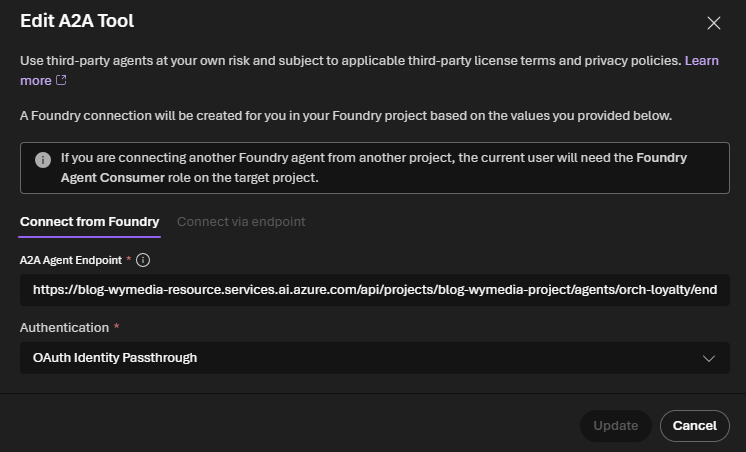

# Microsoft Foundry SDK: Part 11 - Agent2Agent Communication Between Hosted Agents

In Part 10, all of our retail agents lived inside the same application and Microsoft Agent Framework owned their orchestration. The application still coupled the specialists to the same deployment, so this part moves the boundary outward to independently hosted agents communicating through Agent2Agent (A2A).

In this part, we cross that boundary. We will call a loyalty agent that is independently hosted behind an **Agent2Agent (A2A)** endpoint. The calling application will not import the loyalty agent's Python code, know its prompt, or know which model deployment it uses. It only knows how to communicate with the agent through the A2A protocol.

We will build the same scenario in two steps:

1. A local Python program calls the remote agent directly through A2A.
2. A Microsoft Foundry caller agent uses the Foundry `A2ATool` and a `RemoteA2A` connection to call the same remote agent.

The first step is intentionally simple. It teaches the protocol and gives us a working diagnostic baseline. The second step adds the managed Foundry features: a project connection, agent identity, routing instructions, and a caller agent that can decide when to use the remote specialist.

## What you will learn

By the end of this article, you will understand:

- what problem A2A solves and how it differs from MCP;
- what an A2A agent card is and why the caller resolves it first;
- how an authenticated direct A2A request flows from a Python process to a remote Foundry agent;
- how `RemoteA2A` stores the endpoint and authentication configuration in Foundry;
- why a direct call and an `A2ATool` call use different identities;
- how to diagnose the common `Failed to fetch agent card` errors.

## The scenario

The user asks:

> Can I use my loyalty points to buy the blue trail jacket in medium?

The loyalty specialist is already deployed as the Foundry agent `orch-loyalty`. It exposes an A2A endpoint. Our caller sends the question to that specialist and prints the answer.

This is the boundary we are creating:

```text
User request
     |
     v
Local application or Foundry caller agent
     |
     | A2A protocol
     v
Independently hosted loyalty agent
```

The loyalty agent does not have access to a real customer account in this sample. Therefore, a correct answer must explain the general redemption rules without inventing a points balance, price, or eligibility result.

## A2A compared with MCP

MCP and A2A are related but solve different problems:

| Protocol | Connects | Typical use |
| --- | --- | --- |
| MCP | An agent to a tool or data service | Search inventory, query a database, call an API |
| A2A | One independently hosted agent to another agent | Ask a specialist agent to reason about a domain task |

Use MCP when the caller needs a deterministic capability such as “look up the stock for SKU 123.” Use A2A when another team owns a separately deployed reasoning agent and you want to delegate a task to it without importing its implementation.

## Prerequisites

You need:

- an Azure subscription and a Microsoft Foundry project;
- Python 3.10 or later;
- a model deployment in the project;
- a Foundry agent named `orch-loyalty`;
- incoming A2A enabled on that agent;
- permission to read and invoke the target agent;
- Azure CLI authentication, for example `az login`.

The target agent must expose an A2A base endpoint like this:

```text
https://<account>.services.ai.azure.com/api/projects/<project>/agents/<agent>/endpoint/protocols/a2a
```

The target endpoint and the project endpoint are different values. The project endpoint identifies the Foundry project used by the SDK. The A2A endpoint identifies the remote agent that will receive the message.

Incoming A2A must also be configured on the target agent. The Microsoft Learn instructions linked at the end of this article show how to enable the endpoint and verify its agent card.

## Prepare the Python environment

The examples are in the [`code`](code) folder. From the Part 11 folder, create and activate a virtual environment, install the dependencies, and copy the shared series environment template:

```powershell
cd code
python -m venv .venv
.\.venv\Scripts\Activate.ps1
pip install -r requirements.txt
Copy-Item ..\..\.env.example .env
```

Open `code\.env` and fill in the values for Part 11:

```text
FOUNDRY_PROJECT_ENDPOINT=https://<account>.services.ai.azure.com/api/projects/<project>
MODEL_DEPLOYMENT=<model-deployment>
LOYALTY_TEST_PROMPT=Can I use my loyalty points to buy the blue trail jacket in medium?

# Level 1
A2A_LOYALTY_ENDPOINT=https://<account>.services.ai.azure.com/api/projects/<project>/agents/orch-loyalty/endpoint/protocols/a2a
A2A_AGENT_CARD_PATH=agentCard/v0.3

# Level 2
A2A_LOYALTY_CONNECTION_NAME=loyalty-agent-connection
A2A_CALLER_AGENT_NAME=orcha2a-caller
```

For Part 3, also fill in `AZURE_AI_PROJECT_ENDPOINT` in the shared template with the same value as `FOUNDRY_PROJECT_ENDPOINT`. The hosted Agent Framework client uses the `AZURE_AI_PROJECT_ENDPOINT` name. The additional `agent-framework-foundry` dependency is already included in `requirements.txt`.

The direct example uses the v0.3 agent-card path because that is the compatibility path used by the verified run in this article. For a new integration, Microsoft recommends A2A v1.0 when the target agent and installed SDK support it. The managed example uses the GA A2A v1.0 tool.

## Part 1: Call the remote agent directly

### The direct-call mental model

The first program is an ordinary local Python process. Foundry is not creating a caller agent for us. The program performs each protocol step explicitly:

```text
1. Obtain an Entra token
2. Resolve the remote agent card
3. Create an A2A client from that card
4. Send a text message
5. Read the returned task
```

The agent card is the remote agent's published description. It tells the client who the agent is and which A2A capabilities and protocol details it supports. Resolving the card before sending the message prevents the client from blindly assuming the remote contract. Foundry exposes this card when you [enable an A2A endpoint on an agent](https://learn.microsoft.com/en-us/azure/foundry/agents/how-to/enable-agent-to-agent-endpoint).

### Run the direct example

Run:

```powershell
python .\01_a2a_call_direct.py
```

The important parts of [`01_a2a_call_direct.py`](code/01_a2a_call_direct.py) are:

```python
credential = DefaultAzureCredential()
token = credential.get_token("https://ai.azure.com/.default").token

async with httpx.AsyncClient(
    headers={"Authorization": f"Bearer {token}"},
    timeout=httpx.Timeout(120.0),
) as httpx_client:
    resolver = A2ACardResolver(
        httpx_client=httpx_client,
        base_url=loyalty_endpoint,
        agent_card_path=agent_card_path,
    )
    agent_card = await resolver.get_agent_card()
```

### What does `A2ACardResolver` do?

`A2ACardResolver` is a helper from the Python `a2a-sdk`. Its job is to discover the remote agent before we try to send it a task. Given the A2A base endpoint and the card path, it makes an authenticated `GET` request to the agent-card URL, reads the response, and converts it into an `AgentCard` object that the A2A client can use.

In this example, the two configuration values combine to form a URL like this:

```text
A2A_LOYALTY_ENDPOINT
  + /agentCard/v0.3
  = https://<account>.services.ai.azure.com/api/projects/<project>/agents/orch-loyalty/endpoint/protocols/a2a/agentCard/v0.3
```

The resolver is needed because the A2A client should learn the remote agent's published contract rather than guessing it. The card can contain the agent name, supported protocol version, capabilities, supported interfaces, and the URL information required for communication. The client uses that information when `create_client(agent=agent_card, ...)` creates the protocol client.

The resolver does not authenticate by itself. The `httpx.AsyncClient` already contains the bearer token in its `Authorization` header, so the same authenticated client is used both to retrieve the card and to send the eventual A2A message. If the card request returns `401`, `403`, or `404`, the failure occurs before the remote agent has processed the user's question. Check the token, endpoint, card path, and target-agent permissions first.

Microsoft's [A2A authentication guidance](https://learn.microsoft.com/en-us/azure/foundry/agents/concepts/agent-to-agent-authentication) explains why the card endpoint and the identity used to read it must both be configured correctly.

`DefaultAzureCredential` obtains the token from the local Azure CLI session or another supported Entra credential source. The token is attached to the HTTP client, so both the agent-card request and the later A2A message use the same authenticated client.

After the card is resolved, the script creates a non-streaming client and sends a text message:

```python
config = ClientConfig(streaming=False, httpx_client=httpx_client)
client = await create_client(agent=agent_card, client_config=config)

message = new_text_message(test_prompt, role=Role.ROLE_USER)
request = SendMessageRequest(message=message)

async for response in client.send_message(request):
    print(response)
```

The response is a structured A2A task. The task contains an ID, a context ID, a state, and the response artifact. A completed task has the state `TASK_STATE_COMPLETED`.

### Expected result

Your IDs, timestamp, and response wording will differ, but a successful run can look like this:

```text
--- Resolving agent card ---
Agent card resolved: orch-loyalty
--- Sending message to remote agent ---
--- Agent response ---
task {
  id: "resp_02d0447a5907c8de006ab4c352ed608190a6a7cf5c5d08cb95"
  context_id: "ctxt_03272ad67fc449a792118224dee72354"
  status {
    state: TASK_STATE_COMPLETED
    timestamp {
      seconds: 1790231380
    }
  }
  artifacts {
    artifact_id: "msg_02d0447a5907c8de006ab4c353a06881908cc3d672f7bb7cea"
    parts {
      text: "I can help with that, but I can’t see your loyalty balance or the product’s current point redemption rules from here.\n\nIn general, whether you can use points for the blue trailjacket in medium depends on:\n- whether that size/color is in stock\n- whether the item is eligible for points redemption\n- how many points you have available\n- any minimum spend or redemption limits\n\nIf you want, I can help you figure it out quickly if you share:\n- the store/brand name\n- your loyalty program name\n- the jacket’s product link or exact item name\n\nOr you cancheck at checkout for a “Use points” option, since that’s usually where eligibility is confirmed."
    }
  }
}
```

The exact response is generated by the remote agent, so wording may change between runs. The important signals are:

- `Agent card resolved: orch-loyalty` confirms discovery succeeded.
- `TASK_STATE_COMPLETED` confirms the remote task finished successfully.
- The `artifacts` section contains the remote agent's answer.

At this point, you have proved three things independently: the endpoint exists, the agent card is readable, and the target agent can process an A2A message. Do not start with the managed `A2ATool` example until this direct call works.

## Part 2: Let a Foundry agent use A2ATool

The direct example gives the application complete control. In a larger agent workflow, we may instead want a Foundry caller agent to decide when to call the remote specialist. This is where `A2ATool` and a `RemoteA2A` project connection fit.

### What changes in Part 2?

The message now passes through an additional Foundry agent:

```text
User request
     |
     v
Foundry caller agent
     |
     | A2ATool
     v
RemoteA2A project connection
     |
     | A2A protocol
     v
orch-loyalty
```

The project connection stores the remote endpoint and authentication configuration. The caller agent receives the A2A tool. When the caller is invoked, the model can use that tool to delegate the loyalty question.

This is more than a longer version of the direct script. The execution identity changes:

- the direct script uses the identity of the local user running `DefaultAzureCredential`;
- the managed call runs inside Foundry and uses the identity configured for the caller/connection.

That difference explains why a direct call can succeed while the managed call returns a 403 or 404.

### Configure the RemoteA2A connection

Create a project connection named `loyalty-agent-connection` in Foundry. Configure it as follows:

| Setting | Value |
| --- | --- |
| Connection type | `RemoteA2A` |
| Target | The A2A base path, without `/agentCard/v0.3` or `/agentCard/v1.0` |
| Audience | `https://ai.azure.com` |
| Authentication | Entra agent identity or the authentication method required by the endpoint |

The target must look like this:

```text
https://<account>.services.ai.azure.com/api/projects/<project>/agents/orch-loyalty/endpoint/protocols/a2a
```

Do not paste the full agent-card URL into the connection. Foundry resolves the card itself.

The caller identity needs **Foundry Agent Consumer** or a higher role on the target project or target agent. This is separate from your own permission to run the Python script.

### Run the managed example

After the connection exists and its identity has access to `orch-loyalty`, run:

```powershell
python .\02_a2a_call_with_tool.py
```

The script first chooses the specialist:

```python
def route_request(request: str) -> str:
    text = request.lower()
    if any(word in text for word in ("point", "discount", "membership", "reward")):
        return "loyalty"
    if any(word in text for word in ("stock", "available", "shipping", "delivery")):
        return "inventory"
    return "shopper"
```

This routing function is deliberately simple. It is application logic, not A2A itself. Its job is to select the connection name before the caller agent is created. In a production application, the routing decision could be made by another model or by a more complete business rule.

The script then retrieves the connection and creates the GA A2A v1.0 tool:

```python
connection = project.connections.get(connection_name)

a2a_tool = A2ATool(
    a2a_version=A2AProtocolVersion.V1_0,
    project_connection_id=connection.id,
)
```

Finally, it creates a temporary caller agent with that tool and invokes the caller through the Responses API:

```python
caller = project.agents.create_version(
    agent_name=CALLER_AGENT_NAME,
    definition=PromptAgentDefinition(
        model=MODEL_DEPLOYMENT,
        instructions="Use the remote loyalty specialist to answer the customer's question.",
        tools=[a2a_tool],
    ),
)

response = openai.responses.create(
    tool_choice="required",
    input=TEST_PROMPT,
    extra_body={
        "agent_reference": {
            "name": caller.name,
            "type": "agent_reference",
        }
    },
)
```

The `finally` block deletes the temporary caller version after the run. That keeps this learning example from leaving a new version behind every time you execute it.

### Expected result

The verified managed run produced this shape:

```text
Looking up A2A connection: loyalty-agent-connection
  Connection ID: /subscriptions/<subscription-id>/resourceGroups/<resource-group>/providers/Microsoft.CognitiveServices/accounts/<account>/projects/<project>/connections/loyalty-agent-connection
  Connection type: RemoteA2A

Caller agent: orcha2a-caller (version 9)
User request: Can I use my loyalty points to buy the blue trail jacket in medium?
Routed to specialist: loyalty
Using A2A connection: loyalty-agent-connection
--- Agent response ---

Yes—if the blue trail jacket in medium is eligible for loyalty redemption, you can
usually apply points toward the purchase.

I can’t confirm your exact redemption amount or remaining balance without your account
details, but in general:
- If your points cover the full price, you can pay entirely with points.
- If not, you’d use points for part of it and pay the rest another way.

Deleted temporary caller version 9.
```

Foundry assigns the version number, so it will change on later runs. The connection ID is your subscription/resource-group/account path to the `loyalty-agent-connection` project connection - expect it to differ per environment. The important evidence is that the connection resolved, the caller was created, the request was routed to `loyalty`, the remote answer was returned, and the temporary version was deleted.

## Part 3: Use A2A from a hosted Agent Framework agent

The previous example used a server-side Foundry prompt agent. Now we will use the Microsoft Agent Framework hosted-agent pattern instead. The hosted agent still calls the same `orch-loyalty` agent through the same `RemoteA2A` connection, but the wiring is different:

```text
Hosted Agent Framework agent
     |
     | FoundryToolbox (MCP client)
     v
Foundry toolbox
     |
     | A2AToolboxTool
     v
RemoteA2A connection
     |
     | A2A protocol
     v
orch-loyalty
```

This extra toolbox layer is important to understand. The remote call is still A2A. The toolbox exposes the managed A2A tool through an MCP-compatible endpoint so a hosted Agent Framework agent can consume it like any other tool.

This example is [`03_a2a_call_hosted.py`](code/03_a2a_call_hosted.py). It creates an ephemeral toolbox version and runs the Agent Framework agent locally. The same pattern can subsequently be packaged and deployed using the hosted-agent approach from Part 8; “hosted” here describes the Agent Framework integration, not a second implementation of the loyalty agent.

### Create the A2A connection in Foundry

Create the project connection before running the examples. In the Microsoft Foundry portal:

1. Open **Tools**.
2. Select **Connect a tool**.
3. Open the **Custom** tab.
4. Select **Agent2Agent (A2A)**.
5. Choose **Connect** or **Create**, depending on the portal version.
6. Enter the connection name `loyalty-agent-connection`.
7. Enter the target agent's A2A base endpoint:

   ```text
   https://<account>.services.ai.azure.com/api/projects/<project>/agents/<agent>/endpoint/protocols/a2a
   ```

8. For this locally run Agent Framework example, select **OAuth Identity Passthrough** as the authentication method.
9. Save the connection.

The portal creates the project connection for the A2A tool. Do not use the generic **Connected resources** or **Add connection** dialog; A2A is created from the **Tools** experience.





The **Microsoft Entra Agent Identity** option is intended for a registered or hosted Foundry caller agent. A local Python process does not have that agent identity, so selecting it causes the toolbox call to fail with an error saying that `AgentInstanceClientId` and `AgentBlueprintClientId` (or `ApplicationName`) are required.

### Create the A2A toolbox

The script retrieves the existing connection and places an `A2AToolboxTool` inside a Foundry toolbox:

```python
connection = project.connections.get(CONNECTION_NAME)

toolbox = project.toolboxes.create_version(
    name=TOOLBOX_NAME,
    description="A toolbox containing the loyalty A2A tool.",
    tools=[
        A2AToolboxTool(
            a2a_version=A2AProtocolVersion.V1_0,
            project_connection_id=connection.id,
        )
    ],
)
```

The toolbox is a reusable, Foundry-managed container for tools. It does not replace the `RemoteA2A` connection; it references that connection through `project_connection_id`. The toolbox endpoint is then exposed as MCP:

```python
toolbox_mcp_url = (
    f"{PROJECT_ENDPOINT}/toolboxes/{toolbox.name}"
    f"/versions/{toolbox.version}/mcp?api-version=v1"
)
toolbox_tool = FoundryToolbox(credential, url=toolbox_mcp_url)
```

### Attach the toolbox to the hosted agent

The hosted agent uses `FoundryChatClient` and receives the toolbox as a tool:

```python
async with toolbox_tool:
    agent = Agent(
        client=FoundryChatClient(
            project_endpoint=PROJECT_ENDPOINT,
            model=MODEL_DEPLOYMENT,
            credential=credential,
        ),
        instructions=(
            "You are a retail coordinator. Use the loyalty A2A toolbox "
            "to answer the customer's question. Do not invent account-specific facts."
        ),
        tools=[toolbox_tool],
    )

    result = await agent.run(TEST_PROMPT)
    print(result.text)
```

Run it from the `code` folder:

```powershell
python .\03_a2a_call_hosted.py
```

The first run creates a toolbox version, so the output should identify the toolbox and version before printing the loyalty answer:

```text
Using A2A connection: loyalty-agent-connection
  Connection type: RemoteA2A
Created toolbox: a2a-toolbox (version <n>)
Hosted agent request: Can I use my loyalty points to buy the blue trail jacket in medium?
--- Agent response ---
I can help with that, but I can’t verify your actual points balance, the
jacket’s eligibility, or calculate a redemption amount without account and
checkout details.

In general:
- Points can usually be used only on eligible items and at checkout.
- Whether the blue trail jacket in medium qualifies depends on the store’s
  redemption rules.
- The amount of points you can apply depends on your balance, any redemption
  limits, and the item/order price.

If you send me:
1. Your loyalty points balance
2. The jacket’s price
3. Any points redemption rules

I can tell you whether you can use points and how many would remain after
redemption.
```

The wording is generated by the agents and may change. The important point is that the hosted Agent Framework agent called the toolbox, the toolbox invoked the A2A tool, and the A2A tool reached the remote loyalty agent through the existing connection. The toolbox version increments whenever the script creates another version.

The toolbox version is a Foundry resource and is not automatically deleted by this teaching script. If you run the example repeatedly, reuse a named toolbox or clean up old toolbox versions in Foundry after experimenting.

## Troubleshooting

### The direct script cannot import `httpx` or `a2a`

Make sure the virtual environment is active and install the requirements from the `code` folder:

```powershell
.\.venv\Scripts\Activate.ps1
python -m pip install -r requirements.txt
```

The A2A SDK is declared explicitly in `requirements.txt`. Installing only `azure-ai-projects` does not install the standalone Python A2A client used by the direct example.

### The direct script returns 401 or 403

Run `az login`, confirm that the signed-in identity can access the Foundry project and target agent, and verify that the token audience is `https://ai.azure.com/.default`. Also check that `A2A_LOYALTY_ENDPOINT` is the target's A2A base endpoint, not the project endpoint.

### The managed example says the agent card is not found

Check these values in order:

1. Incoming A2A is enabled on `orch-loyalty`.
2. The `RemoteA2A` target ends at `/protocols/a2a`.
3. The target does not include an agent-card path.
4. The audience is exactly `https://ai.azure.com`.
5. The caller identity has **Foundry Agent Consumer** or higher on the target project or agent.
6. The connection points to the exact account, project, and agent names.
7. The connection uses the GA `a2a` tool and the caller uses `A2AProtocolVersion.V1_0`.

Verify the target independently:

```powershell
$token = az account get-access-token --resource https://ai.azure.com --query accessToken -o tsv
Invoke-RestMethod `
  -Uri "https://<account>.services.ai.azure.com/api/projects/<project>/agents/<agent>/endpoint/protocols/a2a/agentCard/v1.0" `
  -Headers @{ Authorization = "Bearer $token" }
```

If this request succeeds but `A2ATool` fails, the basic A2A endpoint is working. Investigate the managed connection identity, its RBAC assignment, and the connection target.

### The hosted example cannot connect to the toolbox

Check that `agent-framework-foundry` was installed and that `AZURE_AI_PROJECT_ENDPOINT` and `MODEL_DEPLOYMENT` are set in `.env`. The `FoundryChatClient` call must provide both `project_endpoint` and `model`, together with the Azure credential.

If the toolbox is created successfully but the hosted agent cannot call it, verify that the signed-in identity can use the toolbox MCP endpoint and that the underlying `RemoteA2A` connection still points to the target agent's A2A base path.

For a locally run Agent Framework process, configure the A2A connection with **OAuth Identity Passthrough**. The **Microsoft Entra Agent Identity** option is for a registered or hosted Foundry caller agent and requires agent identity metadata that a local Python process does not have.

If the request succeeds but an `async_generator` cleanup warning appears after the response, make sure the script uses `async with toolbox_tool:` as shown above. This explicitly closes the MCP toolbox session. The warning can also appear with older Agent Framework/MCP combinations, especially on newer Python versions; it is a cleanup issue after a successful response, not an A2A routing failure.

## Summary

The direct example is the foundation: it shows every A2A step and is the fastest way to isolate endpoint and protocol problems. The managed prompt-agent example moves the connection and authentication into Foundry and gives a caller agent an `A2ATool`. The hosted example uses the same connection through an `A2AToolboxTool` and `FoundryToolbox`.

The progression is therefore:

```text
Direct HTTP/A2A client
        |
        v
RemoteA2A connection
        |
        v
Foundry caller agent + A2ATool
        |
        v
Hosted Agent Framework agent + FoundryToolbox
```

Start with direct A2A when an application or service needs explicit control. Add `A2ATool` for a server-side Foundry prompt agent. Use the toolbox pattern when the caller is an Agent Framework hosted agent and you want to reuse Foundry-managed tools and connections.

## Microsoft Learn resources

- [Connect to an A2A agent endpoint from Foundry Agent Service](https://learn.microsoft.com/en-us/azure/foundry/agents/how-to/tools/agent-to-agent) — configure a `RemoteA2A` connection and use `A2ATool`.
- [Microsoft Agent Framework hosted-agent A2A sample](https://aka.ms/foundry-toolbox-maf) — use `FoundryChatClient`, `FoundryToolbox`, and `A2AToolboxTool`.
- [Enable an A2A endpoint on a Foundry agent](https://learn.microsoft.com/en-us/azure/foundry/agents/how-to/enable-agent-to-agent-endpoint) — expose the loyalty agent and verify its agent card.
- [Agent2Agent (A2A) authentication](https://learn.microsoft.com/en-us/azure/foundry/agents/concepts/agent-to-agent-authentication) — understand authentication modes, agent identities, audiences, and RBAC troubleshooting.
