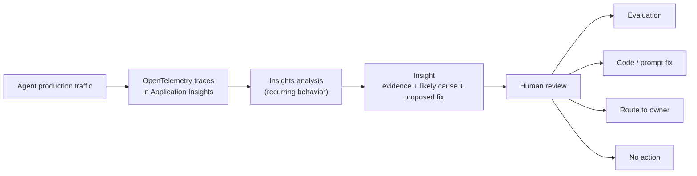

# Part 12 - Use Insights to find recurring agent problems

Important

Insights in Foundry is currently in public preview. This preview is provided without a service-level agreement, and we don't recommend it for production workloads. Certain features might not be supported or might have constrained capabilities. For more information, see [Supplemental Terms of Use for Microsoft Azure Previews](https://azure.microsoft.com/support/legal/preview-supplemental-terms/).

[Part 5](../part5-monitoring/part5-monitoring.md) instrumented Foundry agents with traces so you could see what happened during a single request. [Part 6](../part6-evaluations/part6-evaluations.md) showed how to score whether a *known* behavior was good or bad. Both parts still require a human to already know what to look for: which trace to open, which evaluator to run.

**Insights in Foundry** closes that gap. It reads the same traces from your connected Application Insights resource, but instead of showing you individual requests, it groups recurring behavior across many traces into a single, reviewable **Insight** — with representative traces, an affected agent version, a likely cause, and a recommended next action.

In this article you learn how to:

- Prepare an agent and its telemetry so Insights has enough evidence to work with.
- Run an Insights scan in the Microsoft Foundry portal.
- Read and validate an Insight before acting on it.
- Route a confirmed Insight to evaluation, a code fix, or the right dependency owner.
- Run the same workflow — create a monitor, run a scan, review Insights, enable a schedule — from the Python SDK.
- Avoid the most common setup and result-quality problems.

## Where Insights fits



Insights doesn't replace tracing or evaluation, and it doesn't require you to predefine every evaluator or alert first. It complements known-condition monitoring by surfacing repeated production behavior you might not already know to test — a tool that silently fails for one customer segment, a prompt pattern that triggers hallucinations, a version regression in latency. Once an Insight confirms that pattern, evaluation is what you use to test for it going forward.

## Prerequisites

Before you begin, you need:

- A Foundry project with a supported model deployment and a connected Azure Monitor Application Insights resource (see [Part 5](../part5-monitoring/part5-monitoring.md) if you haven't connected one yet).
- Python 3.10 or later and Azure CLI, signed in with `az login`, for the SDK examples.
- The **Foundry User** role on the project for a Prompt agent, or **Foundry Project Manager** for a Hosted agent.
- The **Monitoring Reader** role on the connected Application Insights resource — for both the interactive user and the Foundry project's managed identity.
- If the `AppGenAIContent` table is protected, the **Privileged Monitoring Data Reader** role for every identity that reads protected content, including the project's managed identity.
- The project's managed identity needs access to the model deployment used for analysis (the "Judge model").
- Recent, representative traces for the selected agent.

Note

Foundry RBAC roles were recently renamed. **Foundry User**, **Foundry Owner**, **Foundry Account Owner**, and **Foundry Project Manager** were previously Azure AI User, Azure AI Owner, Azure AI Account Owner, and Azure AI Project Manager. The role IDs and permissions are unchanged.

### Choose a suitable agent

Don't start Insights on your least-used agent. Pick one with:

- A technical owner who can review its traces and Insights.
- Representative successful *and* unsuccessful traffic.
- Stable agent and version identities in telemetry.
- Enough repeated traffic for a pattern to emerge.

### Verify trace readiness

Insights can only analyze the evidence captured in your traces. Before running a scan:

1. Open the agent in your Foundry project.
2. Select **Traces**, and open the tracing experience.
3. Confirm recent traces are visible and fall within the lookback window.

If identity, content, spans, tool arguments, or tool results are missing from your traces, grouping and diagnosis quality drops — garbage in, vague Insight out.

## What's in an Insight

The first analysis uses a 7-day lookback window over existing trace history. After that, you can run analysis on demand or enable a schedule. Depending on the trace data available, an Insight includes:

| Field | Description |
| --- | --- |
| Title | A concise description of the recurring behavior or regression. |
| Category | Context & memory, Cost & tokens, Hallucinations, Latency, Output quality, Reliability errors, Security & risk, or Tool call failures. |
| Severity | High, Medium, or Low — decision support, not a replacement for your own risk assessment. |
| Status | Current state, such as Active. |
| Agent version and recency | Which version the evidence represents, and when the Insight was created. |
| Description | An AI-generated explanation of the observed behavior and likely cause. |
| Linked traces | The broader cohort associated with the Insight. |
| Highlighted traces | Representative examples for review, with a summary, duration, and token count. |
| Proposed action or fix | A recommended investigation or improvement path; availability varies by Insight and agent type. |

## Run a scan in the portal

1. Sign in to [Microsoft Foundry](https://ai.azure.com/?cid=learnDocs).
2. Open the project that contains your agent.
3. Select **Build** > **Agents**, then select the agent.
4. Select the **Insights** tab.
5. Under **Configuration**, choose the **Judge model** used to generate Insights.
6. Select **Run scan now**.

The scan runs asynchronously — processing time depends on traffic volume, telemetry completeness, and the selected Judge model. You can leave the page and come back later. Select **History** next to **Run now** to see prior runs, including status, duration, token usage, traces analyzed, and new or updated Insights.

To enable recurring generation instead of running scans manually, go to **Settings** > **Insights**.

## Validate before you act

Don't accept an Insight from its title alone. For each candidate:

1. Open the Insight and read the description and proposed fix.
2. Confirm the agent version, category, severity, and creation time.
3. Expand the highlighted traces — check summary, duration, and token count for each, then open the underlying trace.
4. Compare the problematic examples against healthy traces.
5. Decide: is the behavior real, important, correctly grouped, and assigned to the right owner?

A high linked-trace count is a signal, not proof of business impact — you still have to look at the evidence.

## Take action on a confirmed Insight

What you do next depends on what the Insight found and what the agent supports:

- **Investigate traces.** Open the highlighted or filtered trace cohort to see the full execution path — model calls, tool calls, timing, errors, output.
- **Add evaluation coverage.** If the Insight confirms an important expected behavior, turn it into an evaluator or dataset case (see [Part 6](../part6-evaluations/part6-evaluations.md)) so you can test for it explicitly going forward. Evaluation validates what you already know to test; Insights tells you what *should* become a test.
- **Review a proposed improvement.** Prompt agents can get a side-by-side instruction diff; code-based Hosted agents can get a source code diff. When Insights can't access editable instructions or code, it gives general remediation guidance instead. Review any proposal against the highlighted traces, the intended behavior, healthy control traces, security requirements, and your normal review process before deploying it.
- **Route a dependency or platform issue.** If the evidence points to a tool, model endpoint, MCP server, data source, network, or platform problem, hand it to the owner responsible for that system — don't patch the agent's prompt for someone else's outage. Use Azure Monitor for infrastructure availability, quotas, and throttling incidents.
- **Resolve, dismiss, or keep monitoring.** Where supported, update the Insight's status to record your decision. Verify against new production evidence or a relevant evaluation before marking anything resolved.

## Drive the same workflow with the Python SDK

The portal workflow above maps directly onto SDK calls, which is useful once you want on-demand or scheduled analysis as part of an automated pipeline rather than a manual portal click. The code in this article's `code/` folder mirrors the [on-demand](https://github.com/Azure/azure-sdk-for-python/blob/fedc3ab96021c2b0d42496cb4ddf0c476f77b63d/sdk/ai/azure-ai-projects/samples/agent_insights/sample_agent_insights_on_demand.py) and [scheduled](https://github.com/Azure/azure-sdk-for-python/blob/fedc3ab96021c2b0d42496cb4ddf0c476f77b63d/sdk/ai/azure-ai-projects/samples/agent_insights/sample_agent_insights_scheduled.py) samples in the Azure SDK for Python repository, split into four small scripts you can run in order against an existing registered agent.

### Setup

Install the dependencies:

```bash
pip install -r code/requirements.txt
```

Create a `.env` file:

```bash
copy code\.env.example code\.env
```

Run the commands from the `part12-agent-insights` directory. If you start in the repository root:

```powershell
Set-Location ".\articles\Microsoft Foundry\part12-agent-insights"
```

Fill in `.env`:

```dotenv
FOUNDRY_PROJECT_ENDPOINT=https://<your-ai-resource>.services.ai.azure.com/api/projects/<your-project>
FOUNDRY_AGENT_NAME=support-agent
FOUNDRY_MODEL_NAME=gpt-4.1-mini
```

`FOUNDRY_AGENT_NAME` must be the exact name of an existing registered agent, not a name prefix, and it should have ingested traces from the last three hours for the on-demand example to find anything. For an external agent, the emitted OpenTelemetry agent ID must match its registered `otel_agent_id`.

The examples create the client with `allow_preview=True`, since Insights operations live under the preview surface `beta.agent_insight_monitors`:

```python
credential = DefaultAzureCredential()
project_client = AIProjectClient(
    endpoint=os.environ["FOUNDRY_PROJECT_ENDPOINT"],
    credential=credential,
    allow_preview=True,
)
monitor_operations = project_client.beta.agent_insight_monitors
```

Reference: [AIProjectClient](https://learn.microsoft.com/en-us/python/api/azure-ai-projects/azure.ai.projects.aiprojectclient), [DefaultAzureCredential](https://learn.microsoft.com/en-us/python/api/azure-identity/azure.identity.defaultazurecredential).

### 1. Create the monitor

```bash
python code/01_create_monitor.py
```

This creates an `AgentInsightMonitor` for the agent with `enabled=False` — nothing runs until you explicitly start a scan or enable a schedule. Copy the printed monitor ID into `FOUNDRY_INSIGHT_MONITOR_ID` in `.env`; the remaining scripts read it from there.

If the agent already has a monitor, don't create a second one — call `monitor_operations.get("<monitor-id>")` instead so you keep its existing runs and Insights. Deleting a monitor also deletes its runs, Insights, and state, so don't recreate it just to rerun these scripts.

### 2. Run analysis on demand

```bash
python code/02_run_on_demand.py
```

This starts a run over the last three hours and waits for it with `poller.result()`:

```python
poller = monitor_operations.begin_create_run(
    monitor_id,
    AgentInsightRunCreate(lookback_hours=3),
    operation_id=str(uuid.uuid4()),
)
run_result = poller.result()
```

The script prints run status, traces in window, traces analyzed, and Insights created/updated/reopened, plus total tokens used by the Judge model. A successful run does not guarantee new Insights — if the traffic in the window doesn't contain a repeated pattern, there's nothing to group.

### 3. Review and resolve Insights

```bash
python code/03_review_insights.py
```

This lists every Insight on the monitor with its severity, status, linked trace count, and proposed fix text:

```python
insights = list(monitor_operations.list_insights(monitor_id, include_details=True))
for insight in insights:
    print(f"{insight.id}: {insight.title}")
```

Read the output the same way you'd validate an Insight in the portal — check the evidence, don't trust the title alone. Once you've reviewed a specific Insight and are ready to record that decision, set `FOUNDRY_INSIGHT_ID` in `.env` to its ID and rerun the script; it will call `update_insight` to mark it resolved. This only records your review decision — it doesn't apply the proposed fix or change your agent.

### 4. Enable or disable a schedule

```bash
python code/04_schedule_monitor.py           # enable a 6-hour schedule
python code/04_schedule_monitor.py disable   # disable it again
```

```python
scheduled_monitor = monitor_operations.update(
    monitor_id,
    AgentInsightMonitorUpdate(enabled=True, run_interval_hours=6),
)
```

Enabling a schedule can start a run immediately, and the schedule keeps running — and incurring model charges — after your Python session ends. Disabling it stops *future* runs but doesn't cancel one already in progress; use `list_runs` and `cancel_run` if you need to stop an active run. Run the `disable` command when you're done experimenting so you don't leave a recurring scan running against your project.

### Closing the client

Each script closes its own client and credential at the end:

```python
project_client.close()
credential.close()
```

This releases local connections only — it doesn't delete the monitor or touch its schedule.

### The complete Azure SDK samples

If you want a fully self-contained demo that doesn't depend on an existing agent, use the official [on-demand](https://github.com/Azure/azure-sdk-for-python/blob/fedc3ab96021c2b0d42496cb4ddf0c476f77b63d/sdk/ai/azure-ai-projects/samples/agent_insights/sample_agent_insights_on_demand.py) or [scheduled](https://github.com/Azure/azure-sdk-for-python/blob/fedc3ab96021c2b0d42496cb4ddf0c476f77b63d/sdk/ai/azure-ai-projects/samples/agent_insights/sample_agent_insights_scheduled.py) sample from the Azure SDK for Python repository, together with [agent_insights_util.py](https://github.com/Azure/azure-sdk-for-python/blob/fedc3ab96021c2b0d42496cb4ddf0c476f77b63d/sdk/ai/azure-ai-projects/samples/agent_insights/agent_insights_util.py). Unlike the scripts in this article, those samples register a temporary external agent, emit fictional traces, wait for ingestion, and clean up their own monitor and agent in `finally`. Trace generation there doesn't call a model or execute tools — only the Insights analysis itself uses your model deployment. They additionally require `APP_INSIGHTS_RESOURCE_ID` for ingestion queries, and their `FOUNDRY_AGENT_NAME` is a name *prefix*, not an existing agent name.

## Troubleshooting

**Insights isn't available or a scan won't start.** Check that Insights is available in your subscription/region, the project uses a supported project type, recent traces are visible in the connected Application Insights resource, and all the roles from the prerequisites are assigned and have propagated. A `404` from the preview API usually means Insights isn't enabled for your subscription context; a `403` means the endpoint is reachable but you're not authorized.

**The first analysis is still running.** This is normal — don't repeatedly reset or reenable the monitor while a run is active. If it doesn't complete in the expected time, capture the subscription/project IDs, agent name and version, monitor and run IDs, start time in UTC, and any request ID from a failed API response (never credentials or unredacted content) before contacting support.

**No Insights were generated.** This doesn't necessarily mean setup failed — it can mean the traffic in the window has no repeated pattern. Check that the lookback window has enough traffic, includes both healthy and problematic behavior, that agent/version identities are consistent, and that filters on the Insights page aren't hiding completed results.

**An Insight looks wrong.** Use **Give feedback** on the Insights page. Classify the problem first — false positive, expected behavior flagged as a problem, wrong category/severity, right symptom with wrong cause, unactionable proposed fix, merged or duplicated issues — and include the Insight ID, agent version, UTC window, and trace IDs.

**Trace content is missing.** Insights can't reconstruct spans or content it never captured, and can't read data it isn't authorized to read. Verify instrumentation for agent/version identity, request/response content (per your data policy), model calls, tool arguments and results, workflow/subagent spans, and access to protected GenAI content tables.

## Responsible use

Insights uses AI to find patterns, infer causes, and suggest actions — it can be incomplete or wrong. Always review the supporting traces before accepting an Insight, and validate any proposed change against healthy control traces, security requirements, and your normal test and deployment process before shipping it. Don't treat Insights as your only production monitoring, security, safety, or compliance control, and don't assume it's real time or that it catches every real issue. Category, severity, likely cause, and ownership are decision support, not an authoritative verdict — infrastructure outages, quotas, and dependency incidents remain Azure Monitor's and the service owner's responsibility, not something an agent-side prompt fix can solve.

## What's next

Insights tells you what's happening repeatedly in production and gives you a starting point — but it's the loop back to [evaluation](../part6-evaluations/part6-evaluations.md) that turns a one-off finding into a regression test, and the loop back to [guardrails](../part7-guardrails/part7-guardrails.md) that turns a security-and-risk category Insight into a policy you actually enforce. Treat Insights as the discovery step that feeds the controls you already have, not a replacement for them.

## Reference

- [Use Insights in Foundry](https://learn.microsoft.com/en-us/azure/foundry/observability/how-to/agent-insights)
- [AIProjectClient](https://learn.microsoft.com/en-us/python/api/azure-ai-projects/azure.ai.projects.aiprojectclient)
- [BetaAgentInsightMonitorsOperations](https://learn.microsoft.com/en-us/python/api/azure-ai-projects/azure.ai.projects.operations.betaagentinsightmonitorsoperations)
- [AgentInsightMonitorCreate](https://learn.microsoft.com/en-us/python/api/azure-ai-projects/azure.ai.projects.models.agentinsightmonitorcreate)
- [AgentInsightRunCreate](https://learn.microsoft.com/en-us/python/api/azure-ai-projects/azure.ai.projects.models.agentinsightruncreate)
- [AgentInsightUpdate](https://learn.microsoft.com/en-us/python/api/azure-ai-projects/azure.ai.projects.models.agentinsightupdate)
- [AgentInsightMonitorUpdate](https://learn.microsoft.com/en-us/python/api/azure-ai-projects/azure.ai.projects.models.agentinsightmonitorupdate)
