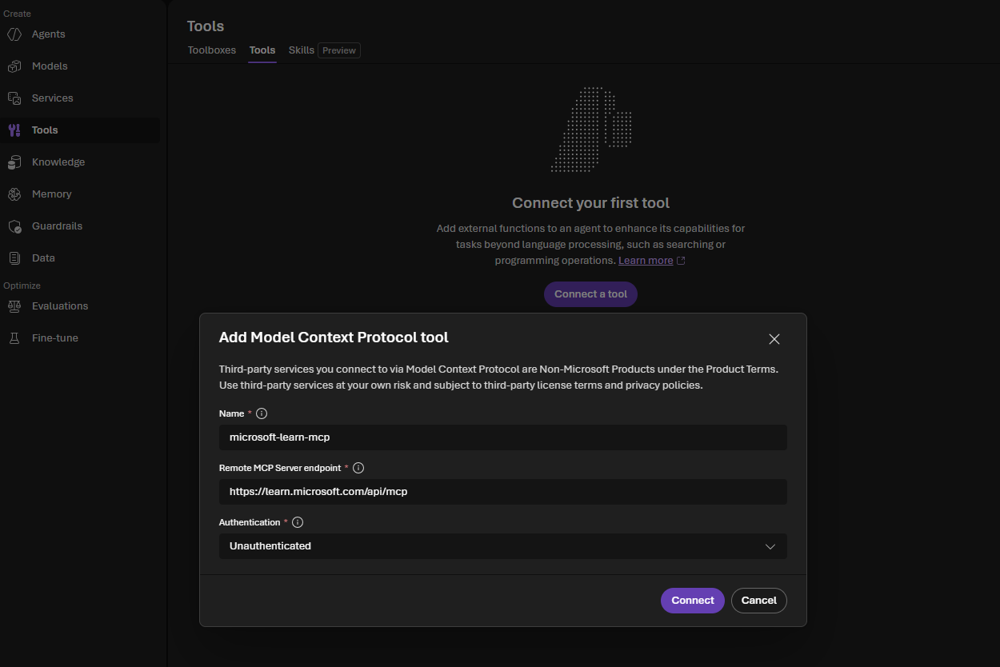
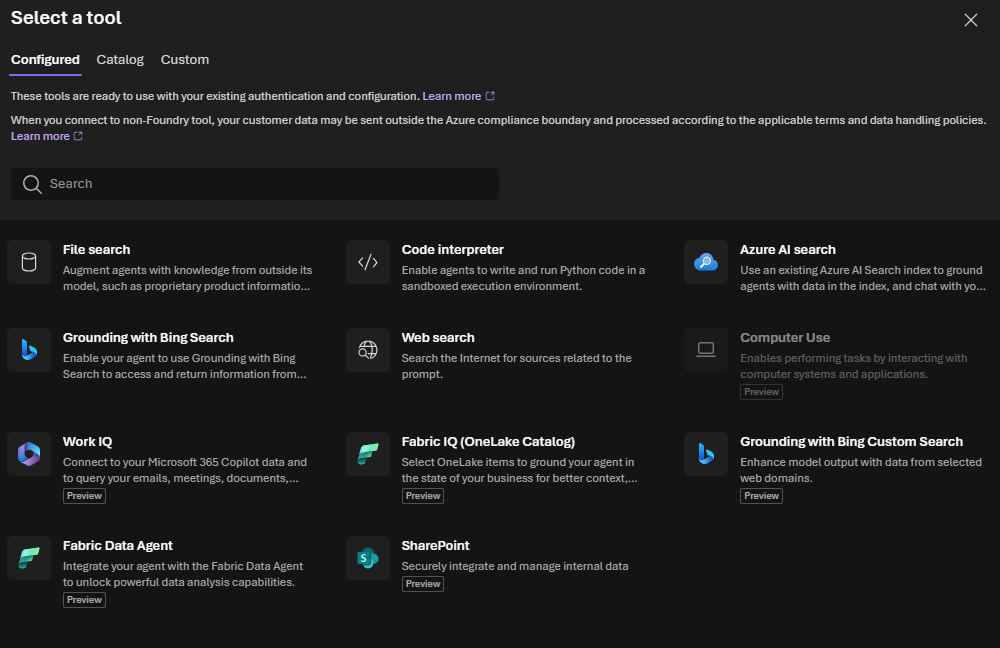

# Part 2 - Beyond the basics: MCP servers, tools, toolboxes, and memory in the Microsoft Foundry SDK

In [Part 1 - Getting started with Microsoft Foundry SDK](/blog/microsoft-foundry/part1-getting-started) we created a Foundry resource, a project, deployed a model, and built our first **Prompt agent** with `PromptAgentDefinition`. That agent could chat — but it couldn't search the web, read your files, call your functions, or remember anything between conversations.

This post is the "rest of the SDK": a rundown of the tool-related API calls Foundry Agent Service supports, shown as small, runnable snippets in **increasing order of complexity**:

1. A single built-in tool (web search)
2. A knowledge source (file search over an uploaded text file containing tabular data)
3. A custom function tool (your own Python code)
4. An external MCP server as a tool
5. Multiple tools bundled behind a **Toolbox**
6. A **memory store** so agents remember things across conversations

Every snippet builds on the project you created in part 1 and prints out what it created, so you can see exactly what's happening.

In [Part 3 - Build a RAG agent with Foundry IQ](/blog/microsoft-foundry/part3-foundryiq-rag) we take the knowledge story further: instead of a small managed vector store, we build an Azure AI Search index from a PDF, turn it into a Foundry IQ knowledge base, and connect that knowledge base to an agent through MCP.

## Prerequisites

```bash
pip install "azure-ai-projects>=2.3.0" azure-identity openai python-dotenv mcp
```

The runnable examples are in the `code` folder. They share these settings
through a `.env` file:

```dotenv
AZURE_AI_PROJECT_ENDPOINT=https://<your-account>.services.ai.azure.com/api/projects/<your-project>
MODEL_DEPLOYMENT=gpt-5-mini
```

The MCP example uses Microsoft's public Learn MCP server:

```dotenv
MCP_SERVER_URL=https://learn.microsoft.com/api/mcp
```

Sign in before running the scripts:

```bash
az login
```

For the simplest setup, configure the Learn MCP server from the Foundry UI:

1. Open the agent's **Select a tool** dialog.
2. Select the **Custom** tab.
3. Choose **Model Context Protocol (MCP)**.
4. Enter `microsoft-learn-mcp` as the **Name**.
5. Enter `https://learn.microsoft.com/api/mcp` as the **Remote MCP Server
   endpoint**.
6. Select **Unauthenticated** and choose **Connect**.

The screenshot illustrates the dialog. For this article, substitute the
Microsoft Learn endpoint and select **Unauthenticated**:



No project connection ID is needed for this public server. Keep only this
setting in `.env`:

```dotenv
MCP_SERVER_URL=https://learn.microsoft.com/api/mcp
```

For a private or authenticated MCP server, add its project connection ID as
`MCP_CONNECTION_NAME`.

```python
import os
from azure.identity import DefaultAzureCredential
from azure.ai.projects import AIProjectClient

PROJECT_ENDPOINT = "https://<your-account>.services.ai.azure.com/api/projects/<your-project>"
MODEL_DEPLOYMENT = "gpt-5-mini"  # the deployment you created in part 1

project = AIProjectClient(
    endpoint=PROJECT_ENDPOINT,
    credential=DefaultAzureCredential(),
)
openai = project.get_openai_client()

print(f"Connected to project: {PROJECT_ENDPOINT}")
```

Every tool below is passed into `PromptAgentDefinition(tools=[...])` — the shape you already know from part 1. What changes is which `Tool` object you put in that list.

The Foundry portal offers several tool types for grounding agents and extending
what they can do:



This article does not cover every option. The sections below demonstrate a few
representative patterns: web search for live public information, file search
for a small managed knowledge source, a custom function for application code,
an external MCP server, a reusable Toolbox, and a memory store for continuity
across conversations.

## 1. Start simple: attach the web search tool

Runnable example: [`code/01_web_search.py`](code/01_web_search.py)

The easiest way to give an agent live, real-world information is the built-in **web search tool**. No extra resource, no toolbox — just add it to the agent's `tools` list.

```python
from azure.ai.projects.models import PromptAgentDefinition, WebSearchTool, WebSearchApproximateLocation

agent = project.agents.create_version(
    agent_name="WebSearchAgent",
    definition=PromptAgentDefinition(
        model=MODEL_DEPLOYMENT,
        instructions="You are a helpful assistant that can search the web.",
        tools=[
            WebSearchTool(
                user_location=WebSearchApproximateLocation(
                    country="GB", city="London", region="London"
                )
            )
        ],
    ),
    description="Agent for web search.",
)
print(f"Agent created (id: {agent.id}, name: {agent.name}, version: {agent.version})")

response = openai.responses.create(
    tool_choice="required",
    input="What is today's date and the weather in Seattle?",
    extra_body={"agent_reference": {"name": agent.name, "type": "agent_reference"}},
)
print(response.output_text)

# Print the sources the model actually used
for item in response.output:
    if item.type == "message":
        for content in item.content:
            for annotation in getattr(content, "annotations", []):
                if annotation.type == "url_citation":
                    print(f"Source: {annotation.url}")
```

`user_location` is an optional, approximate location for the person using the
agent. It gives the search service context for localized results, such as
regional news, nearby businesses, local regulations, or location-sensitive
search ranking. It is not the location that the user is asking about, it is
not precise GPS data, and it does not restrict the search to that place.

That distinction is intentional here: `country="GB"`, `city="London"`, and
`region="London"` describe the approximate user context, while `Seattle` in
the prompt is the independent target of the weather question. A user in
London can ask about the weather in Seattle, just as a user in Brussels can
ask about any other city. Change or omit `WebSearchApproximateLocation` when
localized user context is not relevant.

The model does not inspect your Python `if` statements to decide this. When
the agent is created, Foundry sends the model the available tool definition,
including the tool's name and purpose. When the response is created, the
`tool_choice="required"` argument tells the Responses API that the model must
use a tool for this request. The model then selects `WebSearchTool` because the
prompt asks for current date and weather information—facts that require live
web data. Without `tool_choice="required"`, the model could decide that a
normal conversational answer is sufficient and return text without calling
the tool.

**What just happened:** the model decided a web search was needed, the service ran it, and the response comes back with inline URL citations you can print or show to users.

> There's also `BingGroundingTool` for a paid, dedicated Bing resource with more control (custom search scopes, market/language pinning). Start with `WebSearchTool` — it's the fastest path to a grounded answer.

## 2. Add a knowledge source: file search over tabular data

Runnable example: [`code/02_file_search.py`](code/02_file_search.py)

Web search answers questions about the world. Most real agents also need to answer questions about **your data** — a product catalog, a CSV export, internal docs. The **file search tool** does this by indexing files into a vector store. The retrieval service accepts several document and text formats, but does not currently accept `.csv` files directly, so the runnable example stores CSV-shaped rows in the supported `.txt` format.

The Foundry portal may show this under the agent's **Tools** section rather
than under **Knowledge**. That is not a contradiction: the vector store
(`OrdersKnowledgeBase`) is the knowledge source, while `FileSearchTool` is the
agent capability that searches that source. In other words, **Knowledge** is
the data being indexed and **Tools** is how the agent accesses it. The
vector-store name and ID appear inside the File search tool entry, as in the
portal screenshot.

```python
from pathlib import Path
from azure.ai.projects.models import FileSearchTool

# Any file works here — including a CSV export of your data
orders_path = Path("orders.txt")

# 1. Create a vector store and upload the file into it
vector_store = openai.vector_stores.create(name="OrdersKnowledgeBase")
print(f"Created vector store: {vector_store.id}")

with orders_path.open("rb") as file_handle:
    vector_store_file = openai.vector_stores.files.upload_and_poll(
        vector_store_id=vector_store.id,
        file=file_handle,
    )
print(f"Indexed file: {vector_store_file.id}, status: {vector_store_file.status}")

# 2. Attach the vector store to an agent via the file search tool
agent = project.agents.create_version(
    agent_name="FileSearchAgent",
    definition=PromptAgentDefinition(
        model=MODEL_DEPLOYMENT,
        instructions=(
            "You are a helpful agent that answers questions about orders. "
            "Use file search to look up facts from the uploaded CSV."
        ),
        tools=[FileSearchTool(vector_store_ids=[vector_store.id])],
    ),
    description="File search agent for order data.",
)
print(f"Agent created (id: {agent.id}, name: {agent.name}, version: {agent.version})")

conversation = openai.conversations.create()
response = openai.responses.create(
    conversation=conversation.id,
    input="How many orders are in the file, and what's the largest one?",
    extra_body={"agent_reference": {"name": agent.name, "type": "agent_reference"}},
)
print(response.output_text)

```

**What just happened:** the tabular text file was chunked and embedded into a vector store, and the file search tool lets the model retrieve relevant rows before answering — a lightweight RAG (retrieval-augmented generation) pattern with almost no extra code.

The script prints a small local chunk preview before uploading the file. This
is only an educational approximation so you can see the kind of text that
enters the indexing pipeline. Foundry manages the real chunking and embedding
steps; the service may choose different chunk boundaries, and the generated
embedding vectors are not returned by the vector-store upload API. File search
uses those managed vectors internally to find relevant content for the model.

### File search or Azure AI Search?

These tools solve a similar grounding problem, but they are aimed at
different operating models:

| Choose | Best fit | What you manage |
| --- | --- | --- |
| **File search** | A quick prototype, a small document collection, or data that changes infrequently | Uploading files to a managed vector store; Foundry handles chunking, embeddings, and retrieval |
| **Azure AI Search** | A production knowledge solution, large or frequently changing data, or workloads needing filters and governance | The Azure AI Search service, index schema, data ingestion, skillsets/indexers, permissions, and retrieval configuration |

Use **File search** when you want the shortest path from a file to a working
agent and do not need to control the indexing pipeline. It is convenient for
experiments and demonstrations, but the service-side chunks and embeddings
are managed for you.

Use **Azure AI Search** when search is itself a product capability. It gives
you an explicit index and more control over hybrid keyword/vector search,
semantic ranking, metadata filters, incremental ingestion, scaling, and
security trimming. That control also means more Azure resources, configuration,
operations, and cost. Selecting Azure AI Search in the portal does not upload
your files automatically; you first need an indexed data source and then point
the agent tool at that index.

As a rule of thumb: start with **File search** to validate the agent
experience; choose **Azure AI Search** when you need repeatable ingestion,
search controls, or enterprise governance. The choice is not permanent—you
can move from a file-search prototype to an Azure AI Search-backed agent as
the knowledge workload matures.

## 3. Add a custom function tool

Runnable example: [`code/03_function_tool.py`](code/03_function_tool.py)

Web search and file search cover *external* and *your data* knowledge. Sometimes the agent needs to call **your own code** — a database lookup, an internal API, a calculation. That's the **function tool**.

```python
import json
from azure.ai.projects.models import Tool, FunctionTool
from openai.types.responses.response_input_param import FunctionCallOutput, ResponseInputParam

def get_horoscope(sign: str) -> str:
    """Generate a horoscope for the given astrological sign."""
    return f"{sign}: Next Tuesday you will befriend a baby otter."

# Describe the function so the model knows it exists and how to call it
func_tool = FunctionTool(
    name="get_horoscope",
    parameters={
        "type": "object",
        "properties": {
            "sign": {"type": "string", "description": "An astrological sign like Taurus or Aquarius"},
        },
        "required": ["sign"],
        "additionalProperties": False,
    },
    description="Get today's horoscope for an astrological sign.",
    strict=True,
)

tools: list[Tool] = [func_tool]

agent = project.agents.create_version(
    agent_name="FunctionToolAgent",
    definition=PromptAgentDefinition(
        model=MODEL_DEPLOYMENT,
        instructions="You are a helpful assistant that can use function tools.",
        tools=tools,
    ),
)
print(f"Agent created (id: {agent.id}, name: {agent.name}, version: {agent.version})")

conversation = openai.conversations.create()
response = openai.responses.create(
    input="What is my horoscope? I am an Aquarius.",
    conversation=conversation.id,
    extra_body={"agent_reference": {"name": agent.name, "type": "agent_reference"}},
)

# The model doesn't run your function — YOUR code has to detect the request and run it
input_list: ResponseInputParam = []
for item in response.output:
    if item.type == "function_call" and item.name == "get_horoscope":
        result = get_horoscope(**json.loads(item.arguments))
        print(f"Executed local function -> {result}")
        input_list.append(
            FunctionCallOutput(type="function_call_output", call_id=item.call_id, output=json.dumps({"horoscope": result}))
        )

# Send the tool output back so the model can finish its answer
response = openai.responses.create(
    input=input_list,
    conversation=conversation.id,
    extra_body={"agent_reference": {"name": agent.name, "type": "agent_reference"}},
)
print(f"Final answer: {response.output_text}")

project.agents.delete_version(agent_name=agent.name, agent_version=agent.version)
```

**What just happened:** unlike web/file search, function tools are a two-way handshake — the model *requests* a call, your app *executes* it locally, and you *submit the result back*. This is the pattern to reach for whenever the agent needs to touch your systems, not just public or indexed data.

The model's function-call request is time-limited. After the response run
starts, your application has about 10 minutes to execute the requested
function and submit the matching `function_call_output` using the same
conversation and `call_id`. This does **not** mean that your function or agent
is deleted after 10 minutes; it means that an unanswered pending tool request
can expire. For a quick local function like this horoscope example, the
round-trip is immediate. For a slow or long-running operation, use a
short-running tool that starts or checks a job, or otherwise make sure the
result is returned before the pending request expires.

Think of the request as a temporary ticket:

```text
09:00  Responses API starts a run
09:00  Model returns function_call(call_id="call_123")
09:01  Your application runs get_horoscope(...)
09:01  Your application submits function_call_output(call_id="call_123")
09:01  Model continues and returns the final answer
```

The `call_id` is the correlation key. It connects your result to the exact
function request made by the model; it is not a new conversation ID and should
not be replaced with a generated value. In this example, the loop reads
`item.call_id` and puts that same value into `FunctionCallOutput`.

If your function calls a slow external API, waits for human approval, or
launches a job that may take longer than the request window, do not leave the
model's function call unanswered while waiting. Prefer a small tool that
starts the operation and returns a job ID, followed by another tool that
checks the job status, or move the long-running work outside this
function-call round-trip and then start a new model request with the result.

## 4. Attach an external MCP server as a tool

Runnable example: [`code/04_mcp_tool.py`](code/04_mcp_tool.py)

The [Model Context Protocol (MCP)](https://modelcontextprotocol.io/) is quickly becoming the standard way tools are exposed. Instead of writing a `FunctionTool` yourself, you can point the agent directly at any MCP server — here we use Microsoft's public Learn MCP server.

Before running this example, add the MCP server from the Foundry UI as
described in the prerequisites section. The easiest configuration is:

```dotenv
MCP_SERVER_URL=https://learn.microsoft.com/api/mcp
```

For private or user-specific MCP data, choose an authenticated option in the
UI and add the resulting project connection ID as `MCP_CONNECTION_NAME`.

### 4A. No approval step required

For a trusted, read-only MCP server such as Microsoft Learn, set
`require_approval="never"`. The model can call the MCP tools and continue
without an approval round-trip:

```python
from azure.ai.projects.models import MCPTool, PromptAgentDefinition

from _common import MODEL_DEPLOYMENT, agent_reference, create_clients

project, openai = create_clients()

mcp_tool = MCPTool(
    server_label="learn",
    server_url="https://learn.microsoft.com/api/mcp",
    require_approval="never",
)

agent = project.agents.create_version(
    agent_name="MCPAgentNoApproval",
    definition=PromptAgentDefinition(
        model=MODEL_DEPLOYMENT,
        instructions="Use Microsoft Learn MCP tools as needed.",
        tools=[mcp_tool],
    ),
)
print(f"Agent created: {agent.name} v{agent.version}")

conversation = openai.conversations.create()
response = openai.responses.create(
    conversation=conversation.id,
    input="Find the Microsoft Learn documentation for Azure AI Foundry MCP tools.",
    extra_body=agent_reference(agent.name),
)

print(response.output_text)
```

Use this mode only when automatic calls are acceptable. There is no
`mcp_approval_request` to inspect and no approval response to send.

### 4B. Approval step required

Use `require_approval="always"` when MCP calls can access sensitive data,
change state, incur cost, or require a person to review each call. The
application pauses, asks the person, and sends an `McpApprovalResponse` back:

```python
from azure.ai.projects.models import MCPTool, PromptAgentDefinition
from openai.types.responses.response_input_param import (
    McpApprovalResponse,
    ResponseInputParam,
)

from _common import MODEL_DEPLOYMENT, agent_reference, create_clients

project, openai = create_clients()

mcp_tool = MCPTool(
    server_label="learn",
    server_url="https://learn.microsoft.com/api/mcp",
    require_approval="always",
)

agent = project.agents.create_version(
    agent_name="MCPAgentApproval",
    definition=PromptAgentDefinition(
        model=MODEL_DEPLOYMENT,
        instructions="Use Microsoft Learn MCP tools as needed.",
        tools=[mcp_tool],
    ),
)
print(f"Agent created: {agent.name} v{agent.version}")

conversation = openai.conversations.create()
response = openai.responses.create(
    conversation=conversation.id,
    input="Find the Microsoft Learn documentation for Azure AI Foundry MCP tools.",
    extra_body=agent_reference(agent.name),
)

while True:
    # A response can contain several item types; only approval requests need
    # an application response.
    input_list: ResponseInputParam = []
    for item in response.output:
        if item.type == "mcp_approval_request":
            # Some response items do not expose a name, so use a safe label.
            tool_name = getattr(item, "name", "<unknown>")
            decision = input(
                f"Allow MCP tool '{tool_name}'? [y/N]: "
            ).strip().lower()
            input_list.append(
                McpApprovalResponse(
                    type="mcp_approval_response",
                    approval_request_id=item.id,
                    approve=decision in {"y", "yes"},
                )
            )

    if not input_list:
        break

    # Send the decision back so the model can continue.
    response = openai.responses.create(
        conversation=conversation.id,
        input=input_list,
        extra_body=agent_reference(agent.name),
    )

print(response.output_text)
```

The approval version may ask more than once: the model might search several
times and then fetch the most relevant documentation. The loop handles each
approval round-trip until the final answer is ready.

The script accepts the question as command-line text, so you can change the
request without editing the file:

```powershell
python .\04_mcp_tool.py "What is the current Microsoft Learn guidance for connecting an agent to an MCP server?"
```

The script now pauses at each MCP approval request and asks whether to allow
that specific tool call. Enter `y` to allow it or press Enter to deny it. The
output visibly demonstrates the human-in-the-loop boundary: the model cannot
use the external MCP server until your application sends an approval response.
The loop handles every approval round-trip until the model has finished
responding.

**What just happened:** `require_approval="always"` means every tool call the MCP server wants to make comes back to your app as an `mcp_approval_request` first — useful while you trust a new server, or for anything sensitive. Set it to `"never"` once you're comfortable letting calls run automatically.

## 5. Put multiple tools behind a Toolbox

Runnable example: [`code/05_toolbox.py`](code/05_toolbox.py)

So far each agent got exactly one tool. Real agents usually need several — and re-declaring the same set of tools on every agent gets repetitive fast. A **Toolbox** is a versioned, reusable, MCP-compatible *bundle* of tools that any agent (or even non-Foundry framework like LangGraph or Agent Framework) can connect to as a single MCP endpoint.

```python
from azure.ai.projects.models import MCPToolboxTool, ToolSearchToolboxTool, WebSearchToolboxTool

toolbox_version = project.toolboxes.create_version(
    name="my-toolbox",
    description="Toolbox with web search, an MCP server, and tool search",
    tools=[
        WebSearchToolboxTool(name="web-search"),
        MCPToolboxTool(
            server_label="microsoft-learn",
            server_url="https://learn.microsoft.com/api/mcp",
            require_approval="never",
        ),
        ToolSearchToolboxTool(name="tool-search"),  # lets the agent discover tools dynamically as the toolbox grows
    ],
)
print(f"Created toolbox: {toolbox_version.name}, version: {toolbox_version.version}")

# List all versions of the toolbox
versions = list(project.toolboxes.list_toolbox_versions(name="my-toolbox"))
print(f"Toolbox has {len(versions)} version(s)")
```

> A toolbox allows at most **one unnamed tool per type** (web search, file search, code interpreter, Azure AI Search). Add more instances of the same tool type by giving each a unique `name`.

Once created, the toolbox exposes its own MCP endpoint:

```text
https://<account>.services.ai.azure.com/api/projects/<project>/toolboxes/my-toolbox/versions/1/mcp?api-version=v1
```

The runnable example also connects an agent to that generated endpoint with
`MCPTool`, then sends a question through the Responses API. This is the
important distinction: creating a Toolbox publishes the reusable MCP endpoint;
the agent call is what actually uses the bundled tools.

You can verify what tools are live on that endpoint before wiring it into any agent:

```python
import asyncio
import httpx2
from mcp.client.streamable_http import streamable_http_client
from mcp import ClientSession

toolbox_url = (
    f"{PROJECT_ENDPOINT}/toolboxes/my-toolbox/versions/{toolbox_version.version}/mcp?api-version=v1"
)
token = DefaultAzureCredential().get_token("https://ai.azure.com/.default").token
headers = {"Authorization": "Bearer " + token}

async def verify_toolbox():
    # streamable_http_client takes an httpx2.AsyncClient (not a raw headers
    # dict) and yields just (read, write) in this MCP client version.
    async with httpx2.AsyncClient(headers=headers) as http_client:
        async with streamable_http_client(toolbox_url, http_client=http_client) as (read, write):
            async with ClientSession(read, write) as session:
                await session.initialize()
                tools_result = await session.list_tools()
                print(f"Tools found: {len(tools_result.tools)}")
                for tool in tools_result.tools:
                    print(f"  - {tool.name}: {(tool.description or '')[:80]}")

asyncio.run(verify_toolbox())
```

**What just happened:** you now have a single, versioned, reusable endpoint that bundles several tools. A Prompt agent can attach it with a plain `MCPTool` pointing at the toolbox's endpoint; a Hosted agent built with Microsoft Agent Framework can connect to the same endpoint using `MCPStreamableHTTPTool`. Either way, you manage the tool set in one place instead of duplicating it per agent.

### The agent picks the right tool automatically

A toolbox only exposes two meta-tools over MCP — `tool_search` and `call_tool` — so the model has to *discover* which bundled tool fits the question before invoking it. That means one agent, with no per-question hints from you, can transparently route different questions to different tools:

```python
conversation = openai.conversations.create()

def ask(question: str) -> None:
    response = openai.responses.create(
        conversation=conversation.id,
        input=question,
        extra_body=agent_reference(agent.name),
    )
    print(response.output_text)

    # Every toolbox invocation shows up as an mcp_call for "call_tool" — the
    # arguments reveal which underlying tool the model actually chose.
    for item in response.output:
        if item.type == "mcp_call" and item.name == "call_tool":
            args = json.loads(item.arguments)
            print(f"[toolbox routed to: {args.get('name')}]")

# A documentation question — the model should route to the Microsoft Learn MCP tool
ask("Find the official Microsoft Learn documentation for Azure AI Foundry MCP tools.")

# A live/current-events question — the model should route to web search instead
ask("What is today's top news headline about Microsoft?")
```

Sample output:

```text
[toolbox routed to: microsoft-learn___microsoft_docs_search]
...
[toolbox routed to: web-search]
```

Same agent, same toolbox, same conversation — but the model picked a different tool for each question based on what it needed. This is the payoff of bundling tools behind a Toolbox: you don't have to hardcode which tool answers which question, and you can add more tools later without touching agent code, only the toolbox definition.

The agent's instructions matter here: tell it explicitly that it has multiple tools available via `tool_search`/`call_tool`, and to pick the one that best fits the question (Microsoft Learn for documentation, web search for anything current or outside the docs). Without that nudge, the model may default to whichever tool it tried first instead of actively comparing options.

## 6. Give the agent memory across conversations

Runnable example: [`code/06_memory.py`](code/06_memory.py)

Everything so far lives inside a single run or conversation. A **memory store** lets an agent remember facts about a user (preferences, prior context) and recall them automatically in future, unrelated conversations.

```python
import os
from datetime import timedelta
from azure.ai.projects.models import MemoryStoreDefaultDefinition, MemoryStoreDefaultOptions

# Memory needs both a chat model deployment and an embedding model deployment
CHAT_MODEL = MODEL_DEPLOYMENT
EMBEDDING_MODEL = "text-embedding-3-small"  # deploy this in Foundry first

memory_store_name = "my_memory_store"

options = MemoryStoreDefaultOptions(
    chat_summary_enabled=True,
    user_profile_enabled=True,
    procedural_memory_enabled=True,
    default_ttl_seconds=timedelta(days=30),
    user_profile_details="Avoid irrelevant or sensitive data, such as age, financials, precise location, and credentials",
)

definition = MemoryStoreDefaultDefinition(
    chat_model=CHAT_MODEL,
    embedding_model=EMBEDDING_MODEL,
    options=options,
)

memory_store = project.beta.memory_stores.create(
    name=memory_store_name,
    definition=definition,
    description="Memory store with procedural memory and 30-day default TTL",
)
print(f"Created memory store: {memory_store.name}")
```

Now attach the **memory search tool** to a Prompt agent so it reads/writes memories during conversations:

```python
from azure.ai.projects.models import MemorySearchPreviewTool

scope = "user_123"  # associate memories with a specific user

agent = project.agents.create_version(
    agent_name="MemoryAgent",
    definition=PromptAgentDefinition(
        model=CHAT_MODEL,
        instructions="You are a helpful assistant that answers general questions",
        tools=[
            MemorySearchPreviewTool(
                memory_store_name=memory_store_name,
                scope=scope,
                update_delay=1,  # wait 1s of inactivity before updating memories (use ~300s in production)
            )
        ],
    ),
)
print(f"Agent created (id: {agent.id}, name: {agent.name}, version: {agent.version})")
```

And search for what the agent has remembered:

```python
from azure.ai.projects.models import MemorySearchOptions

query_message = {"role": "user", "content": "What are my coffee preferences?", "type": "message"}

search_response = project.beta.memory_stores.search_memories(
    name=memory_store_name,
    scope=scope,
    items=[query_message],
    options=MemorySearchOptions(max_memories=5),
)
print(f"Found {len(search_response.memories)} memories")
for memory in search_response.memories:
    print(f"  - {memory.memory_item.memory_id}: {memory.memory_item.content}")
```

If you run this right after creating the store, you'll see `Found 0 memories` — that's expected. The store starts empty; nothing has *taught* it anything yet. To see memory actually working, have a conversation first, then search:

```python
import time

# Step 1: have a conversation where the user states a fact worth remembering.
# The memory search tool extracts and stores durable facts like this in the
# background as the conversation happens. Let the reader type their own fact
# instead of hard-coding one, so the recall step below feels genuinely live.
default_fact = "I only drink oat milk lattes, no other coffee. Please remember that."
user_fact = input(f"Tell the agent something to remember [{default_fact}]: ").strip() or default_fact

conversation = openai.conversations.create()
teach_response = openai.responses.create(
    conversation=conversation.id,
    input=user_fact,
    extra_body=agent_reference(agent.name),
)
print(f"Agent replied: {teach_response.output_text}")

# Memory extraction runs asynchronously after the response, so give it a
# moment before searching (in production, update_delay=1 above still means
# near-instant extraction, but a short buffer avoids a race on first run).
time.sleep(5)

# Step 2: search the memory store directly to prove the fact was captured.
# Reuse whatever the reader just taught the agent as the query, so it stays
# relevant to what was actually stored.
recall_question = f"What do you remember about: {user_fact}"
query_message = {"role": "user", "content": recall_question, "type": "message"}

search_response = project.beta.memory_stores.search_memories(
    name=memory_store_name,
    scope=scope,
    items=[query_message],
    options=MemorySearchOptions(max_memories=5),
)
print(f"Found {len(search_response.memories)} memories")
for memory in search_response.memories:
    print(f"  - {memory.memory_item.memory_id}: {memory.memory_item.content}")

# Step 3: ask the agent the same question in a brand-new conversation. The
# memory search tool retrieves the stored fact automatically, so the agent
# can answer correctly without the user repeating themselves.
new_conversation = openai.conversations.create()
recall_response = openai.responses.create(
    conversation=new_conversation.id,
    input=recall_question,
    extra_body=agent_reference(agent.name),
)
print(f"Agent recalled: {recall_response.output_text}")
```

Sample output (with the default fact accepted by pressing Enter):

```text
Tell the agent something to remember [I only drink oat milk lattes, no other coffee. Please remember that.]:
Agent replied: Got it — I'll remember that you only drink oat milk lattes, no other coffee.
Found 1 memories
  - dXNlcl8xMjM_c27528ab8f454de791dbb9649acb30a6:  The user only drinks oat milk lattes, no other coffee.
Agent recalled: You only drink oat milk lattes, and you prefer oat milk as the milk choice for coffee drinks.
```

Type your own fact instead — a favorite programming language, a dietary restriction, a project you're working on — and the script asks the same question back to prove it was remembered, not just echoed within one conversation.

**What just happened:** the memory store extracts durable facts from conversations (respecting `scope`, TTL, and the privacy guidance you configure in `user_profile_details`), and the memory search tool lets any agent attached to that store retrieve relevant memories before responding. Notice the fact was stated in one conversation and recalled correctly in a completely separate, brand-new conversation — that's the difference between memory and a conversation's own history: a user doesn't have to repeat themselves the next time they show up.

> The memory store itself doesn't version like a Toolbox does — re-running the create call against a name that already exists returns a `bad_request`/"already exists" error. The runnable script handles this by catching that error and reusing the existing store via `project.beta.memory_stores.get(name=...)`.

## Putting it together

A realistic agent usually combines several of these: a Toolbox for external capabilities, a Function tool for your own systems, and a Memory store for continuity.

```python
from azure.ai.projects.models import PromptAgentDefinition, MCPTool, MemorySearchPreviewTool

# The toolbox's MCP endpoint requires the same bearer token used to verify it earlier.
toolbox_token = DefaultAzureCredential().get_token("https://ai.azure.com/.default").token

full_agent = project.agents.create_version(
    agent_name="FullFeaturedAgent",
    definition=PromptAgentDefinition(
        model=MODEL_DEPLOYMENT,
        instructions="You are a helpful assistant with tools, a toolbox, and memory.",
        tools=[
            func_tool,  # custom function from step 3
            MCPTool(  # this agent's own toolbox, exposed as an MCP endpoint
                server_label="my-toolbox",
                server_url=toolbox_url,
                authorization=toolbox_token,
                require_approval="never",
            ),
            MemorySearchPreviewTool(memory_store_name=memory_store_name, scope=scope),
        ],
    ),
)
print(f"Full-featured agent created (id: {full_agent.id}, version: {full_agent.version})")
```

## Cleanup

The examples intentionally leave created resources available for inspection.
When you are finished experimenting, clean them up explicitly. For the
file-search example, use the IDs printed by the script:

```python
from _common import create_clients

project, openai = create_clients()

project.agents.delete_version(agent_name="FileSearchAgent", agent_version="1")
openai.vector_stores.delete("vs_<vector-store-id>")
```

The agent version and vector-store ID may differ in your run. The remaining
examples use the same pattern: delete the agent version you created, delete
the memory store when finished, and remove any Toolbox versions or project
connections that are no longer needed.

```python
project.agents.delete_version(agent_name=full_agent.name, agent_version=full_agent.version)
project.beta.memory_stores.delete(memory_store_name)
print("Cleaned up agent and memory store")
```

## What to try next

- Swap `WebSearchTool` for `BingGroundingTool` once you need a paid Bing resource with custom search scopes.
- Explore the other Toolbox tool types: Azure AI Search, Code Interpreter, OpenAPI, Agent-to-Agent, Browser Automation, Fabric IQ, and Work IQ.
- Try `require_approval="always"` on MCP tools in development, and only relax it to `"never"` once you trust the server.
- Look at `project.beta.memory_stores.update_memory` / `delete_memory` / `list_memories` for full memory item CRUD — not just search.
- If you're building custom agent *code* rather than a config-only Prompt agent, look at **Microsoft Agent Framework** — it can consume the exact same Toolbox MCP endpoint via `MCPStreamableHTTPTool`.

## Closing note

Every tool type here — web search, file search, function tools, MCP, toolboxes, memory — plugs into the same `tools=[...]` list on `PromptAgentDefinition` you learned in part 1. Once you're comfortable with that one pattern, adding new capabilities to an agent is mostly a matter of picking the right `Tool` class and grounding it with a resource (a vector store, a connection, a toolbox, a memory store). Start small, verify each tool in isolation with `print()` statements like the ones above, then compose them together once you trust each piece.

Next up: **[Part 3 – Build a RAG agent with Foundry IQ](/blog/microsoft-foundry/part3-foundryiq-rag)** — turning a PDF into an Azure AI Search knowledge base and connecting it to a Foundry agent through MCP.

---

## Runnable Sample Code

The code is split into six focused scripts that correspond to the sections
above. Run them from the `code` directory:

| Section | Script |
| --- | --- |
| Web search | [`01_web_search.py`](code/01_web_search.py) |
| File search over tabular text | [`02_file_search.py`](code/02_file_search.py) |
| Custom function tool | [`03_function_tool.py`](code/03_function_tool.py) |
| External MCP server | [`04_mcp_tool.py`](code/04_mcp_tool.py) |
| Toolbox | [`05_toolbox.py`](code/05_toolbox.py) |
| Memory store | [`06_memory.py`](code/06_memory.py) |

For example:

```powershell
python .\01_web_search.py
python .\02_file_search.py
python .\03_function_tool.py
python .\04_mcp_tool.py
python .\05_toolbox.py
python .\06_memory.py
```

The file-search example uses the accompanying
[`orders.txt`](code/orders.txt) sample data. The scripts leave resources
available for inspection; use the cleanup section above when you are finished.

---

*Sources: [Microsoft Foundry documentation](https://learn.microsoft.com/azure/foundry/), [Tool resources in Prompt Agent Definition](https://learn.microsoft.com/azure/foundry/concepts/agents/tools), [MCP Tool in Agent Definition](https://learn.microsoft.com/azure/foundry/concepts/agents/tools-mcp), [Memory Stores](https://learn.microsoft.com/azure/foundry/concepts/agents/memory), [Azure AI Search Integration](https://learn.microsoft.com/azure/foundry/how-to/agents/tools-search).*
