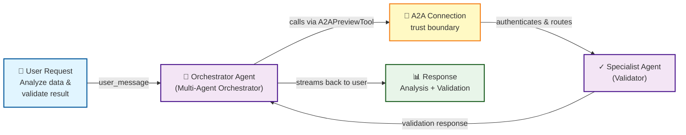

# Microsoft Foundry SDK: Part 4 – Multi-Agent Orchestration

Building on parts 1–3, you now know how to create individual agents, attach tools, and observe their behavior. But production systems often need **multiple specialized agents** working together—a dispatcher coordinating with experts, a content reviewer validating an analyst's output, or a fallback chain when one agent can't handle a request.

This post introduces the **Agent-to-Agent (A2A)** pattern: a native SDK way for one Foundry agent to call another agent as a tool. You'll expose a specialist agent as an endpoint, create an A2A connection, and orchestrate calls from a coordinator agent—all with real Python snippets.

## Prerequisites

- Azure CLI authenticated: `az account show`
- A Foundry project with `azure-ai-projects` >= 1.14.0 and `openai` >= 1.58.0
- Two agents already created (or use the part 1 template to create them)
- Basic understanding of agents and tools (parts 1–2)

## Step 1: Recap – Your Baseline Single Agent

Recall the part 1 pattern: create an agent, attach tools, invoke via `responses.create()`:

```python
from azure.ai.projects import AIProjectClient
from azure.ai.projects.models import PromptAgentDefinition, ToolUseBlock
from openai.types.chat import ChatCompletionMessageParam

# Initialize Foundry client
project_client = AIProjectClient.from_config()

# Define a simple analyst agent
analyst_agent = PromptAgentDefinition(
    name="analyst-agent",
    instructions="You are a data analyst. Analyze the data and provide insights."
)

# Create agent
project_client.agents.create_agent(
    agent_definition=analyst_agent,
    model="gpt-4o-mini"
)
print("✓ Analyst agent created")

# Invoke the agent
response = project_client.agents.create_response(
    agent_name="analyst-agent",
    user_message="What is the trend in Q3 sales?"
)

print(f"✓ Response received: {response.output_text}")
```

In a multi-agent scenario, you might want to send the analyst's output to a **review agent** for validation before returning to the user. This is where A2A comes in.

## Step 2: Expose a Specialist Agent as an A2A Target

The specialist agent (e.g., a reviewer) must be enabled as an A2A endpoint. Use `project.agents.update_details()` to configure it:

```python
from azure.ai.projects.models import (
    AgentEndpointConfig,
    ProtocolConfiguration,
    ResponsesProtocolConfiguration,
    A2AProtocolConfiguration,
    AgentCard,
    AgentCardSkill
)

# Enable the specialist agent (reviewer) as an A2A target
specialist_name = "reviewer-agent"

project_client.agents.update_details(
    agent_name=specialist_name,
    agent_endpoint=AgentEndpointConfig(
        protocol_configuration=ProtocolConfiguration(
            responses=ResponsesProtocolConfiguration(),
            a2a=A2AProtocolConfiguration()
        )
    ),
    agent_card=AgentCard(
        version="1.0",
        description="Reviews and validates analysis",
        skills=[
            AgentCardSkill(
                id="validate",
                name="Content Validation",
                description="Validates the accuracy and completeness of analysis"
            )
        ]
    )
)

print(f"✓ {specialist_name} exposed as A2A target")
print(f"  Card published at: /.../endpoint/protocols/a2a/agentCard/v1.0")
```

**What happened?**
- The specialist agent can now receive calls from other agents
- Its `AgentCard` is published at `.../agentCard/v1.0` (Foundry hosts this automatically)
- Incoming calls authenticate via Microsoft Entra ID (no key-based auth)

## Step 3: Create an A2A Connection

An A2A connection represents the link between your orchestrator and the specialist. Create it in the Foundry portal or via REST, then retrieve it by name in the SDK:

```python
# After creating the connection in portal (or via REST PUT),
# retrieve the connection ID from the project
connection = project_client.connections.get(name="specialist-connection")
connection_id = connection.id

print(f"✓ A2A connection created")
print(f"  Connection ID: {connection_id}")
```

The connection holds the Foundry project ID of the specialist and establishes the trust boundary.

## Step 4: Create an Orchestrator Agent with A2APreviewTool

Now create the orchestrator agent with an `A2APreviewTool` that references the specialist:

```python
from azure.ai.projects.models import PromptAgentDefinition, A2APreviewTool

# Define the orchestrator agent
orchestrator = PromptAgentDefinition(
    name="orchestrator-agent",
    instructions="""You are an orchestrator agent. 
1. First, call the specialist-agent to review and validate the analysis.
2. Wait for the response.
3. Return the specialist's feedback to the user.""",
    tools=[
        A2APreviewTool(
            project_connection_id=connection_id
        )
    ]
)

# Create the orchestrator
project_client.agents.create_agent(
    agent_definition=orchestrator,
    model="gpt-4o-mini"
)

print("✓ Orchestrator agent created with A2APreviewTool")
```

**What is A2APreviewTool?**
- A tool that calls another Foundry agent by name
- The connection ID tells the SDK which Foundry project to find the specialist in
- Supports tool choice ("always use this tool") or optional use
- Currently text-only (no image/audio streaming)

## Step 5: Orchestrator Calling Specialist – Streaming Response

The orchestrator invokes the specialist via `responses.create()`. The specialist name is passed via `agent_reference`:

```python
# Orchestrator makes a request that internally calls the specialist
response = project_client.agents.create_response(
    agent_name="orchestrator-agent",
    user_message="Analyze sales trends and get them reviewed.",
    extra_body={
        "agent_reference": {
            "agent_name": "reviewer-agent"
        }
    },
    stream=True
)

# Stream the orchestrator's response
print("✓ Orchestrator response (streaming):")
for chunk in response:
    if hasattr(chunk, 'output_text') and chunk.output_text:
        if hasattr(chunk.output_text, 'delta'):
            print(chunk.output_text.delta, end="", flush=True)
        elif chunk.output_text.value:
            print(chunk.output_text.value)

print("\n✓ A2A call completed")
```

**What happened?**
- The orchestrator received the user's request
- It detected that it should use the specialist (via tool choice)
- It called the specialist agent via A2A protocol
- The specialist processed the request and returned a response
- The orchestrator streamed back the results

## Step 6: Hosted Agent Variant – Toolbox Pattern (Optional)

If you're using a **Hosted agent** as the orchestrator, use the Microsoft Agent Framework with a toolbox:

```python
from agent_framework.foundry import FoundryChatClient
from agent_framework.foundry import A2APreviewToolboxTool

# Initialize Foundry chat client (for Hosted agents)
chat_client = FoundryChatClient(
    project_endpoint="<your-foundry-endpoint>",
    model="gpt-4o-mini",
    agent_name="orchestrator-hosted-agent"
)

# Define A2A tools in a toolbox
a2a_tools = {
    "specialist": A2APreviewToolboxTool(
        project_connection_id=connection_id,
        agent_name="reviewer-agent"
    )
}

# Send a request with the A2A tool available
response = chat_client.chat(
    "Analyze and review sales data",
    tools=a2a_tools
)

print(f"✓ Hosted orchestrator response: {response}")
```

This pattern mirrors the toolbox approach from part 2—multiple tools can be grouped and the agent chooses which to invoke.

## Step 7: Combined Multi-Agent Orchestration Snippet

Here's a complete example tying it all together:

```python
from azure.ai.projects import AIProjectClient
from azure.ai.projects.models import (
    PromptAgentDefinition, A2APreviewTool,
    AgentEndpointConfig, ProtocolConfiguration,
    ResponsesProtocolConfiguration, A2AProtocolConfiguration,
    AgentCard, AgentCardSkill
)

project_client = AIProjectClient.from_config()

# === Setup: Expose specialist as A2A target ===
project_client.agents.update_details(
    agent_name="specialist-agent",
    agent_endpoint=AgentEndpointConfig(
        protocol_configuration=ProtocolConfiguration(
            responses=ResponsesProtocolConfiguration(),
            a2a=A2AProtocolConfiguration()
        )
    ),
    agent_card=AgentCard(
        version="1.0",
        description="Specialist agent",
        skills=[]
    )
)

# === Setup: Get A2A connection ===
connection = project_client.connections.get(name="specialist-connection")

# === Create orchestrator with A2A tool ===
orchestrator = PromptAgentDefinition(
    name="multi-agent-orchestrator",
    instructions="Coordinate with specialist agent. Call specialist for validation.",
    tools=[A2APreviewTool(project_connection_id=connection.id)]
)

project_client.agents.create_agent(
    agent_definition=orchestrator,
    model="gpt-4o-mini"
)

# === Invoke orchestrator ===
response = project_client.agents.create_response(
    agent_name="multi-agent-orchestrator",
    user_message="Process and validate customer data",
    extra_body={"agent_reference": {"agent_name": "specialist-agent"}},
    stream=True
)

print("✓ Multi-agent orchestration:")
for chunk in response:
    if hasattr(chunk, 'output_text') and chunk.output_text and hasattr(chunk.output_text, 'delta'):
        print(chunk.output_text.delta, end="", flush=True)

print("\n✓ Complete")
```

## Multi-Agent Orchestration Flow



## Cleanup

Remove the A2A endpoint from the specialist agent:

```python
# Disable A2A endpoint
project_client.agents.update_details(
    agent_name="specialist-agent",
    agent_endpoint=None  # Clear endpoint config
)

print("✓ A2A endpoint removed")

# Optionally, delete agents
project_client.agents.delete_agent(agent_name="orchestrator-agent")
project_client.agents.delete_agent(agent_name="specialist-agent")

print("✓ Multi-agent orchestration cleaned up")
```

## What to Try Next

1. **Cascade multiple specialists**: Create a chain where orchestrator → specialist A → specialist B
2. **Tool selection logic**: Use tool choice (`"auto"`, `"required"`, or specify by name) to control when the specialist is called
3. **Error handling**: Add retry loops if A2A calls fail (e.g., specialist timeout)
4. **Hybrid multi-region**: Call specialists in different Foundry projects via separate A2A connections
5. **Mixing modalities** (future): When Foundry A2A supports multimodal, pass images or voice between agents

## Key Takeaways

- **A2A Pattern**: Native way for Foundry agents to call each other as tools
- **Two Roles**: Orchestrator (caller) with `A2APreviewTool`, Specialist (target) with `AgentEndpointConfig`
- **Authentication**: Entra ID–based, project-scoped connections
- **Hosted Agents**: Use `A2APreviewToolboxTool` + Microsoft Agent Framework for the same pattern
- **Scale**: Coordinate dozens of agents across projects without custom middleware
- **Limitations**: Text-only, preview feature, not yet production-ready

Next up: **Part 5** – Deploying agents to production with versioning, blue-green rollouts, and environment management.

---

## Full Sample Code

The complete working example for this post is available on GitHub:

**[part4_multi_agent_orchestration.py](code/part4_multi_agent_orchestration.py)**

Run it locally:
```bash
python part4_multi_agent_orchestration.py
```

---

*Sources: [Agent-to-Agent (A2A) Communication Preview](https://learn.microsoft.com/azure/foundry/concepts/agents/agent-to-agent), [A2A Tool in Agent Definition](https://learn.microsoft.com/azure/foundry/concepts/agents/tools-a2a), [Microsoft Agent Framework](https://learn.microsoft.com/azure/foundry/concepts/agents/agent-framework), [Hosted Agents in Microsoft Agent Framework](https://learn.microsoft.com/azure/foundry/how-to/agents/hosted-agents-agent-framework).*
