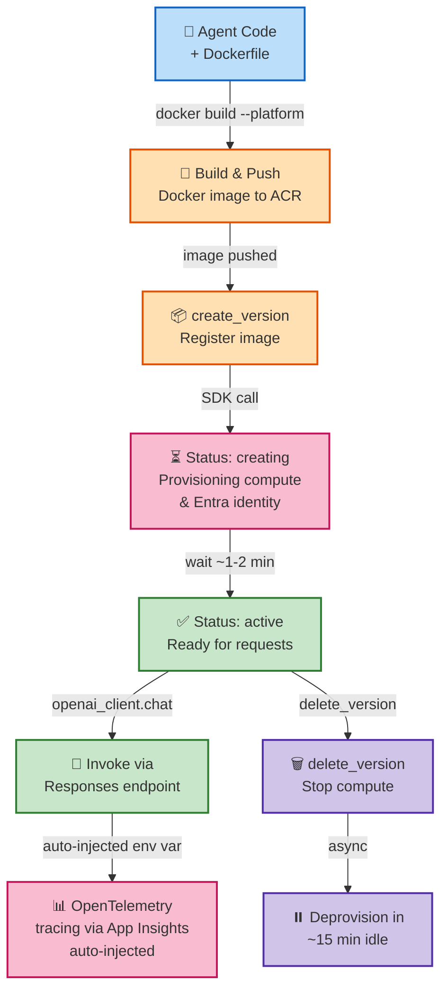

# Microsoft Foundry SDK: Part 5 – Deploying Hosted Agents

You've built sophisticated agents in the Foundry project environment (parts 1–4). But production demands **persistent, scalable infrastructure**: agents that run 24/7, scale to thousands of concurrent users, and remain isolated from development workspaces.

This post walks through **Hosted Agent deployment**—containerizing your agent, pushing to Azure Container Registry, provisioning managed compute, and invoking via production endpoints. You'll see both the **Python SDK path** (full control, explicit steps) and the **`azd` shortcut** (automated, convention-over-configuration).

## Prerequisites

- Azure CLI authenticated: `az account show`
- A Foundry project with `azure-ai-projects` >= 2.3.0
- Docker installed and running locally
- An existing agent (use part 1 template, add tools from part 2 if desired)
- Container Registry access (create via `az acr create --resource-group <rg> --name <name> --sku Basic`)
- Foundry Project Manager role on your project

## Step 1: Choose Your Deployment Method

Before diving into code, you need to pick **how** you're deploying your agent. Foundry supports **three approaches**, each with different tradeoffs:

| Deployment Method | Best For | Packaging | Inner Loop | Container Registry |
|---|---|---|---|---|
| **Source Code (ZIP)** | Most teams, fastest dev cycle, Python/C# only | `main.py` + `requirements.txt` | `azd up` or SDK | Not needed |
| **Container (Docker)** | Multi-language agents, existing Docker workflows, complex dependencies | Dockerfile → ACR | Docker build/push | Required (ACR) |
| **Azure Developer CLI** | First-time deployments, guided setup, both paths | Chosen by tooling | Interactive wizards | Auto-created if needed |

**Recommendation for beginners**: Start with **Source Code (ZIP)** – smallest upload, no Docker needed, platform handles dependency resolution.

This section covers **both Container and Source Code paths**. The container path is perfect if you have existing Docker expertise or multi-language requirements; the ZIP path is simpler and faster for Python/C# development.

## Step 2: Understand Hosted Agent Protocols

A Hosted agent can expose multiple **protocols**, each for a different client pattern:

| Protocol | URL Path | Use Case | Streaming |
|----------|----------|----------|-----------|
| **Responses** | `/responses` | Conversational, chat-like | ✓ Yes (SSE) |
| **Invocations** | `/invocations` | Webhook/non-conversational, batch | ✗ No |
| **Invocations WS** | `/invocations_ws` | WebSocket, voice/bidirectional | ✓ Yes |

For this post, we'll focus on **Responses** (most common). Your container can expose multiple protocols—the SDK lets you choose which versions to deploy:

```python
from azure.ai.projects.models import ProtocolVersionRecord, AgentEndpointProtocol

# Define which protocols this agent will expose
protocol_versions = [
    ProtocolVersionRecord(
        protocol=AgentEndpointProtocol.RESPONSES,
        version="1.0.0"
    ),
    # Optionally add more:
    # ProtocolVersionRecord(
    #     protocol=AgentEndpointProtocol.INVOCATIONS,
    #     version="1.0.0"
    # )
]

print(f"✓ Protocols defined: {[p.protocol for p in protocol_versions]}")
```

---

## Path A: Source Code (ZIP) Deployment – Fastest Inner Loop

If you're using Python or C# and want to skip Docker entirely, use **ZIP deployment**. You upload a zip file of your source code, and Foundry either runs it as-is (`bundled` mode) or installs dependencies server-side (`remote_build` mode).

### Path A, Step 1: Choose Dependency Resolution

Before packaging, decide how you want dependencies handled:

```python
# Two strategies:

# 1. Remote Build (Recommended for beginners)
# Foundry installs dependencies from requirements.txt at deployment time
# - Smaller upload size
# - Simplest inner loop
# - Requires stable PyPI/NuGet access
dependency_resolution = "remote_build"

# 2. Bundled (For reproducible builds or private dependencies)
# You ship prebuilt dependencies in the zip (wheels for Python, publish output for C#)
# - Full control, reproducible
# - Larger upload (up to 250 MB)
# - Private deps don't need PyPI access
dependency_resolution = "bundled"

print(f"✓ Using dependency_resolution: {dependency_resolution}")
```

### Path A, Step 2: Package Your Agent as a ZIP

#### Python (remote_build):

```bash
# Create your agent directory
mkdir my-agent && cd my-agent

# Minimal requirements
cat > main.py << 'EOF'
# agent.py
from azure.ai.projects import AIProjectClient
from azure.ai.projects.models import PromptAgentDefinition

project_client = AIProjectClient.from_config()

agent_def = PromptAgentDefinition(
    name="my-zip-agent",
    instructions="You are a helpful assistant deployed from ZIP."
)

project_client.agents.create_agent(
    agent_definition=agent_def,
    model="gpt-4o-mini"
)

print("✓ Agent created from ZIP deployment")
EOF

cat > requirements.txt << 'EOF'
azure-ai-projects>=2.3.0
openai>=1.58.0
python-dotenv
EOF

# Create the ZIP (flat structure, no wrapper folder)
zip agent-code.zip main.py requirements.txt

echo "✓ ZIP created: agent-code.zip"
```

#### C# (remote_build):

```bash
# Project structure (no bin/, obj/, or publish/ output)
cat > agent-code.zip << 'EOF'
MyAgent.csproj
Program.cs
<additional .cs files>
EOF

# The server will run: dotnet restore && dotnet publish

echo "✓ ZIP created: agent-code.zip"
```

### Path A, Step 3: Deploy via SDK (Zip Upload)

```python
import hashlib
from azure.ai.projects import AIProjectClient
from azure.ai.projects.models import (
    PromptAgentDefinition,
    CodeConfiguration,
    ProtocolVersionRecord,
    AgentEndpointProtocol
)

project_client = AIProjectClient.from_config()

# 1. Read and hash the ZIP
with open("agent-code.zip", "rb") as f:
    zip_bytes = f.read()
    zip_sha256 = hashlib.sha256(zip_bytes).hexdigest()

print(f"✓ ZIP ready: {len(zip_bytes)} bytes, SHA-256: {zip_sha256[:16]}...")

# 2. Define code configuration
code_config = CodeConfiguration(
    runtime="python_3_13",  # or "dotnet_8_0" for C#
    entry_point=["python", "main.py"],
    dependency_resolution="remote_build"  # or "bundled"
)

# 3. Create the agent from ZIP
agent_def = PromptAgentDefinition(
    name="zip-deployed-agent",
    instructions="I'm deployed from source code ZIP"
)

version_resp = project_client.agents.create_version(
    agent_definition=agent_def,
    code_configuration=code_config,
    protocol_versions=[
        ProtocolVersionRecord(
            protocol=AgentEndpointProtocol.RESPONSES,
            version="1.0.0"
        )
    ]
)

print(f"✓ ZIP deployed")
print(f"  Version: {version_resp.version}")
print(f"  Status: {version_resp.status}")  # "creating" initially
```

### Path A, Step 4: Poll Until Active & Invoke

```python
import time

agent_name = version_resp.agent_name
version = version_resp.version

# Poll until active (same as container path)
print(f"⏳ Polling for ZIP deployment status...")
while True:
    version_info = project_client.agents.get_version(
        agent_name=agent_name,
        agent_version=version
    )
    status = version_info.status
    print(f"  Status: {status}")
    
    if status == "active":
        print(f"✓ ZIP-deployed agent is active!")
        break
    elif status == "failed":
        print(f"✗ Deployment failed: {version_info.error_message}")
        break
    
    time.sleep(10)

# Invoke (same as container path)
openai_client = project_client.get_openai_client(
    agent_name=agent_name
)

response = openai_client.chat.completions.create(
    model="gpt-4o-mini",
    messages=[
        {"role": "user", "content": "What's your deployment method?"}
    ]
)

print(f"✓ ZIP-deployed agent response:")
print(f"  {response.choices[0].message.content}")
```

### Path A Advantages

- ✅ **No Docker needed** – pure ZIP upload
- ✅ **Smaller payload** – remote_build installs deps server-side
- ✅ **Faster iteration** – skip Docker build/push steps
- ✅ **Python & C# friendly** – natural for managed languages
- ✅ **Content-addressable versioning** – same ZIP = same version ID

---

## Step 3 (Container Path): Package Your Agent in a Container

Hosted agents run in Docker containers. Create a **Dockerfile** that:
## Step 3 (Container Path): Package Your Agent in a Container

Hosted agents run in Docker containers. Create a **Dockerfile** that:
1. Starts from a Python base image
2. Installs `azure-ai-agentserver-responses` (protocol library)
3. Copies your agent code
4. Runs an HTTP server on port 8088

Example **Dockerfile**:

```dockerfile
FROM python:3.11-slim

WORKDIR /app

# Install the Foundry agent server protocol library
RUN pip install --no-cache-dir azure-ai-agentserver-responses

# Copy your agent code
COPY agent.py .
COPY requirements.txt .
RUN pip install --no-cache-dir -r requirements.txt

# Expose port 8088 (Foundry standard)
EXPOSE 8088

# Start the agent server
CMD ["python", "-m", "azure.ai.agentserver.responses", "agent:app", "--host", "0.0.0.0", "--port", "8088"]
```

Example **agent.py** (minimal Responses-protocol agent):

```python
# agent.py
from azure.ai.agentserver.responses import app
from azure.ai.projects import AIProjectClient
from azure.ai.projects.models import PromptAgentDefinition

# Initialize Foundry client (uses env vars injected by platform)
project_client = AIProjectClient.from_config()

# Define your agent
agent_def = PromptAgentDefinition(
    name="my-hosted-agent",
    instructions="You are a helpful assistant."
)

# Create agent (or reference existing one)
project_client.agents.create_agent(
    agent_definition=agent_def,
    model="gpt-4o-mini"
)

# The 'app' from agentserver.responses handles routing and invocation
# Foundry platform will call your agent via this app
```

Example **requirements.txt**:

```
azure-ai-projects>=2.3.0
azure-ai-agentserver-responses>=1.0.0
openai>=1.58.0
python-dotenv
```

Build and push to your registry:

```bash
# Build for Linux (required for hosted agents)
docker build --platform linux/amd64 -t <registry>.azurecr.io/my-hosted-agent:v1.0.0 .

# Login and push
az acr login --name <registry>
docker push <registry>.azurecr.io/my-hosted-agent:v1.0.0

echo "✓ Container image pushed to ACR"
```

## Step 4 (Container Path): Create a Hosted Agent Version (Python SDK)

Now deploy the container image via the Foundry SDK:

```python
from azure.ai.projects import AIProjectClient
from azure.ai.projects.models import (
    HostedAgentDefinition,
    ProtocolVersionRecord,
    AgentEndpointProtocol,
    ContainerConfiguration
)

project_client = AIProjectClient.from_config()

# Define the hosted agent
hosted_agent = HostedAgentDefinition(
    name="production-agent",
    instructions="You are a production assistant.",
    model="gpt-4o-mini"
)

# Define container config (image URI, resource limits)
container_config = ContainerConfiguration(
    image_uri="<registry>.azurecr.io/my-hosted-agent:v1.0.0",
    cpu=1.0,        # CPU cores
    memory_gb=2.0   # Memory in GB
)

# Define protocol versions
protocol_versions = [
    ProtocolVersionRecord(
        protocol=AgentEndpointProtocol.RESPONSES,
        version="1.0.0"
    )
]

# Create the version
version_response = project_client.agents.create_version(
    agent_definition=hosted_agent,
    container_configuration=container_config,
    protocol_versions=protocol_versions,
    environment_variables={
        "FOUNDRY_LOG_LEVEL": "INFO"
    }
)

print(f"✓ Hosted agent version created")
print(f"  Agent: {version_response.agent_name}")
print(f"  Version: {version_response.version}")
print(f"  Status: {version_response.status}")  # "creating" initially
```

**What is status?**
- `creating`: Foundry is provisioning the compute and Entra identity
- `active`: Ready to receive requests
- `failed`: Deployment failed; check logs
- `deleting`: Version is being torn down

## Step 5 (Container Path): Poll Until Version is Active

Hosting takes a minute or two. Poll until the version transitions to `active`:

```python
import time

agent_name = version_response.agent_name
version = version_response.version

print(f"⏳ Polling for version status...")

while True:
    version_info = project_client.agents.get_version(
        agent_name=agent_name,
        agent_version=version
    )
    
    status = version_info.status
    print(f"  Status: {status}")
    
    if status == "active":
        print(f"✓ Hosted agent version is active!")
        print(f"  Endpoint: {version_info.endpoint}")
        break
    elif status == "failed":
        print(f"✗ Deployment failed: {version_info.error_message}")
        break
    
    time.sleep(10)  # Poll every 10 seconds
```

## Step 6 (Container Path): Invoke the Hosted Agent via Responses Protocol

Once active, invoke via the Responses protocol using the Foundry client:

```python
# Invoke the hosted agent
openai_client = project_client.get_openai_client(
    agent_name="production-agent"
)

response = openai_client.chat.completions.create(
    model="gpt-4o-mini",
    messages=[
        {"role": "user", "content": "What are the top 3 features?"}
    ]
)

print(f"✓ Hosted agent response:")
print(f"  {response.choices[0].message.content}")
```

Or stream the response:

```python
response_stream = openai_client.chat.completions.create(
    model="gpt-4o-mini",
    messages=[
        {"role": "user", "content": "Explain machine learning in 2 sentences."}
    ],
    stream=True
)

print(f"✓ Streaming response:")
for chunk in response_stream:
    if chunk.choices[0].delta.content:
        print(chunk.choices[0].delta.content, end="", flush=True)

print("\n✓ Streaming complete")
```

## Step 7 (Container Path): Fast Path – Using `azd` for Deployment

If you're using the **Azure Developer CLI** (recommended for rapid iteration), the deployment is even simpler:

```bash
# At the root of your project (where azure.yaml exists):

# Provision infrastructure and deploy
azd up

# Or just deploy (if infrastructure already exists)
azd deploy

# Verify the deployment
azd ai agent show

# Get the live endpoint URL
AGENT_ENDPOINT=$(azd env get-value AGENT_ENDPOINT)
echo "Agent endpoint: $AGENT_ENDPOINT"

# Cleanup when done
azd down
```

**What `azd` does automatically:**
- Builds and pushes your Docker image to ACR
- Creates the Foundry Hosted Agent version
- Polls until deployment is active
- Exports the endpoint URL as environment variables
- Handles RBAC (Container Registry Repository Reader role for the agent identity)

## Step 8 (Container Path): Complete Deployment Snippet (SDK + Cleanup)

Here's a full example with cleanup:

```python
from azure.ai.projects import AIProjectClient
from azure.ai.projects.models import (
    HostedAgentDefinition,
    ProtocolVersionRecord,
    AgentEndpointProtocol,
    ContainerConfiguration
)
import time

project_client = AIProjectClient.from_config()

# === Deploy ===
hosted_agent = HostedAgentDefinition(
    name="demo-agent",
    instructions="You are a helpful demo assistant.",
    model="gpt-4o-mini"
)

container_config = ContainerConfiguration(
    image_uri="myregistry.azurecr.io/my-agent:v1.0.0",
    cpu=1.0,
    memory_gb=2.0
)

protocol_versions = [
    ProtocolVersionRecord(
        protocol=AgentEndpointProtocol.RESPONSES,
        version="1.0.0"
    )
]

version_resp = project_client.agents.create_version(
    agent_definition=hosted_agent,
    container_configuration=container_config,
    protocol_versions=protocol_versions
)

print(f"✓ Deploying {version_resp.agent_name} version {version_resp.version}")

# Poll until active
while True:
    version_info = project_client.agents.get_version(
        agent_name=version_resp.agent_name,
        agent_version=version_resp.version
    )
    if version_info.status == "active":
        print(f"✓ Ready at: {version_info.endpoint}")
        break
    elif version_info.status == "failed":
        print(f"✗ Failed: {version_info.error_message}")
        break
    time.sleep(10)

# === Invoke ===
client = project_client.get_openai_client(agent_name=version_resp.agent_name)
response = client.chat.completions.create(
    model="gpt-4o-mini",
    messages=[{"role": "user", "content": "Hello, what can you do?"}]
)

print(f"✓ Response: {response.choices[0].message.content}")

# === Cleanup ===
project_client.agents.delete_version(
    agent_name=version_resp.agent_name,
    agent_version=version_resp.version
)

print(f"✓ Version deleted; compute will deprovision in ~15 minutes")
```

## Hosted Agent Deployment Lifecycle



## Configuration via Environment Variables

Use `azure.yaml` to inject secrets and config at deployment time (resolved by the platform, never echoed):

```yaml
services:
  my-agent:
    host: azure.ai.agent
    environmentVariables:
      API_KEY: ${{ env.API_KEY }}
      DATABASE_URL: ${{ connections.mydb.target }}
      LOG_LEVEL: INFO
```

In your agent code:

```python
import os

api_key = os.getenv("API_KEY")  # Resolved from azure.yaml
db_url = os.getenv("DATABASE_URL")  # Connection placeholder syntax
```

Run `azd env set API_KEY <value>` to populate environment-specific secrets.

## Auto-Injected Environment Variables

The Foundry platform automatically injects these into every Hosted agent container:

```python
import os

foundry_endpoint = os.getenv("FOUNDRY_PROJECT_ENDPOINT")
foundry_project_id = os.getenv("FOUNDRY_PROJECT_ARM_ID")
agent_name = os.getenv("FOUNDRY_AGENT_NAME")
agent_version = os.getenv("FOUNDRY_AGENT_VERSION")
session_id = os.getenv("FOUNDRY_AGENT_SESSION_ID")
app_insights_conn = os.getenv("APPLICATIONINSIGHTS_CONNECTION_STRING")

print(f"Agent {agent_name}:{agent_version} running in session {session_id}")
# Use app_insights_conn to initialize OpenTelemetry (part 3)
```

These enable observability and tracing automatically.

## Cleanup & Scaling Notes

- **Delete version**: `project_client.agents.delete_version(agent_name, agent_version)` — stops compute immediately
- **Idle deprovision**: After 15 minutes of no requests, Foundry auto-stops compute to save costs
- **Multi-version blue-green**: Keep version 1.0 and 1.1 both active; switch traffic via DNS or load-balancing logic
- **Scaling**: Each version auto-scales based on concurrency; no manual replica management needed

## What to Try Next

1. **Version rollout**: Deploy v2.0, run canary traffic, then switch 100%
2. **Blue-green deployment**: Keep two versions active, toggle traffic between them
3. **Health checks**: Add a `/health` endpoint for Foundry to monitor agent responsiveness
4. **Multi-region**: Deploy the same agent image to multiple Foundry regions for DR
5. **Custom protocols**: Extend with your own protocol by implementing `AgentProtocol`
6. **Cost optimization**: Monitor idle time and adjust resource specs (`cpu`, `memory_gb`)

## Key Takeaways

- **Hosted Agents**: Run persistent, scalable agents outside the project environment
- **Container-based**: Package as Docker, push to ACR, deploy via SDK or `azd`
- **Protocols**: Responses (chat), Invocations (webhook), Invocations WS (voice/bidirectional)
- **Automatic observability**: OpenTelemetry connection string injected; no manual tracing setup needed
- **Blue-green ready**: Multiple versions coexist; version switching is a runtime choice
- **Cost-aware**: Auto-deprovision idle compute; pay only for active usage
- **RBAC-secured**: Entra ID authentication, role-based caller access control

Next up: **Part 6** – From Notebook to Production—versioning strategies, multi-environment promotion, and guardrails for shipping.

---

## Full Sample Code

The complete working example for this post is available on GitHub:

**[part5_deploying_hosted_agents.py](code/part5_deploying_hosted_agents.py)**

Run it locally:
```bash
python part5_deploying_hosted_agents.py
```

---

*Sources: [Hosted Agents in Microsoft Foundry](https://learn.microsoft.com/azure/foundry/how-to/agents/hosted-agents), [Deploying with Azure Developer CLI](https://learn.microsoft.com/azure/developer/azure-developer-cli/), [Container Deployment Models](https://learn.microsoft.com/azure/foundry/concepts/agents/deployment-models), [Environment Variables and Configuration](https://learn.microsoft.com/azure/foundry/how-to/agents/configure-agent), [Blue-Green Deployment Patterns](https://learn.microsoft.com/azure/foundry/concepts/patterns/blue-green-deployment).*
