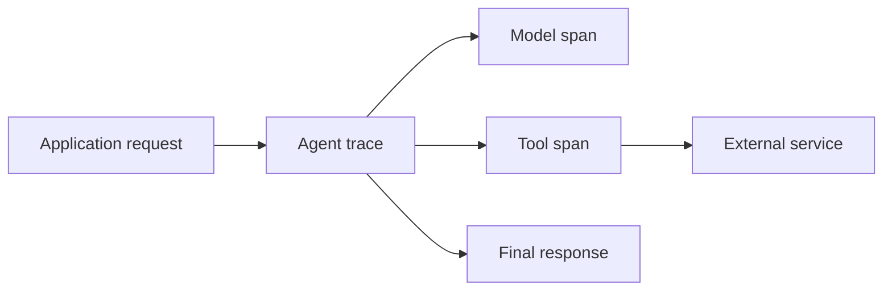
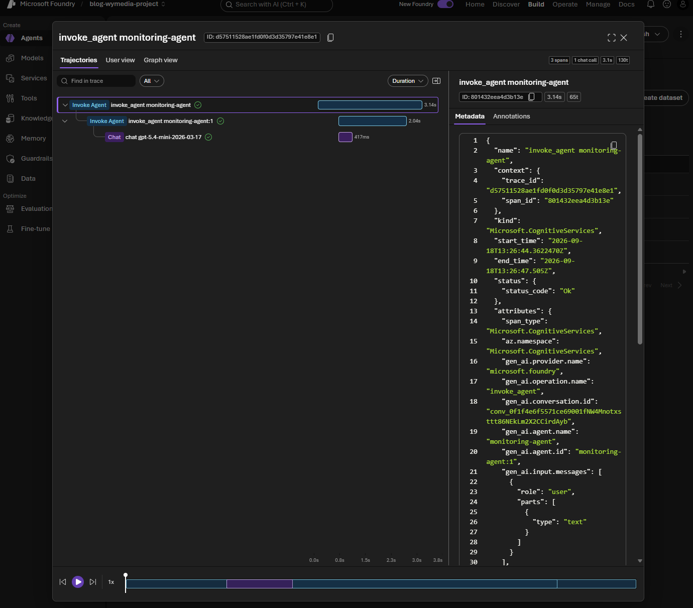
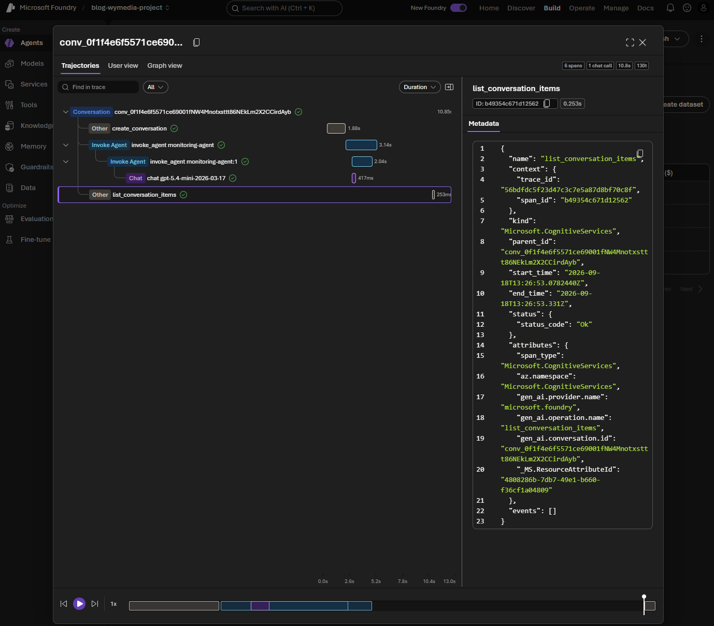

# Part 5 – Monitor Microsoft Foundry agents with traces and telemetry

Parts 1–4 built agents, tools, and grounded experiences. The next production question is not only whether an answer looks correct, but what happened while it was being produced:

- Which agent and model version handled the request?
- How long did the complete request take?
- Was the time spent in the model, retrieval, or a tool?
- How many input and output tokens were used?
- Did a tool fail, retry, or return an unexpectedly large result?
- Can an operator investigate the request without exposing customer content?

These questions belong to **monitoring**, also called observability. Monitoring gives us evidence about runtime behavior. It does not decide whether an answer is good (that is evaluation) and it does not block unsafe content (that is a guardrail).

## Monitoring is more than printing a response

An agent request usually contains several operations: your application receives a request, the agent calls a model, the model may select a tool, the tool returns data, and the model produces a final answer. Measuring only the total duration hides where the time went.

The useful unit of investigation is a **trace**. A trace represents one end-to-end operation. It contains **spans**, which represent child operations such as a model call, a tool call, retrieval, or application code.



If a request takes eight seconds, the spans can tell you whether that was one slow model call, three sequential tool calls, a retry, or a slow downstream service. That distinction determines the fix.

## Two telemetry sources

Foundry gives you two complementary views:

| Source | What it provides | Where it is useful |
|---|---|---|
| **Foundry server-side traces** | The service-side execution of Prompt agents, Hosted agents, and workflows | Investigating what Foundry executed, including model and tool activity |
| **Application OpenTelemetry** | Spans from your application and supported Azure/OpenAI SDK calls | Correlating Foundry work with your routes, tenants, retrieval code, and downstream services |

Foundry server-side traces are available in the portal under **Observability > Traces** for the retention period configured by the service. Client-side instrumentation does not replace those traces; it adds the context that only your application knows.

For example, a server trace can show that a tool call took 2.4 seconds. A custom application span can show that the tool was the `customer-search` route, used a particular safe correlation ID, and returned 12 records. Keep those concerns separate so the trace remains useful without recording sensitive content.

## Prerequisites

Use a Foundry project with an Application Insights resource connected to it. You also need a model deployment and an agent version that can be invoked by the Responses API pattern used below.

The telemetry APIs are preview-sensitive. Pin the versions used by your project and verify the current Microsoft Foundry documentation before moving the sample into automation.

```bash
pip install "azure-ai-projects>=2.4.0" azure-identity azure-mgmt-applicationinsights azure-monitor-query openai python-dotenv opentelemetry-sdk azure-monitor-opentelemetry
```

The examples expect:

```text
AZURE_AI_PROJECT_ENDPOINT=https://...
MODEL_DEPLOYMENT=your-deployment-name
FOUNDRY_AGENT_NAME=your-agent-name
AZURE_APPLICATION_INSIGHTS_NAME=your-app-insights-name
APPINSIGHTS_RESOURCE_ID=/subscriptions/.../resourceGroups/.../providers/Microsoft.Insights/components/...
```

`DefaultAzureCredential` must be able to access the project. For local development, that normally means signing in with Azure CLI or using a developer identity with the required Foundry permissions.

Agent names must start and end with an alphanumeric character, may contain hyphens in the middle, and may be at most 63 characters long. For example, use `monitoring-agent`, not `MONITORING_AGENT`.

The code folder includes a `.env` file for these local settings. Add the tracing switch there as well:

```dotenv
AZURE_EXPERIMENTAL_ENABLE_GENAI_TRACING=true
```

The scripts call `load_dotenv()` before importing the Azure SDK, so this setting is available early enough to enable GenAI instrumentation. The tracing module also keeps a `setdefault` fallback, which makes it work when you launch it outside the code folder with the environment variable already set. Do not commit real connection strings or credentials to `.env`.

## 0. Create Application Insights

New Foundry resources do not necessarily have an Application Insights resource associated with them. Without that association, the local console example still works, but Foundry cannot send its server-side traces and monitoring data to an Application Insights resource.

`00_configure_app_insights.py` creates or reuses an Application Insights component in the resource group from `.env`, retrieves its connection string, and saves it to the local `.env` file:

```bash
python code/00_configure_app_insights.py
```

The script provisions the Azure resource and writes both its connection string and resource ID to `.env`. It does not silently associate the resource with Foundry: open the Foundry portal, go to **Agents > Traces**, select **Connect**, and choose the Application Insights resource. This is the same setup shown in the screenshot for this article. Keep the connection string private and do not commit the populated `.env`.

If you only want local spans, skip this step and leave `APPLICATIONINSIGHTS_CONNECTION_STRING` unset. `01_configure_tracing.py` then uses the console exporter.

## 1. Export telemetry to Application Insights

Application Insights is useful when the agent is part of a larger application. It gives operators one place to correlate:

- HTTP request duration and status code.
- Agent and model spans.
- Retrieval or database calls.
- Exceptions and dependency failures.
- Deployment or route metadata.

Set the connection string explicitly when you already have it:

```powershell
$env:APPLICATIONINSIGHTS_CONNECTION_STRING = "InstrumentationKey=...;IngestionEndpoint=..."
python code/01_configure_tracing.py
```

If you prefer to retrieve the connection string from the Foundry project instead of storing it in an environment variable, resolve it once during application startup and pass the result to `configure_azure_monitor`:

```python
project.telemetry.get_application_insights_connection_string()
```

For local learning, leave `APPLICATIONINSIGHTS_CONNECTION_STRING` unset; the sample then uses console spans and does not need an Application Insights resource. In a long-running process, configure Azure Monitor once during startup. Do not configure a new provider for every request: duplicate providers can produce duplicate spans and confusing telemetry.

Once data arrives, open the Foundry project and inspect **Observability > Traces**. Use the application trace view when you need the surrounding web request or custom business spans; use the Foundry view when you need the service-side agent execution.

## 2. Start with local console traces

Before sending telemetry to a shared monitoring system, use the console exporter to understand the shape of a trace. This is useful while learning because it makes spans visible without requiring an Application Insights connection string.

Set the experimental GenAI tracing switch before importing the Azure SDK. The recommended place is the `.env` file:

```python
import os

os.environ["AZURE_EXPERIMENTAL_ENABLE_GENAI_TRACING"] = "true"
```

`01_configure_tracing.py` creates an OpenTelemetry provider. If `APPLICATIONINSIGHTS_CONNECTION_STRING` is present, it configures Azure Monitor; otherwise it uses the console exporter. This lets the same small example work locally and in a deployed application.

```bash
python code/01_configure_tracing.py
```

The output from the console exporter is verbose. That is intentional: inspect the span name, duration, parent-child relationship, and attributes first. Do not enable message-content capture simply to make the output easier to read.

## 3. Instrument a direct model request

Run the direct model call first:

```bash
python code/02_model_call.py
```

This uses the Foundry SDK's OpenAI-compatible client without an `agent_reference`. That is deliberate: this is a direct model request, not an agent request. `agent_reference` is an extra request property used only when an agent is executing, so Foundry can associate the request with a named agent and show it under that agent in the portal.

There are three different pieces of information in the output:

- **Response ID** comes from the Foundry response.
- **Latency** is measured locally with `time.perf_counter()` around the network call. Application Insights is not required to print it.
- **Token usage** comes from `response.usage`, returned by the model service. Application Insights is not required to print it either.

Application Insights has a different role: it exports and stores OpenTelemetry spans so you can inspect the request later in Foundry's **Traces** view or query the data with Azure Monitor. Without it, the sample can still print the response, elapsed time, and usage locally, and the tracing module uses the console exporter instead.

With Application Insights connected, the SDK's OpenTelemetry instrumentation sends the model span to the same resource used by the portal's **Traces** tab. The local latency measurement and the telemetry span duration should be close, but they are not identical: the local timer includes the full client-side call, while the span measures the instrumented operation.

### What does the response object contain?

`responses.create()` returns a response object, not just a string. The SDK model contains metadata, one or more output items, and usage information. A shortened example looks like this:

```json
{
  "id": "resp_062a7383c7573eb5006aad2e1ccf4c8197b3d41453f2bbcbfd",
  "object": "response",
  "status": "completed",
  "model": "gpt-5.4-mini",
  "output": [
    {
      "type": "message",
      "role": "assistant",
      "content": [
        {
          "type": "output_text",
          "text": "Request traces are useful because they show ...",
          "annotations": []
        }
      ]
    }
  ],
  "usage": {
    "input_tokens": 17,
    "output_tokens": 40,
    "total_tokens": 57
  }
}
```

The example is abbreviated: the actual object can contain additional IDs, timestamps, and output item properties. The sample reads the most useful fields through the SDK:

```python
print(response.id)           # response identifier
print(response.output_text)  # assistant text extracted from output items
print(response.usage)        # input/output/total token counts
```

If you want to inspect the complete SDK object while experimenting, add this temporarily:

```python
print(response.model_dump_json(indent=2))
```

Avoid leaving full response dumps enabled in production because model inputs and outputs can contain sensitive information.

### Where does this model trace appear?

The direct model call is instrumented and exported to Application Insights when the connection string is configured, so you can find its span in **Application Insights > Logs** and in the output of `04_query_traces.py`. However, it has no `agent_reference`, so it is not associated with a named agent. Do not expect it to appear under `Agents > <agent name> > Traces`.

To see a trace in the Foundry agent experience, run `03_agent_call.py`. That request includes `agent_reference` and Foundry can associate the trace with the agent version and conversation. This distinction is useful in real applications: direct model calls are application telemetry, while agent calls are telemetry that Foundry can group and display as agent traces.

## 4. Instrument an agent request

`03_agent_call.py` creates an agent version, sends one request, prints the request latency and token usage, and leaves the agent and conversation in place so you can inspect them in the portal. It includes `agent_reference`, which lets Foundry associate the request with the agent in the portal. In a real application, create or deploy the agent during deployment rather than for every request.

```bash
python code/03_agent_call.py
```

The call uses `responses.create` with an `agent_reference`, so Foundry can correlate the request with the agent. The exact span names and attributes are SDK-dependent, but the important relationship is stable:

```text
application operation
  └── agent request
      ├── model invocation
      ├── tool invocation(s), if any
      └── final response
```

With console tracing enabled, the output contains one span for the application request and child spans for supported model or tool operations. Each span includes a start time, end time, duration, and attributes such as the operation name. A simplified result summary looks like this:

```text
Request latency: 1842 ms
Usage object present: True
Input tokens: 32
Output tokens: 118
Total tokens: 150
```

The exact span names and token attributes depend on the SDK version. The important comparison is whether the sum of the child spans explains the end-to-end request time, and whether token growth correlates with longer or more expensive requests.

The response may expose token usage directly through a `usage` object. The sample prints `input_tokens`, `output_tokens`, and `total_tokens` when the SDK returns them. It also prints a local request duration so you can compare the end-to-end time with the child spans in the console trace. Treat the exported trace and the service-side Foundry record as the authoritative operational evidence; the local timer is a useful application-level measurement, not a replacement for SDK instrumentation.

## 5. Retrieve the trace records with Python

The Foundry SDK emits the telemetry, but it does not provide a generic `list_traces()` operation for the portal's trace table. The portal reads Application Insights, so the equivalent Python retrieval uses the Azure Monitor Logs Query SDK:

```bash
python code/04_query_traces.py
```

The script queries the last hour of the resource-scoped Application Insights tables `requests`, `dependencies`, and `traces`, then prints timestamps, span names, durations, and operation IDs. Run it a few minutes after the model and agent calls because Application Insights ingestion is asynchronous. The exact table names depend on the query scope: workspace-scoped Log Analytics queries commonly use `AppRequests`, `AppDependencies`, and `AppTraces`, while `query_resource()` against an Application Insights resource uses the resource-scoped names shown here:

```

The direct model request appears as a **dependency** because the application depends on the Foundry model service. For example, this is the model span from the sample:

```text
dependencies | chat gpt-5.4-mini | duration=6711
```

The script also prints the dependency's custom dimensions. They include useful OpenTelemetry semantic attributes such as `gen_ai.request.model`, `gen_ai.response.id`, `gen_ai.usage.input_tokens`, and `gen_ai.usage.output_tokens`. This is why the model call may not look like a top-level `request` record: the dependency row is the trace for the outbound model operation.

For the model dependency, the detailed output looks like this:

```text
target=chat gpt-5.4-mini
resultCode=0
success=True
id=3f868745cbc61947
attributes={
  "gen_ai.request.model": "gpt-5.4-mini",
  "gen_ai.response.model": "gpt-5.4-mini",
  "gen_ai.response.id": "resp_...",
  "gen_ai.usage.input_tokens": "17",
  "gen_ai.usage.output_tokens": "40"
}
```

The telemetry identifies the input and output message types, but does not necessarily include the full prompt and answer. That is a useful privacy default: tracing metadata can explain the request and its cost without automatically copying conversation content into Application Insights.

If the telemetry includes message content, `04_query_traces.py` extracts a small preview from the trace attributes:

```text
prompt_preview=In one sentence, explain why request traces are useful.
response_preview=Request traces are useful because they let you see ...
```

With the default instrumentation settings, the sample may instead print `[content not captured by telemetry]`. The trace remains metadata-focused. If an application needs prompt or completion content in telemetry, enable sensitive-content capture only deliberately, with redaction, access control, and retention policies in place.

```text
Trace records returned: 6
2026-09-18 11:04:12 | dependencies | chat ... | duration=...
2026-09-18 11:04:15 | dependencies | responses ... | duration=...
2026-09-18 11:04:19 | requests | agent ... | duration=...
```

Use the agent response ID or conversation ID in the portal search box, select the matching trace, and compare its span tree with the records printed by the query. The portal is the richer experience: it expands the conversation, run steps, tool calls, and response details. The Python query is useful for automation, alerting, exports, and joining traces with your own operational data.

## 6. Reproduce the portal's three views with Python

The agent page separates one run into three useful views. They are related, but they do not come from the same API:

- **Trace view** shows the distributed telemetry for the run: request and dependency spans, durations, operation IDs, status, and model attributes. This view is backed by Application Insights and is ingested asynchronously.
- **Conversation view** shows the durable conversation record and its ordered input/output message items. This is retrieved from the Foundry conversations API.
- **Response view** shows the complete Responses API object for one request, including the response ID, agent reference, output, status, and token usage. This is retrieved from the Responses API.

This distinction explains a common result when running the sample: the conversation and response can be retrieved immediately, while the trace view says that no matching trace exists yet. The request has completed in Foundry, but Application Insights has not necessarily finished ingesting and indexing its telemetry. Wait a few minutes and run the script again if the trace section is empty.

The IDs printed by the script provide the links between the views:

```text
response_id       -> one Responses API request and its response object
conversation_id   -> the conversation containing the request and response messages
agent_reference   -> the named agent and version associated with the request
operation_id      -> the Application Insights operation containing the trace spans
```

`03_agent_call.py` prints the IDs and retrieves these records after the agent request:

```bash
python code/03_agent_call.py
```

The script queries Application Insights for the trace associated with the response ID, then calls `conversations.retrieve()`, `conversations.items.list()`, and `responses.retrieve()` through the Foundry OpenAI-compatible client. This is the programmatic equivalent of selecting **Trace view**, **Conversation view**, and **Response view** in the portal. The trace query is deliberately best-effort for a newly completed request: if ingestion has not finished, it prints a clear message instead of treating the missing trace as a failed agent request.

In the portal, use the `agent_reference` to open the named agent and its **Traces** tab. Use the `response_id` or `conversation_id` to correlate the portal record with the JSON printed by the script. The trace view is best for timing and dependency analysis; the conversation view is best for following the messages; and the response view is best for inspecting the exact API result and usage metadata.

The project identity needs **Log Analytics Reader** on the connected Application Insights resource (and on its linked workspace when required). Without that role, the calls can succeed while the trace query returns an authorization error.

### Side-by-side: CLI output vs. the Foundry portal

Here is a real run of `03_agent_call.py`, with the matching Foundry portal screen underneath each section so you can see exactly what the printed JSON corresponds to.

**Trace view**

```text
=== TRACE VIEW ===
2026-09-18 13:26:44.977867+00:00 | dependencies | invoke_agent monitoring-agent:1 | duration=2043.3416 | operation_id=d57511528ae1fd0f0d3d35797e41e8e1 | success=True
```



The `operation_id` printed by the script is the same value shown as the trace `ID` at the top of the Foundry panel. Selecting the `Invoke Agent` row in the portal expands the same span tree the query summarizes on one line: an outer `invoke_agent monitoring-agent` span, a child `invoke_agent monitoring-agent:1` span for the specific agent version, and a `chat gpt-5.4-mini-2026-03-17` span for the underlying model call. The metadata panel on the right shows the raw span attributes, including `gen_ai.conversation.id` and `gen_ai.agent.id`, which is how Foundry links this trace back to the conversation view.

**Conversation view**

```text
=== CONVERSATION VIEW ===
{
  "id": "conv_0f1f4e6f5571ce69001fNW4Mnotxsttt86NEkLm2X2CCirdAyb",
  "created_at": 1789738004,
  "metadata": {},
  "object": "conversation"
}
[
  {
    "id": "msg_0f1f4e6f5571ce69006aad3c14d0d4819094b8a4fecd3ba382",
    "content": [
      {
        "text": "In one sentence, explain why request traces are useful.",
        "type": "input_text",
        "prompt_cache_breakpoint": null
      }
    ],
    "role": "user",
    "status": "completed",
    "type": "message",
    "phase": null,
    "partition_key": "0f1f4e6f5571ce6900"
  },
  {
    "id": "msg_0f1f4e6f5571ce69006aad3c153508819098c1c1fcf8e5d092",
    "content": [
      {
        "annotations": [],
        "text": "Request traces are useful because they let you follow a request end-to-end through a system, making it easier to debug errors, identify bottlenecks, and understand performance.",
        "type": "output_text",
        "logprobs": []
      }
    ],
    "role": "assistant",
    "status": "completed",
    "type": "message",
    "phase": null,
    "created_by": {
      "response_id": "resp_0f1f4e6f5571ce69006aad3c14bfc0819091d29c7404da4515",
      "agent": {
        "type": "agent_id",
        "name": "monitoring-agent",
        "version": "1"
      }
    },
    "partition_key": "0f1f4e6f5571ce6900"
  }
]
```



The portal's conversation trajectory is a superset of what the script prints: it shows the same `conv_...` ID, but also the surrounding spans that produced it — `create_conversation`, the nested `invoke_agent` spans from the trace view above, and the `list_conversation_items` call itself (which is literally the same operation `conversations.items.list()` performs in the script). The metadata panel confirms this by showing `gen_ai.operation.name: list_conversation_items` and the matching `gen_ai.conversation.id`. In other words, the conversation view in the portal is really a trace of every operation touching that conversation, while the script's conversation view is just the resulting data: the conversation record and its ordered message items.

**Response view**

```text
=== RESPONSE VIEW ===
{
  "id": "resp_0f1f4e6f5571ce69006aad3c14bfc0819091d29c7404da4515",
  "created_at": 1789738004.0,
  "model": "gpt-5.4-mini",
  "object": "response",
  "output": [
    {
      "id": "msg_0f1f4e6f5571ce69006aad3c153508819098c1c1fcf8e5d092",
      "content": [
        {
          "annotations": [],
          "text": "Request traces are useful because they let you follow a request end-to-end through a system, making it easier to debug errors, identify bottlenecks, and understand performance.",
          "type": "output_text",
          "logprobs": []
        }
      ],
      "role": "assistant",
      "status": "completed",
      "type": "message",
      "phase": "final_answer",
      "agent_reference": {
        "type": "agent_reference",
        "name": "monitoring-agent",
        "version": "1"
      },
      "response_id": "resp_0f1f4e6f5571ce69006aad3c14bfc0819091d29c7404da4515"
    }
  ],
  "conversation": {
    "id": "conv_0f1f4e6f5571ce69001fNW4Mnotxsttt86NEkLm2X2CCirdAyb"
  },
  "status": "completed",
  "usage": {
    "input_tokens": 27,
    "output_tokens": 38,
    "total_tokens": 65
  },
  "agent_reference": {
    "type": "agent_reference",
    "name": "monitoring-agent",
    "version": "1"
  }
}
```

This is the same `resp_...` ID referenced by `created_by.response_id` in the conversation view above, and it is the object the Foundry portal reads to render the agent's answer, its status, and its token usage on the run detail page. There is no separate "Response view" screenshot here because the response object is folded into the same run detail page as the conversation: the portal shows the rendered message, while `responses.retrieve()` gives you the full underlying object, including fields like `usage`, `agent_reference`, and `status` that are useful for automation but not all shown in the UI.

Together, the three sections tell one consistent story: the **trace view** explains how long each step took and how the spans nest, the **conversation view** shows what was said and confirms which operations touched the conversation, and the **response view** gives you the complete, machine-readable record of one specific request — including the fields (like token usage) that you would otherwise have to read off the portal by hand.

## 7. Add custom spans around your code

SDK instrumentation can see model and supported tool activity, but it cannot know what your application considers important. Add custom spans around operations such as:

- Authorization and security-filter construction.
- Foundry IQ or Azure AI Search retrieval.
- Prompt assembly and post-processing.
- Calls to a CRM, database, or internal API.
- Response validation and redaction.

`05_custom_span.py` demonstrates the pattern:

```python
from opentelemetry import trace

tracer = trace.get_tracer(__name__)

with tracer.start_as_current_span("retrieve_customer_context") as span:
    span.set_attribute("result.record_count", 1)
```

Good attributes are low-cardinality and safe to search, such as `agent.name`, `route`, `operation`, `result.count`, and a tenant-safe correlation ID. Avoid raw prompts, model outputs, tool arguments, access tokens, email addresses, and customer identifiers unless your privacy review explicitly permits them.

The sample uses Python's `hash()` only as a demonstration. It is not a stable anonymization mechanism across processes. In production, use an approved pseudonymization or correlation-ID strategy instead.

## 8. What should you monitor?

The Foundry portal's **Traces** tab is a per-run inspector: it is excellent for looking at one trace, conversation, or response in detail, but it does not aggregate percentiles, cost, or error rates across many runs into a dashboard. To get that kind of view, query Application Insights with KQL and either read the results directly or pin them to an **Azure Monitor Workbook** (Application Insights > **Workbooks**) or **Dashboard**. The sections below describe what to track conceptually; each one maps to a KQL query you can run in Application Insights > **Logs**.

### Latency

Track end-to-end duration and the durations of child spans. The average can look healthy while a small but important group of requests is very slow, so use p50, p95, and p99:

- **p50** shows the normal experience.
- **p95** shows the slow tail that many users encounter.
- **p99** exposes severe outliers and timeout risk.

Break latency down by model, agent version, tool, region, and request type. A regression isolated to one tool points to a different remedy than a regression across every model call.

In KQL, `percentile()` (or `percentiles()` for several at once) computes this directly from the `dependencies` table, grouped by the dimension you care about:

```kusto
dependencies
| where timestamp > ago(1h)
| where name has "chat"
| summarize p50 = percentile(duration, 50),
            p95 = percentile(duration, 95),
            p99 = percentile(duration, 99)
    by tostring(customDimensions["gen_ai.request.model"])
```

Save this as a Workbook query with a bar or time-chart visualization to get a live latency dashboard instead of reading one trace at a time.

### Tokens and cost

Track prompt and completion tokens when the response or trace exposes them. Prompt tokens often grow when retrieved context, conversation history, or tool results become larger. Completion tokens grow when the agent is verbose or repeats work.

Useful dimensions include model deployment, agent version, route, and whether tools were used. Never use raw prompt content as a metric dimension: it creates privacy risk and high-cardinality telemetry.

The `gen_ai.usage.input_tokens` and `gen_ai.usage.output_tokens` custom dimensions captured by the model and agent spans (see [section 5](#5-retrieve-the-trace-records-with-python)) make this queryable too:

```kusto
dependencies
| where timestamp > ago(1d)
| where isnotempty(customDimensions["gen_ai.usage.input_tokens"])
| extend inputTokens = toint(customDimensions["gen_ai.usage.input_tokens"]),
         outputTokens = toint(customDimensions["gen_ai.usage.output_tokens"]),
         model = tostring(customDimensions["gen_ai.request.model"])
| summarize totalInput = sum(inputTokens),
            totalOutput = sum(outputTokens),
            requests = count()
    by model
```

Add this query to the same Workbook to get a running token/cost view per model, alongside the latency panel above.

### Tool calls

Count tool calls, failures, retries, and timeouts. Also monitor the size of tool responses. A tool that returns an entire document instead of the small set of fields the agent needs can increase both latency and token consumption.

An increasing number of tool calls may indicate an instruction change, a model update, an ambiguous tool description, or a failing tool that causes retries.

### Errors

Record exception type, status code, Foundry request ID, agent version, and deployment. Redact message content and secrets. Separate:

- User input validation failures.
- Model or service failures.
- Tool and dependency failures.
- Policy or access-control rejections.

This classification makes alerts actionable and prevents a blocked unsafe request from looking like an infrastructure outage.

### Availability and saturation

Track request success rate, timeouts, throttling, concurrency, and downstream dependency saturation. An agent can have good answer quality while still being operationally unhealthy if requests queue or tools reach their rate limits.

## 9. A practical monitoring checklist

Before calling an agent production-ready, verify:

- Every request has a correlation ID.
- Foundry traces identify the agent and version.
- Application Insights contains the surrounding application operation.
- p95 latency and timeout alerts exist.
- Token usage can be grouped by deployment and route.
- Tool failures and retries are visible.
- Errors retain request IDs without retaining sensitive content.
- Access-control and policy rejections are distinguishable from service failures.
- Trace sampling and retention match the privacy and cost requirements.

Monitoring tells you **what happened**. In [Part 6 – Evaluations](/blog/microsoft-foundry/part6-evaluations), we use datasets and evaluators to ask whether the result was good. [Part 7 – Guardrails](/blog/microsoft-foundry/part7-guardrails) then covers policies that can block unsafe interactions. Later parts cover [multi-agent orchestration](/blog/microsoft-foundry/part8-multi-agent-orchestration), [hosted agents](/blog/microsoft-foundry/part9-deploying-hosted-agents), and [production operations](/blog/microsoft-foundry/part10-from-notebook-to-production).

## Run the sample

The files are intentionally small:

```bash
python code/01_configure_tracing.py
python code/02_model_call.py
python code/03_agent_call.py
python code/04_query_traces.py
python code/05_custom_span.py
```

- [01_configure_tracing.py](code/01_configure_tracing.py) configures console or Azure Monitor export.
- [02_model_call.py](code/02_model_call.py) sends one direct model request.
- [03_agent_call.py](code/03_agent_call.py) sends one correlated agent request.
- [04_query_traces.py](code/04_query_traces.py) retrieves recent spans from Application Insights.
- [05_custom_span.py](code/05_custom_span.py) adds an application span without recording message content.
- [00_configure_app_insights.py](code/00_configure_app_insights.py) provisions Application Insights and saves its connection string locally.
