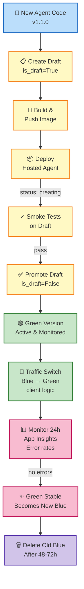

# Microsoft Foundry SDK: Part 6 – From Notebook to Production

You've learned to build agents, orchestrate multi-agent systems, and deploy to production infrastructure (parts 1–5). But production systems need more: **safe rollout strategies, configuration management across environments, telemetry-driven decision-making, and guardrails against breaking changes**.

This final post bridges the gap from local notebooks and dev projects to **production-grade agent operations**. You'll learn agent versioning strategies, blue-green deployments, environment promotion patterns, and how to instrument your pipeline with the observability and evaluation techniques from part 3.

## Prerequisites

- Foundry project with `azure-ai-projects` >= 2.3.0
- A deployed Hosted agent (from part 5)
- Familiarity with parts 1–3 (agents, tools, observability)
- Three environments set up: **dev**, **staging**, **prod** (can be separate projects or same project with version naming)

## Step 1: Versioning Strategy

Versioning is the key to safe rollouts. Foundry supports **semantic versioning** for agent versions (e.g., `1.0.0`, `1.0.1`, `2.0.0`). Each version is immutable—changes create a new version.

### Version Naming Convention

Adopt a naming scheme that reflects readiness:

```python
# Pattern: <major>.<minor>.<patch>
# major: Breaking instruction/schema changes
# minor: New capabilities, tools
# patch: Bug fixes, tuning

version_candidates = [
    "0.1.0",  # Dev/experimental (dev environment only)
    "1.0.0",  # Beta (staging; customers test)
    "1.0.1",  # Hotfix (patch after 1.0.0 is live)
    "1.1.0",  # Minor feature release (prod rollout via blue-green)
    "2.0.0",  # Major rewrite (old 1.x kept for rollback)
]

print("✓ Version naming strategy: <major>.<minor>.<patch>")
```

### Draft Versions for Testing

Before committing to a version, use **drafts**. Drafts are temporary, excluded from default listings, and never increment your release version:

```python
from azure.ai.projects import AIProjectClient
from azure.ai.projects.models import HostedAgentDefinition

project_client = AIProjectClient.from_config()

# Create a DRAFT version (not yet production)
draft_version = project_client.agents.create_version(
    agent_definition=HostedAgentDefinition(
        name="production-agent",
        instructions="New behavior to test",
        model="gpt-4o-mini"
    ),
    container_configuration=...,  # your container config
    is_draft=True  # <-- Mark as draft
)

# Draft gets version like "draft-1723000000000"
print(f"✓ Draft created: {draft_version.version}")

# Test the draft version
openai_client = project_client.get_openai_client(
    agent_name="production-agent"
)

# Invoke the draft (by explicitly specifying the draft version in the request)
response = openai_client.chat.completions.create(
    model="gpt-4o-mini",
    messages=[{"role": "user", "content": "Test message"}],
    extra_body={"agent_version": draft_version.version}
)

print(f"✓ Draft test response: {response.choices[0].message.content}")

# If happy, promote draft to release version
# (Remove draft status, assign version number)
promoted_version = project_client.agents.update_version(
    agent_name="production-agent",
    agent_version=draft_version.version,
    is_draft=False
)

print(f"✓ Draft promoted to: {promoted_version.version}")
```

## Step 2: Blue-Green Deployment for Zero-Downtime Rollouts

Keep two agent versions active—one "blue" (current), one "green" (new). After green passes smoke tests, switch traffic atomically.

```python
import time

project_client = AIProjectClient.from_config()

agent_name = "production-agent"

# === Blue version (currently live) ===
blue_version = "1.0.0"
print(f"🔵 Blue version (live): {blue_version}")

# === Deploy green version ===
green_version_resp = project_client.agents.create_version(
    agent_definition=HostedAgentDefinition(
        name=agent_name,
        instructions="Improved behavior with new logic",
        model="gpt-4o-mini"
    ),
    container_configuration=...,  # Updated container
    is_draft=False
)

green_version = green_version_resp.version  # "1.1.0"
print(f"🟢 Green version (new): {green_version}")

# Poll green until active
print("⏳ Waiting for green to be ready...")
while True:
    green_info = project_client.agents.get_version(
        agent_name=agent_name,
        agent_version=green_version
    )
    if green_info.status == "active":
        print(f"✓ Green is active at {green_info.endpoint}")
        break
    elif green_info.status == "failed":
        print(f"✗ Green failed: {green_info.error_message}")
        # Rollback (keep blue running, delete green)
        project_client.agents.delete_version(agent_name, green_version)
        print("✓ Rolled back to blue")
        exit(1)
    time.sleep(10)

# === Smoke test green ===
green_client = project_client.get_openai_client(agent_name=agent_name)
test_response = green_client.chat.completions.create(
    model="gpt-4o-mini",
    messages=[{"role": "user", "content": "Test: respond with 'ready'"}],
    extra_body={"agent_version": green_version}
)

if "ready" in test_response.choices[0].message.content.lower():
    print("✓ Smoke test passed; green is ready")
else:
    print("✗ Smoke test failed; rolling back")
    project_client.agents.delete_version(agent_name, green_version)
    exit(1)

# === Switch traffic from blue to green ===
# In a multi-client scenario, this is typically done via:
# 1. DNS/load-balancer switch
# 2. Client-side version pinning logic
# 3. Foundry routing rules (if available)

# For this example, we'll just print the switch instruction
print(f"""
✓ Traffic switch: Update all client requests from:
  agent_version={blue_version}
  TO:
  agent_version={green_version}
  
  # Example client-side code:
  # response = client.chat.completions.create(
  #     ...,
  #     extra_body={{"agent_version": "{green_version}"}}
  # )
""")

# === Keep blue as fallback ===
print(f"✓ Blue ({blue_version}) remains active for quick rollback")
print(f"✓ Monitor green for errors; if any, switch back to blue")

# === After stability period (e.g., 24 hours), clean up blue ===
# (optional; keeping blue for a few days is also common)
# project_client.agents.delete_version(agent_name, blue_version)
# print(f"✓ Blue version {blue_version} deleted after stability period")
```

## Step 3: Environment Promotion Across Dev, Staging, Prod

Implement a **promotion pipeline** that moves tested agents up the stack:

```python
import os
from azure.ai.projects import AIProjectClient

# Environments are separate Microsoft Foundry projects
environments = {
    "dev": {
        "project_id": os.getenv("FOUNDRY_DEV_PROJECT"),
        "version_tag": "0.1.0"  # Experimental versions allowed here
    },
    "staging": {
        "project_id": os.getenv("FOUNDRY_STAGING_PROJECT"),
        "version_tag": "1.0.0"  # Beta versions; customer testing
    },
    "prod": {
        "project_id": os.getenv("FOUNDRY_PROD_PROJECT"),
        "version_tag": "1.0.0"  # Production versions only
    }
}

def promote_agent(from_env: str, to_env: str, agent_name: str, version: str):
    """
    Promote an agent from one environment to the next.
    In practice, this involves:
    1. Retrieve agent definition from source
    2. Re-container and push to target's registry
    3. Create version in target environment
    4. Validate via smoke tests
    """
    
    from_client = AIProjectClient(
        project_id=environments[from_env]["project_id"]
    )
    to_client = AIProjectClient(
        project_id=environments[to_env]["project_id"]
    )
    
    # Get the agent from source environment
    source_agent = from_client.agents.get_agent(agent_name)
    print(f"✓ Retrieved {agent_name} from {from_env}")
    
    # In real promotion, you'd rebuild the container image,
    # push to the target environment's registry, then deploy.
    # For this example, we'll assume the image is already there.
    
    # Create version in target environment
    target_version = to_client.agents.create_version(
        agent_definition=source_agent,
        container_configuration=...,  # same image, or rebuilt for target
    )
    
    print(f"✓ Deployed {agent_name}:{version} to {to_env}")
    print(f"  New version ID: {target_version.version}")
    
    return target_version.version

# Promotion flow: dev → staging → prod
print("=== Promoting agent through environments ===")

# Step 1: Test in dev
dev_client = AIProjectClient(project_id=environments["dev"]["project_id"])
print("✓ Testing in dev environment...")

# Step 2: Promote to staging
print("→ Promoting to staging...")
staging_version = promote_agent(
    from_env="dev",
    to_env="staging",
    agent_name="production-agent",
    version="1.0.0"
)

# Step 3: Run evaluations in staging (part 3 technique)
print(f"→ Running evaluations on staging version {staging_version}...")
# (Use techniques from part 3 here)

# Step 4: Promote to production
print("→ Promoting to production...")
prod_version = promote_agent(
    from_env="staging",
    to_env="prod",
    agent_name="production-agent",
    version="1.0.0"
)

print(f"✅ Agent now live in production: v{prod_version}")
```

## Step 4: Versioning + Observability Integration

Instrument your rollout with telemetry from part 3. Use **spans** to track which agent version is handling each request:

```python
from azure.monitor.opentelemetry import configure_azure_monitor
from opentelemetry import trace

# Configure OpenTelemetry (from part 3)
configure_azure_monitor()
tracer = trace.get_tracer(__name__)

def invoke_agent_with_telemetry(agent_name: str, version: str, user_message: str):
    """Invoke agent and record version in telemetry."""
    
    project_client = AIProjectClient.from_config()
    openai_client = project_client.get_openai_client(agent_name=agent_name)
    
    with tracer.start_as_current_span("agent_invocation") as span:
        # Record version in span attributes
        span.set_attribute("agent.name", agent_name)
        span.set_attribute("agent.version", version)
        span.set_attribute("user.message", user_message[:100])  # Truncate for privacy
        
        try:
            response = openai_client.chat.completions.create(
                model="gpt-4o-mini",
                messages=[{"role": "user", "content": user_message}],
                extra_body={"agent_version": version}
            )
            
            span.set_attribute("response.success", True)
            span.set_attribute("response.length", len(response.choices[0].message.content))
            
            return response
        
        except Exception as e:
            span.set_attribute("response.error", str(e))
            raise

# Usage
response = invoke_agent_with_telemetry(
    agent_name="production-agent",
    version="1.1.0",
    user_message="What's new in v1.1.0?"
)

print(f"✓ Response recorded in telemetry with version tag")
```

Export logs to **Application Insights**, then run queries to compare performance across versions:

```kusto
// In Application Insights, query performance by version
customMetrics
| where name == "agent_latency"
| extend version = tostring(customDimensions["agent.version"])
| summarize avg_latency_ms = avg(value), p95_latency = percentile(value, 95) by version
| project version, avg_latency_ms, p95_latency
```

## Step 5: Guardrails for Production Agents

Protect your production agents from breaking changes and unsafe behavior:

```python
from azure.ai.projects.models import PromptAgentDefinition, RaiConfig, RaiBlocklistConfig

# Define RAI (Responsible AI) guardrails (from part 3)
rai_config = RaiConfig(
    blocklist=RaiBlocklistConfig(
        add=[
            "hate_speech",
            "violence",
            "sexual_content"
        ]
    ),
    content_filter_result_threshold="high"
)

# Production agent with guardrails
prod_agent = PromptAgentDefinition(
    name="production-agent",
    instructions="You are a helpful, safe assistant.",
    model="gpt-4o-mini",
    rai_config=rai_config  # <-- Enable guardrails
)

print("✓ Production agent has RAI guardrails enabled")
```

Also implement **instruction versioning**—track changes to agent instructions alongside code versions:

```yaml
# agents/production-agent/instructions.txt (versioned in git)
version: 1.1.0
date: 2024-08-15
author: alice@example.com
change: Added support for multimodal queries

You are a helpful, respectful assistant.
- Only respond to technical questions.
- Avoid political or controversial topics.
- Cite sources when providing facts.
```

## Step 6: Complete Production Rollout Snippet

Here's a full production rollout scenario:

```python
from azure.ai.projects import AIProjectClient
from azure.ai.projects.models import (
    HostedAgentDefinition,
    ProtocolVersionRecord,
    AgentEndpointProtocol,
    ContainerConfiguration,
    PromptAgentDefinition,
    RaiConfig
)
import time

project_client = AIProjectClient.from_config()

agent_name = "production-agent"
new_version = "1.1.0"

print(f"=== Production Rollout: {agent_name} → v{new_version} ===\n")

# === 1. Draft & Test ===
print("1️⃣  Creating draft version...")
draft_resp = project_client.agents.create_version(
    agent_definition=HostedAgentDefinition(
        name=agent_name,
        instructions="New production behavior",
        model="gpt-4o-mini"
    ),
    container_configuration=ContainerConfiguration(
        image_uri="prod.azurecr.io/agent:v1.1.0",
        cpu=2.0,
        memory_gb=4.0
    ),
    protocol_versions=[
        ProtocolVersionRecord(
            protocol=AgentEndpointProtocol.RESPONSES,
            version="1.0.0"
        )
    ],
    is_draft=True
)

print(f"   Draft: {draft_resp.version}")

# Poll until active
while True:
    info = project_client.agents.get_version(agent_name, draft_resp.version)
    if info.status == "active":
        break
    time.sleep(10)

# === 2. Smoke Test ===
print("\n2️⃣  Running smoke tests...")
client = project_client.get_openai_client(agent_name=agent_name)
test_response = client.chat.completions.create(
    model="gpt-4o-mini",
    messages=[{"role": "user", "content": "Hello"}],
    extra_body={"agent_version": draft_resp.version}
)
print(f"   ✓ Smoke test passed")

# === 3. Promote Draft → Release ===
print(f"\n3️⃣  Promoting draft to release version {new_version}...")
promoted = project_client.agents.update_version(
    agent_name=agent_name,
    agent_version=draft_resp.version,
    is_draft=False
)
print(f"   Release version: {promoted.version}")

# === 4. Blue-Green Switch ===
print(f"\n4️⃣  Blue-green traffic switch (manual step)...")
print(f"   Update client routing from 1.0.0 → {new_version}")
print(f"   # response = client.chat.completions.create(..., extra_body={{'agent_version': '{new_version}'}})")

# === 5. Monitor ===
print(f"\n5️⃣  Monitoring {new_version} in production...")
print(f"   - Check Application Insights for errors")
print(f"   - If issues, rollback: agent_version=1.0.0")

# === 6. Cleanup (after stability) ===
print(f"\n6️⃣  Cleanup (after 24h stability)...")
# project_client.agents.delete_version(agent_name, "1.0.0")
print(f"   (Keep old version for 24h as rollback safety net)")

print(f"\n✅ Production rollout complete")
```

## Production Rollout Workflow



## Checklist for Production Readiness

Before shipping to production, verify:

- [ ] Agent passes smoke tests
- [ ] Instructions and tools documented and reviewed
- [ ] Observability enabled (OpenTelemetry, Application Insights)
- [ ] Guardrails/RAI checks enabled
- [ ] Error handling for edge cases (timeouts, rate limits)
- [ ] Rollback plan (blue version kept active for 24h minimum)
- [ ] Load test completed (expected QPS validated)
- [ ] Change log updated (git history of instructions)
- [ ] On-call runbook prepared (who to page if errors spike)
- [ ] Customer communication plan (if breaking changes)

## Key Takeaways

- **Versioning**: Semantic versioning + draft versions for safe testing
- **Blue-Green Deployments**: Keep two versions active; switch atomically; rollback in seconds
- **Environment Promotion**: Move agents through dev → staging → prod with evaluation gates
- **Observability**: Instrument rollouts with telemetry; track version performance side-by-side
- **Guardrails**: Enable RAI checks in production; version instructions in git
- **Runbooks**: Document rollback procedures and on-call escalation
- **Stability-First Mindset**: Keep old versions active; monitor for 24–48h before cleanup

## Closing Thoughts

The six-part series has taken you from "Hello Agent" to production-grade orchestration:

1. **Part 1** – Foundations: Project, agent, tools, responses
2. **Part 2** – Ecosystem: MCP, toolbox, memory stores, advanced tools
3. **Part 3** – Safety & Insights: Tracing, evaluations, continuous eval, guardrails
4. **Part 4** – Scale: Multi-agent orchestration via A2A, specialist coordination
5. **Part 5** – Infrastructure: Hosted agents, versioning, deployment automation
6. **Part 6** – Operations: Rollout strategies, environment promotion, production guardrails

From here:

- **Build multi-region agents** across Azure geographies for DR
- **Integrate with Foundry chains** for agentic workflows beyond single-turn requests
- **Adopt Foundry frameworks** (Microsoft Agent Framework) for enterprise voice & video
- **Join the Foundry community** – share patterns, ask questions, contribute

Happy shipping! 🚀

---

## Full Sample Code

The complete working example for this post is available on GitHub:

**[part6_from_notebook_to_production.py](code/part6_from_notebook_to_production.py)**

Run it locally:
```bash
python part6_from_notebook_to_production.py
```

---

**Next Steps & Resources**
- [Azure AI Foundry Agents documentation](https://learn.microsoft.com/en-us/azure/ai-services/agents/)
- [Responsible AI guardrails](https://learn.microsoft.com/en-us/azure/ai-services/responsible-ai/)
- [OpenTelemetry & Application Insights integration](https://learn.microsoft.com/en-us/azure/monitor/app/opentelemetry-overview)
- [Agent Framework (enterprise features)](https://github.com/microsoft/agent-framework)
- [Azure AI Foundry SDK Blog Series](https://github.com/azure/azure-ai-foundry-sdk-blog) – All parts, samples, and patterns
