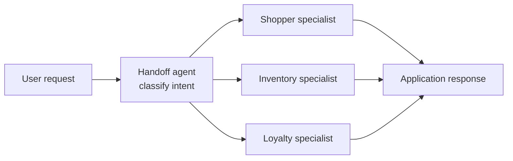
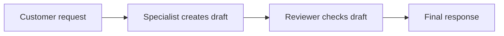

# Microsoft Foundry SDK: Part 9 - Multi-Agent Orchestration

An individual agent can answer a question, call a tool, and maintain a conversation. Production applications often need more structure: one component classifies the request, a specialist handles the domain, and another component reviews or combines the result.

This article builds that progression with Microsoft Foundry prompt agents and the Microsoft Agent Framework:

1. Create focused specialist agents and a handoff agent.
2. Invoke a specialist directly.
3. Route a request through the handoff agent.
4. Compare sequential and concurrent orchestration.
5. Build a complete multi-agent application with a handoff, sequential review, and concurrent specialists.

## Choose the orchestration layer first

The current Microsoft architecture separates two responsibilities:

- **Microsoft Agent Framework** owns the orchestration logic: sequencing, fan-out, handoffs, group chat, and manager-style workflows.
- **Microsoft Foundry** provides the project, model deployments, agent hosting, identity, tracing, evaluation, and operational controls around that logic.

The numbered examples in this article deliberately show the mechanics with the Azure AI Projects Responses API. For a new production workflow, prefer the Agent Framework orchestration builders once the pattern is clear. Avoid starting new work on classic connected agents; Microsoft documents that classic Agent Service as deprecated and scheduled for retirement.

## The orchestration patterns

The Agent Framework provides five useful patterns:

| Pattern | Use it when | Main trade-off |
| --- | --- | --- |
| Sequential | Work has a fixed order, such as draft then review. | Latency accumulates at each step. |
| Concurrent | Independent specialists can assess the same input. | Token and capacity usage multiply. |
| Handoff | One specialist should take ownership of the task. | Routing quality depends on agent descriptions. |
| Group chat | Agents need to react to each other's responses. | Context is synchronized across participants, increasing token usage. |
| Magentic | The task is open-ended and needs planning and replanning. | Cost and behavior are less predictable; cap rounds and stalls. |

Start with one agent and tools. Add multiple agents only when specialization, isolation, or independent perspectives justify the extra latency and failure modes.

## Prerequisites

- Azure CLI authenticated with an account that can access the Foundry project: `az login`
- A Microsoft Foundry project
- A deployed model in that project
- Python 3.10 or later
- `azure-ai-projects` 2.6.0 or later

The examples use the current project endpoint pattern:

```text
https://<account>.services.ai.azure.com/api/projects/<project>
```

Create a virtual environment and install the dependencies:

```powershell
python -m venv .venv
.venv\Scripts\Activate.ps1
pip install -r code\requirements.txt
Copy-Item code\.env.example code\.env
```

Copy `code/.env.example` to `code/.env`, then fill in `AZURE_AI_PROJECT_ENDPOINT`, `MODEL_DEPLOYMENT`, and a unique `AGENT_PREFIX`.

## What we are building

The sample uses a small retail domain so each agent has a clear responsibility:

- **Shopper specialist**: product selection and recommendations.
- **Inventory specialist**: availability and delivery questions.
- **Loyalty specialist**: points, discounts, and membership benefits.
- **Reviewer specialist**: checks drafts for unsupported claims and missing assumptions.
- **Handoff agent**: classifies the request and returns the target specialist as JSON.

The handoff agent does not answer the customer. It makes a routing decision. The application then invokes the selected specialist. Keeping classification and dispatch as explicit application steps makes the workflow easier to validate, observe, and change than hiding the routing logic in one large prompt.

In the diagram below, **Handoff agent — classify intent** is the component that produces the `target`, `confidence`, and `reason` fields. The confidence is the model's self-assessment of its routing decision, not an independent platform measurement.



## Step 1: Create the specialist agents

The Foundry SDK represents an agent as a versioned definition. A shared helper keeps the creation code consistent, while each specialist has its own focused instructions and, in a real application, its own tools and permissions.

Run:

```powershell
python code\00_create_agents.py
```

The script creates a new version of each agent. The names are prefixed from `.env` so that multiple developers can run the sample in the same project without colliding.

The important part of the factory is the current SDK call:

```python
agent = project_client.agents.create_version(
    agent_name=name,
    description=description,
    definition=PromptAgentDefinition(
        model=MODEL_DEPLOYMENT,
        instructions=instructions,
    ),
)
```

This replaces the older `create_agent()` and `AIProjectClient.from_config()` patterns used in some early Agent Service examples.

## Step 2: Invoke a specialist directly

Before adding orchestration, test one specialist in isolation. The script reads the `SPECIALIST` environment variable from your local `code/.env`; in this example it is set to `inventory`, so the inventory specialist handles the request. The question comes from `SPECIALIST_PROMPT`.

```powershell
python code\01_invoke_specialist.py
```

With the sample `.env` values, the command invokes the inventory specialist and produces a response such as:

```text
--- Inventory specialist is answering ---
I can help with inventory questions, but I don't have live stock data here, so I can't confirm availability for a blue trail running jacket in medium.

If you want, I can help you check:
- the exact product name or SKU
- whether it's in stock at a specific store or warehouse
- delivery timing once you have the item listing

If this is a product lookup, the inventory or sales specialist should handle the exact availability check.
```

The important call is `get_openai_client(agent_name=agent_name)`. It selects the prefixed inventory agent and returns an OpenAI-compatible client whose Responses API requests are handled by that deployed agent:

```python
responses = project_client.get_openai_client(
    agent_name=agent_name
).responses

response = responses.create(
    input="Do you have a blue trail running jacket in medium?"
)
print(response.output_text)
```

This is useful during development because it separates agent quality problems from routing problems. If the inventory specialist gives a poor answer when called directly, adding a handoff agent will not fix it.

## Step 3: Add application-level handoff routing

A dedicated handoff agent classifies the request and lets the application dispatch to the appropriate specialist. The small sample also asks the model to return a confidence value and a reason for its decision.

Run:

```powershell
python code\02_handoff_router.py
```

The script now shows the complete interaction: the user request goes to the handoff agent, the application uses the returned `target` to select the loyalty specialist, and only that specialist's answer is printed. The specialist instructions explicitly tell it not to describe the routing process or mention other agents.

With the sample `TEST_PROMPT` in `.env.example`, the output is similar to:

```text
User request: Can I use my loyalty points on this order?
Handoff agent is classifying the request...
--- Routing specialist is answering ---
{
  "target": "loyalty",
  "confidence": 0.99,
  "reason": "The user is asking about using loyalty points on an order, which is a loyalty program question."
}
Routing to: loyalty

--- Loyalty specialist is answering ---
Yes—**if the store's loyalty program allows points redemption on this type of order**, you can usually apply them at checkout.

A few common limits to check:
- **Minimum order value** may be required
- **Not all items** may be eligible
- Points may not be usable with certain **promotions or discounts**
- There may be a **maximum number of points** you can apply per order

I can help you figure it out. If you want, send me:
1. the **store or brand**, and
2. whether you're checking out **online or in-store**

and I'll explain how loyalty points typically work for that order.
```

The router selects one specialist. If you use a question with two intents, such as both product availability and payment with points, the model may choose inventory as the primary intent. Use the loyalty-only prompt above when following this routing example.

The handoff response is deliberately structured:

```json
{
  "target": "loyalty",
  "confidence": 0.99,
  "reason": "The user is asking about using loyalty points on an order, which is a loyalty program question."
}
```

In plain language, the flow is:

1. The handoff agent reads the question and says, “I am 99% confident that the loyalty specialist should handle this.”
2. The application reads `target: "loyalty"` and checks that it is an allowed specialist.
3. The application sends the original question to the loyalty agent.
4. The loyalty agent produces the answer shown to the user.

The `99%` is the handoff model's own confidence estimate. In the sample, it is printed for visibility and does not stop the dispatch; production code can require a minimum confidence and use a fallback when the estimate is too low.

Because this is a model-generated estimate, treat it as a routing signal rather than a guarantee that the classification is correct.

The application validates `target` before invoking an agent. Do not blindly use a model-generated agent name as a dictionary key or service endpoint. A production handler should also define a confidence threshold and a safe fallback response.

Routing is not the same as collaboration:

| Pattern | Meaning |
| --- | --- |
| Routing or handoff | Select one specialist for the request. |
| Sequential orchestration | Pass one agent's output to another agent. |
| Concurrent orchestration | Ask independent specialists to assess the same input. |

## Step 4: Sequential orchestration

Some tasks have a dependency: one specialist must produce a draft before another specialist can inspect it. Here, the shopper specialist receives the jacket recommendation request and writes the first draft. The reviewer specialist then receives that draft inside a new prompt, checks its assumptions and claims, and writes the revised answer. The reviewer is not answering the original request independently; it is reviewing the shopper specialist's output.

Run:

```powershell
python code\03_sequential_review.py
```

The flow is:



Unlike the previous handoff example, this workflow does not use the routing agent. The application already knows the fixed sequence: send the request to the shopper specialist, then send that specialist's draft to the reviewer specialist. A routing agent is useful when the application must choose which specialist should own an incoming request; it is unnecessary when every request follows the same analyst-then-reviewer path.

The output makes both stages visible:

```text
--- Shopper specialist is answering ---
Draft:
A good recommendation for this runner/hiker is a **lightweight waterproof trail running jacket** with:

- **Breathable waterproof fabric**: helps keep rain out without overheating on runs
- **Packable design**: easy to stow in a vest or daypack
- **Adjustable hood and cuffs**: better fit in wind and rain
- **Reflective details**: useful for early morning or evening runs
- **Slightly longer hem**: helpful for hiking and added coverage
- **Durable water repellent (DWR) finish**: sheds light rain and trail spray

### Why this fits the use case
This person needs a jacket that works for **two activities**:
- **Running**: needs to be lightweight, breathable, and non-bulky
- **Weekend hiking**: needs enough weather protection and durability for longer wear

A trail running jacket is usually the best compromise because it prioritizes **mobility and ventilation** more than a heavy rain shell, while still offering waterproof protection for wet weather.

### Assumptions
I'm assuming:
1. The runner wants a jacket for **rain protection**, not just wind resistance.
2. They prefer something that can be used **on both runs and hikes**, so versatility matters.
3. Conditions are likely **light to moderate rain**, not extended alpine downpours.
4. They care about **comfort while moving fast**, so weight and breathability are important.

### If you want to narrow it further
- For **mostly running**: choose the **lightest, most breathable** option
- For **more hiking than running**: choose a jacket with **more durability, pockets, and coverage**
- For **very wet climates**: prioritize **fully seam-sealed waterproof construction**

If you want, I can also turn this into a **short product recommendation blurb** or a **comparison between two jacket types**.

--- Reviewer specialist is answering ---
Review:
A good recommendation for this runner/hiker is a **lightweight waterproof trail running jacket**, especially if they want one jacket for both running and weekend hiking.

### Why it fits
- **Lightweight and packable**: easier to carry and less bulky for runs
- **Breathable waterproof fabric**: helps reduce overheating, though no waterproof jacket will stay fully dry or perfectly breathable in all conditions
- **Adjustable hood and cuffs**: can improve fit in wind and rain
- **Reflective details**: useful for low-light runs
- **Slightly longer hem**: can add coverage for hiking
- **DWR finish**: helps shed light rain and trail spray, but it is not the same as full waterproofing

### Best use case
This is a reasonable compromise if the person needs:
- **Running**: low weight, mobility, and ventilation
- **Hiking**: basic weather protection and enough durability for occasional longer wear

### Assumptions
This recommendation assumes:
1. They want **rain protection**, not just wind resistance.
2. They want **one jacket for both activities**.
3. They expect **light to moderate rain**, not prolonged severe weather.
4. They care about **comfort while moving** more than maximum storm protection.

### If narrowing the choice
- **Mostly running**: prioritize the lightest, most breathable option
- **More hiking than running**: prioritize durability, pockets, and coverage
- **Very wet conditions**: look for **fully seam-sealed construction** and a higher level of weather protection
```

The important detail is how the second agent receives the first agent's work. The reviewer does not automatically know what the shopper specialist said. The application takes the draft, adds instructions such as “check the assumptions and unsupported claims,” and sends that complete text as a new request:

```python
review_prompt = (
    "Review this draft for unsupported claims and missing assumptions. "
    "Return a corrected, concise version.\n\nDRAFT:\n"
    + response_text(draft)
)
review = run_agent(project_client, AGENT_NAMES["reviewer"], review_prompt)
```

This makes the workflow easy to understand: the first agent writes, the application passes its text to the second agent, and the second agent reviews it. In a larger application, you can add other information to that second request, such as a product ID or customer request, so the reviewer has the context it needs.

For production code, you can later replace the manual prompt construction with a declarative orchestration workflow such as Microsoft Agent Framework's `SequentialBuilder`. The important idea remains the same: the first agent's output becomes the second agent's input.

## Step 5: Concurrent orchestration

Sometimes several agents can work on the same question without waiting for one another. For example, a customer may ask about a jacket, its availability, and whether loyalty points can be used. The shopper, inventory, and loyalty specialists can each investigate their own part at the same time.

This is called **concurrent orchestration**. The application sends the request to all three specialists, waits for their answers, and then collects the results. The agents do not automatically see one another's answers, and there is no routing decision that picks only one of them. This is useful when you want several independent opinions or facts before deciding what to show the user.

In practical terms, the difference from the previous example is:

- **Sequential**: shopper answers first, then reviewer reads the shopper's answer.
- **Concurrent**: shopper, inventory, and loyalty answer independently at the same time.

The sample prints a heading for each responding specialist, so you can see which part of the answer came from which agent. It does not yet combine the three answers into one polished response; a real application could add a final summarizer after all three responses arrive.

When you run the script, it also prints a clear “Running specialists in parallel” message and identifies each later answer as a **parallel result**. The order in which those results are displayed is not proof of the execution order: all three requests have already been started together.

Each specialist is also given a narrow instruction for its part of the question. The shopper specialist discusses suitability and alternatives, the inventory specialist discusses stock and delivery, and the loyalty specialist discusses points and membership rules. This prevents every agent from repeating the entire answer when the customer asks about several topics at once.

Run:

```powershell
python code\04_parallel_review.py
```

The Python example uses `ThreadPoolExecutor` to start the three synchronous requests together. This means the application does not wait for the shopper response to finish before starting the inventory request. In an asynchronous web application, the same idea can be implemented with async tasks.

When using this pattern in a real application, also decide:

- How long to wait before treating a specialist as unavailable.
- Whether one failed specialist should prevent the other answers from being used.
- How many agents may run at the same time, to control cost and capacity.
- How to combine the separate answers into one response when the user does not need to see the internal analysis.

## Step 6: Full example

The full sample creates the agents, sends a user request to the handoff agent, validates the classification, and invokes the selected specialist.

```powershell
python code\full_example.py
```

Use a unique `AGENT_PREFIX` in `.env`:

```powershell
python code\full_example.py
```

The complete source is available here:

- [00_create_agents.py](code/00_create_agents.py)
- [01_invoke_specialist.py](code/01_invoke_specialist.py)
- [02_handoff_router.py](code/02_handoff_router.py)
- [03_sequential_review.py](code/03_sequential_review.py)
- [04_parallel_review.py](code/04_parallel_review.py)
- [full_example.py](code/full_example.py)
- [common.py](code/common.py)
- [requirements.txt](code/requirements.txt)
- [.env.example](code/.env.example)

## Production notes for hosted agents

When this orchestration is deployed as a hosted agent, Foundry supplies the runtime, scaling, identity, and observability. The orchestration code still owns the workflow behavior. For hosted agents that consume Foundry-managed tools, plan the Toolbox/MCP boundary explicitly rather than assuming tools attached to a prompt-agent definition will automatically be available inside the hosted process.

For manager-style or Magentic workflows, always configure maximum rounds and stall limits. Add human approval before actions that change production systems, such as placing orders, changing accounts, or writing records.

## Cleanup

The cleanup script deletes only agents whose names use the configured prefix:

```powershell
python code\cleanup.py
```

It calls the current SDK method:

```python
project_client.agents.delete(
    agent_name=name,
    force=True,
)
```

Review `AGENT_PREFIX` before running cleanup. Never use a broad prefix in a shared project.

## Key takeaways

- Multiple agents are useful when responsibilities, tools, or permissions differ.
- A shared initializer keeps specialist creation consistent.
- A handoff agent should classify and return structured data; the application should validate and dispatch.
- Sequential orchestration passes an explicit result from one agent to another.
- Concurrent orchestration is appropriate only when the specialist calls are independent.
Next up: **Part 10** - Let agents communicate across application and deployment boundaries.
